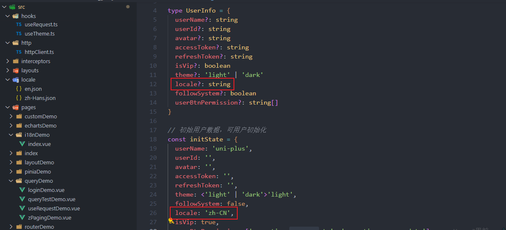
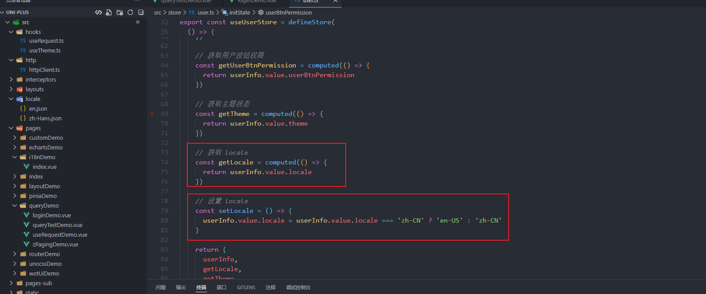
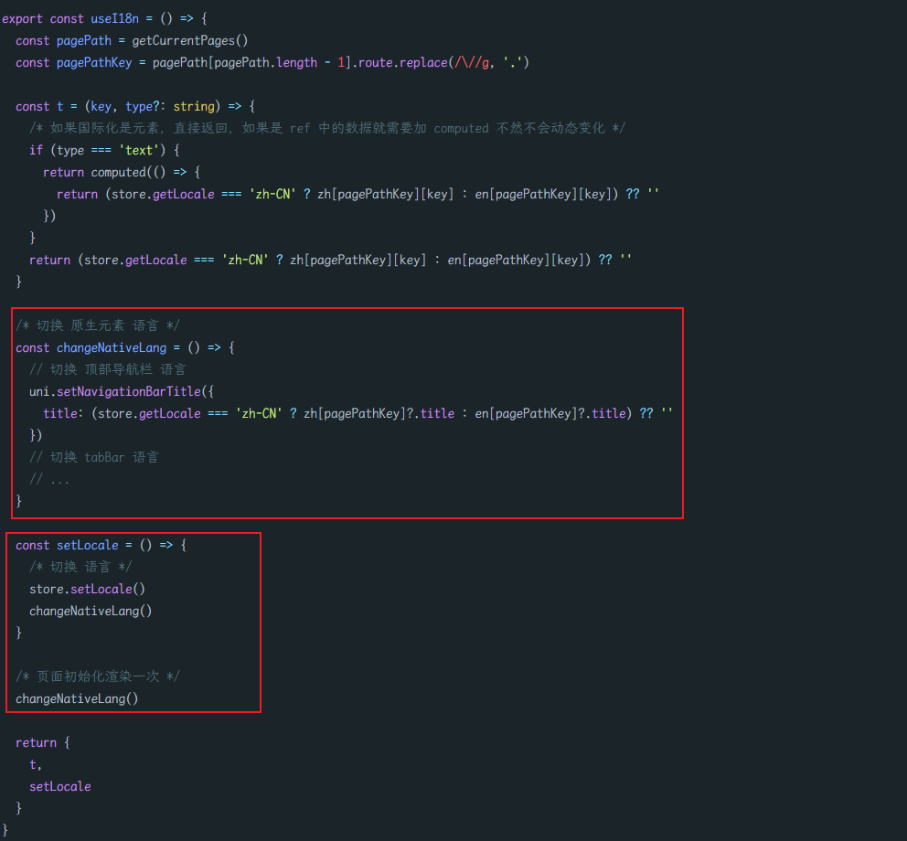
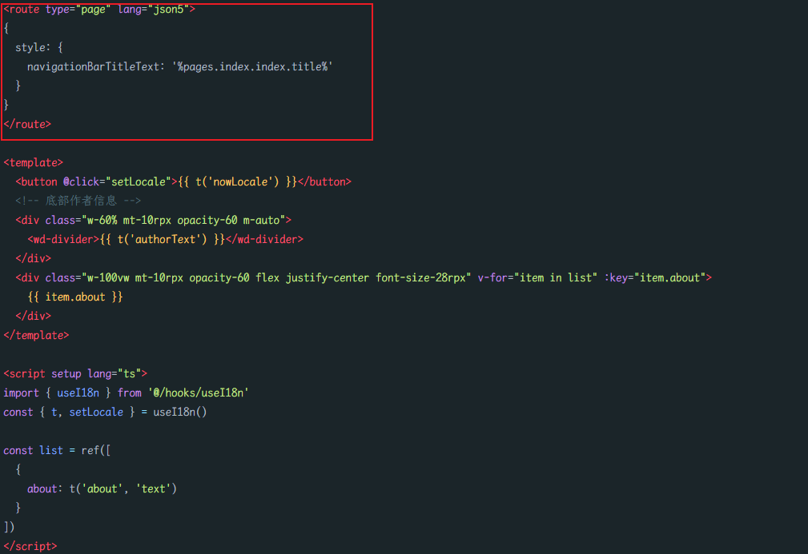
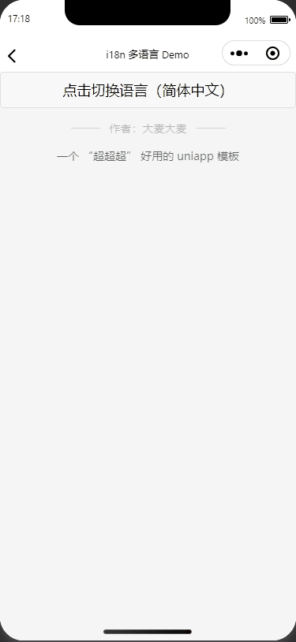
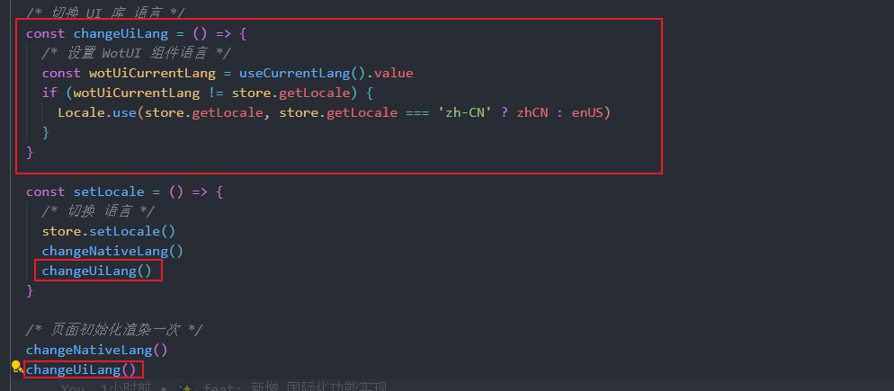
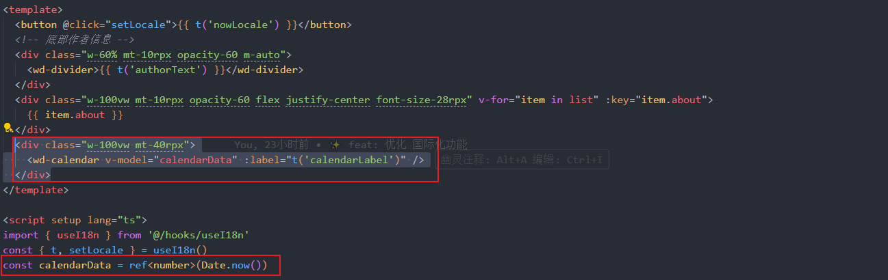
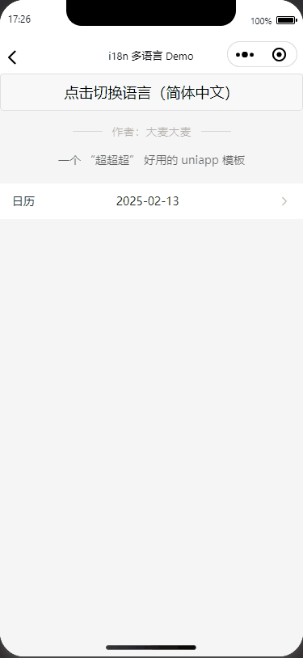

# 10-i18n篇

## 前言

`uniapp` 的需要做国际化部分，大概有下面 `4` 部分

- `Tempalte`
- `Script`
- 原生模块
- `UI` 库

## Tempalte

`uniapp` 上国际化涉及到很多东西，还是涉及到原生模块的国际化，后续还需要进行封装所以，就没必要使用 `vue-i18n` 等插件了

我们完成可以自定义一个插件来实现国际化，代码体积也会小一点

我们以两个语言作为国际化（英文 & 中文），后期可以根据需要自己进行扩展即可

先建立 `src/locale` 文件，用于存放国际化的文字，`en.json`、`zh-Hans.json`

```json
// src/locale/en.json
{
  "pages.i18nDemo.index": {
     "title": "i18n Multilingual Demo",
     "authorText": "Author: DaMaiCoding",
     "about": "A 'super super super' easy to use uniapp template",
     "nowLocale": "Click to switch language(English-US)",
     "calendarLabel": "Calendar"
  }
}
```

```json
// src/locale/zh.json
{
  "pages.i18nDemo.index": {
    "title": "i18n 多语言 Demo",
    "authorText": "作者：大麦大麦",
    "about": "一个 “超超超” 好用的 uniapp 模板",
    "nowLocale": "点击切换语言（简体中文）",
    "calendarLabel": "日历"
  }
}
```

关于 `pages.i18nDemo.index` 这个 `key` 是用于区分是哪个页面的数据

【注意】文件名的命名有规范的，`locale/语言地区代码.json`，如：`en.json，zh-Hans.json，zh-Hant.json`

具体可以看下 [uniapp 国际化部分](https://uniapp.dcloud.net.cn/tutorial/i18n.html)

首先，要使用 `pnina` 创建一个来记录我们当前的选择的语言的变量





并且我们创建了两个函数 `getLocale`、`setLocale` 用于获取与设置当前语言（`locale`）

接下来，我们模仿 `vue-i18n` 的写法，创建一个 `hooks` 返回 `t` 函数来解析当前语言所对应的文字

其实原理非常简单，就是判断当前语言是 `en-US` 还是 `zh-CN`，然后使用 `t` 传过来的 `key` 读取对应 `json` 中的数据

`getCurrentPages()` 用于获取当前页面栈的实例，以数组形式按栈的顺序给出，比如：`['pages/index/index', 'pages/i18nDemo/index']`

最后把 `/` 替换为 `.` 就可以访问了

>你可能要问了，为要用 `.` 用 `/` 作为 `key` 不就好了，都不用转换了
>
>确实是这样，这样写主要是这样会看起来更符合 `.` 语法获取数据，当然你也可以直接换成 `/`

```typescript
// src/hooks/useI18n.ts

import { useUserStore } from '@/store'
const store = useUserStore()
import en from '@/locale/en.json'
import zh from '@/locale/zh-Hans.json'

export const useI18n = () => {
  const pagePath = getCurrentPages()
  const pagePathKey = pagePath[pagePath.length - 1].route.replace(/\//g, '.')  
  
  const t = (key) => {
    return (store.getLocale === 'zh-CN' ? zh[pagePathKey][key] : en[pagePathKey][key]) ?? ''
  }

  const setLocale = () => {
    return store.setLocale()
  }

  return {
    t,
    setLocale
  }
}
```

```vue
<!-- src/pages/i18nDemo.vue -->

<template>
  <button @click="setLocale">{{ t('nowLocale') }}</button>
  <!-- 底部作者信息 -->
  <div class="w-60% mt-10rpx opacity-60 m-auto">
    <wd-divider>{{ t('authorText') }}</wd-divider>
  </div>
</template>

<script setup lang="ts">
import { useI18n } from '@/hooks/useI18n'
const { t, setLocale } = useI18n()
</script>
```

执行一下，我们到编译器中看下效果

```shell
pnpm dev:mp-weixin
```

 

## Script

上面那个是在 `tempalte` 中的国际化

那我们写在 `script` 中的数据能国际化吗？

```vue
<!-- src/pages/i18nDemo.vue -->

<template>
  <button @click="setLocale">{{ t('nowLocale') }}</button>
  <!-- 底部作者信息 -->
  <div class="w-60% mt-10rpx opacity-60 m-auto">
    <wd-divider>{{ t('authorText') }}</wd-divider>
  </div>
  <div class="w-100vw mt-10rpx opacity-60 flex justify-center font-size-28rpx" v-for="item in list" :key="item.about">
    {{ item.about }}
  </div>
</template>

<script setup lang="ts">
import { useI18n } from '@/hooks/useI18n'
const { t, setLocale } = useI18n()

const list = ref([
  {
    about: t('about')
  }
])

</script>
```

 

可以看到，这并没有效果呀~

这是因为，`ref` 无法直接对 `function` 返回值进行监听

所以，为了让 `t` 函数返回值具有响应式，我们可以使用 `computed` 来加上响应式

传递参数，加一个 `type` 用于识别，是 `template` 中的数据，还是 `script` 中的数据

```typescript
// src/hooks/useI18n.ts

import { useUserStore } from '@/store'
const store = useUserStore()
import en from '@/locale/en.json'
import zh from '@/locale/zh-Hans.json'

export const useI18n = () => {
  const pagePath = getCurrentPages()
  const pagePathKey = pagePath[pagePath.length - 1].route.replace(/\//g, '.')  
  
  /* 如果国际化是元素，直接返回，如果是 ref 中的数据就需要加 computed 不然不会动态变化 */
  const t = (key, type?: string) => {
    if (type === 'text') {
      return computed(() => {
        return (store.getLocale === 'zh-CN' ? zh[pagePathKey][key] : en[pagePathKey][key]) ?? ''
      })
    }
    return (store.getLocale === 'zh-CN' ? zh[pagePathKey][key] : en[pagePathKey][key]) ?? ''
  }

  const setLocale = () => {
    return store.setLocale()
  }

  return {
    t,
    setLocale
  }
}
```

```vue
<!-- src/pages/i18nDemo.vue -->

<template>
  <button @click="setLocale">{{ t('nowLocale') }}</button>
  <!-- 底部作者信息 -->
  <div class="w-60% mt-10rpx opacity-60 m-auto">
    <wd-divider>{{ t('authorText') }}</wd-divider>
  </div>
  <div class="w-100vw mt-10rpx opacity-60 flex justify-center font-size-28rpx" v-for="item in list" :key="item.about">
    {{ item.about }}
  </div>
</template>

<script setup lang="ts">
import { useI18n } from '@/hooks/useI18n'
const { t, setLocale } = useI18n()

const list = ref([
  {
    about: t('about', 'text')
  }
])

</script>
```

 

## 原生模块

好啦接下来，就是要实现原生模块的国际化

比如，顶部导航栏，`tabBar` ...

这里我们先实现顶部导航栏，`tabBar` 也是同理，自己加一下即可

```typescript
import { useUserStore } from '@/store'
import { Locale, useCurrentLang } from 'wot-design-uni'
import enUS from 'wot-design-uni/locale/lang/en-US'
import zhCN from 'wot-design-uni/locale/lang/zh-CN'

const store = useUserStore()
import en from '@/locale/en.json'
import zh from '@/locale/zh-Hans.json'

export const useI18n = () => {
  const pagePath = getCurrentPages()
  const pagePathKey = pagePath[pagePath.length - 1].route.replace(/\//g, '.')

  const t = (key, type?: string) => {
    /* 如果国际化是元素，直接返回，如果是 ref 中的数据就需要加 computed 不然不会动态变化 */
    if (type === 'text') {
      return computed(() => {
        return (store.getLocale === 'zh-CN' ? zh[pagePathKey][key] : en[pagePathKey][key]) ?? ''
      })
    }
    return (store.getLocale === 'zh-CN' ? zh[pagePathKey][key] : en[pagePathKey][key]) ?? ''
  }

  /* 切换 原生元素 语言 */
  const changeNativeLang = () => {
    // 切换 顶部导航栏 语言
    uni.setNavigationBarTitle({
      title: (store.getLocale === 'zh-CN' ? zh[pagePathKey]?.title : en[pagePathKey]?.title) ?? ''
    })
    // 切换 tabBar 语言
    // ...
  }

  const setLocale = () => {
    /* 切换 语言 */
    store.setLocale()
    changeNativeLang()
  }

  /* 页面初始化渲染一次 */
  changeNativeLang()

  return {
    t,
    setLocale
  }
}
```

 

原生元素封装成一个函数  `changeNativeLang`

`uni.setNavigationBarTitle` 是用于切换 顶部导航栏 文字

我们需要进入页面就根据当前语言，渲染 顶部导航栏

`hooks` 被首次加载时，就会默认执行一次，那么我们在末尾执行一下 `changeNativeLang()`，就相当于进入页面渲染一次

在设置语言的时候，也切换执行一下 `changeNativeLang`

```vue
<route type="page" lang="json5">
{
  style: {
    navigationBarTitleText: '%pages.index.index.title%'
  }
}
</route>

<template>
  <button @click="setLocale">{{ t('nowLocale') }}</button>
  <!-- 底部作者信息 -->
  <div class="w-60% mt-10rpx opacity-60 m-auto">
    <wd-divider>{{ t('authorText') }}</wd-divider>
  </div>
  <div class="w-100vw mt-10rpx opacity-60 flex justify-center font-size-28rpx" v-for="item in list" :key="item.about">
    {{ item.about }}
  </div>
</template>

<script setup lang="ts">
import { useI18n } from '@/hooks/useI18n'
const { t, setLocale } = useI18n()

const list = ref([
  {
    about: t('about', 'text')
  }
])
</script>
```

 

`navigationBarTitleText: '%pages.index.index.title%'`，`locale` 目录下，`语言地区代码.json` 文件中定义的 key，使用 `%%` 占位

这里是使用  `@uni-helper/vite-plugin-uni-layouts` 的路由配置

如果不使用这个插件，可以直接在 `src/pages.json` 改对应路由配置也可以

 

## UI 库

组件库部分，需要根据组件库自己的切换方式来定，这里只介绍 `Wot UI` 的语言切换方式

```typescript
import { Locale, useCurrentLang } from 'wot-design-uni'
import enUS from 'wot-design-uni/locale/lang/en-US'
import zhCN from 'wot-design-uni/locale/lang/zh-CN'
```

先引入 `Wot UI` 的语言包

`Locale` 用于设置当前 Wot UI 组件的文字语言

`useCurrentLang` 用于获取当前语言

 

```typescript
import { useUserStore } from '@/store'
import { Locale, useCurrentLang } from 'wot-design-uni'
import enUS from 'wot-design-uni/locale/lang/en-US'
import zhCN from 'wot-design-uni/locale/lang/zh-CN'

const store = useUserStore()
import en from '@/locale/en.json'
import zh from '@/locale/zh-Hans.json'

export const useI18n = () => {
  const pagePath = getCurrentPages()
  const pagePathKey = pagePath[pagePath.length - 1].route.replace(/\//g, '.')

  const t = (key, type?: string) => {
    /* 如果国际化是元素，直接返回，如果是 ref 中的数据就需要加 computed 不然不会动态变化 */
    if (type === 'text') {
      return computed(() => {
        return (store.getLocale === 'zh-CN' ? zh[pagePathKey][key] : en[pagePathKey][key]) ?? ''
      })
    }
    return (store.getLocale === 'zh-CN' ? zh[pagePathKey][key] : en[pagePathKey][key]) ?? ''
  }

  /* 切换 原生元素 语言 */
  const changeNativeLang = () => {
    // 切换 顶部导航栏 语言
    uni.setNavigationBarTitle({
      title: (store.getLocale === 'zh-CN' ? zh[pagePathKey]?.title : en[pagePathKey]?.title) ?? ''
    })
    // 切换 tabBar 语言
    // ...
  }

  /* 切换 UI 库 语言 */
  const changeUiLang = () => {
    /* 设置 WotUI 组件语言 */
    const wotUiCurrentLang = useCurrentLang().value
    if (wotUiCurrentLang != store.getLocale) {
      Locale.use(store.getLocale, store.getLocale === 'zh-CN' ? zhCN : enUS)
    }
  }

  const setLocale = () => {
    /* 切换 语言 */
    store.setLocale()
    changeNativeLang()
    changeUiLang()
  }

  /* 页面初始化渲染一次 */
  changeNativeLang()
  changeUiLang()

  return {
    t,
    setLocale
  }
}
```

与切换原生元素一样，设置一个切换函数，并且页面初始化的时执行一次，切换语言也调用一下



```vue
<route type="page" lang="json5">
{
  layout: 'theme', // 使用主题
  style: {
    navigationBarTitleText: '%pages.index.index.title%'
  }
}
</route>

<template>
  <button @click="setLocale">{{ t('nowLocale') }}</button>
  <!-- 底部作者信息 -->
  <div class="w-60% mt-10rpx opacity-60 m-auto">
    <wd-divider>{{ t('authorText') }}</wd-divider>
  </div>
  <div class="w-100vw mt-10rpx opacity-60 flex justify-center font-size-28rpx" v-for="item in list" :key="item.about">
    {{ item.about }}
  </div>
  <div class="w-100vw mt-40rpx">
    <wd-calendar v-model="calendarData" :label="t('calendarLabel')" />
  </div>
</template>

<script setup lang="ts">
import { useI18n } from '@/hooks/useI18n'
const { t, setLocale } = useI18n()
const calendarData = ref<number>(Date.now())

const list = ref([
  {
    about: t('about', 'text')
  }
])
</script>

<style>
/* 暗黑模式 start */
.wot-theme-dark {
  color: #f5f5f5;
  background: black;
  --theme-bg-color: #1b1b1b;
}
</style>
```

我们使用一个 日历日期选择组件（`wd-calendar`）来测试下

 

【注意】

目前组件库发布到 `npm` 上的包是未经编译的 `vue` 与 `ts`，而 Vite 会将[预构建](https://cn.vitejs.dev/guide/dep-pre-bundling.html)的依赖项缓存到 `node_modules/.vite`，组件库的国际化的实现是基于 `reactive` 实现的数据共享，在 `dev` 阶段就会出现页面使用预构建产物中的国际化数据，而组件库使用组件库内部的国际化数据，所以在非 `uni_modules` 模式引入时，需要在 `vite.config.ts` 中增加以下配置

```typescript
import { defineConfig } from 'vite'
import uni from '@dcloudio/vite-plugin-uni'

export default defineConfig({
  ...
  optimizeDeps: {
    exclude: process.env.UNI_PLATFORM === 'h5' && process.env.NODE_ENV === 'development' ? ['wot-design-uni'] : []
  }
  ...
})
```

使用 [optimizeDeps.exclude](https://cn.vitejs.dev/config/dep-optimization-options.html#optimizedeps-exclude)在预构建中强制排除 `wot-design-uni` 模块，在 `uni_modules` 模式下，不需要做任何处理。
