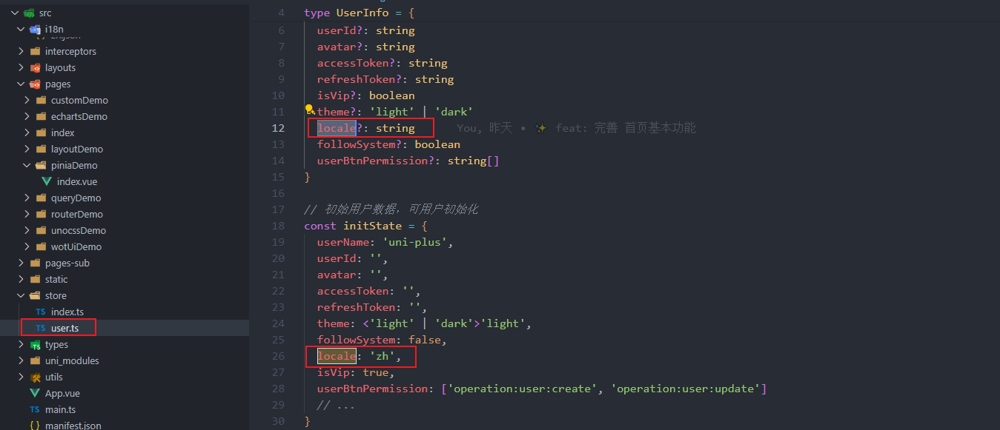
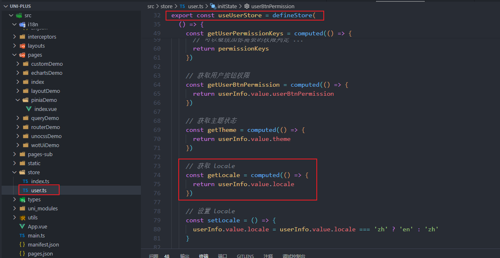
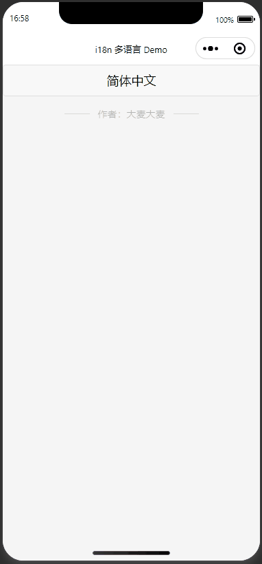
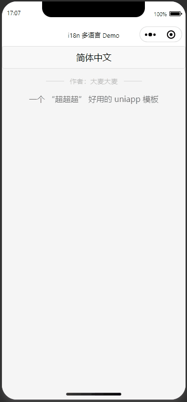
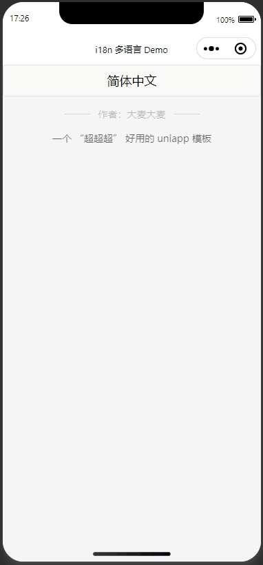

# 10-i18n篇

## 前言

`uniapp` 的需要做国际化部分，大概有下面 `4` 部分

- `Tempalte`
- `Script`
- 原生模块
- `UI` 库

## Tempalte

`uniapp` 上国际化涉及到很多东西，还是涉及到原生模块的国际化，后续还需要进行封装所以，就没必要使用 `vue-i18n` 等插件了

我们完成可以自定义一个插件来实现国际化，代码体积也会小一点

我们以两个语言作为国际化（英文 & 中文），后期可以根据需要自己进行扩展即可

先建立 `src/i18n` 文件，用于存放国际化的文字，`en.json`、`zh.json`

```json
// src/i18n/en.json
{
  "nowLocale": "English-US",
  "authorText": "Author: DaMaiCoding"
}
```

```json
// src/i18n/zh.json
{
  "nowLocale": "简体中文",
  "authorText": "作者：大麦大麦"
}
```

首先，要使用 `pnina` 创建一个来记录我们当前的选择的语言的变量





并且我们创建了一个函数 `getLocale` 用于获取当前语言（`locale`）

接下来，我们模仿 `vue-i18n` 的写法，创建一个 `hooks` 返回 `t` 函数来解析当前语言所对应的文字

其实原理非常简单，就是判断当前语言是 `en` 还是 `zh`，然后使用 `t` 传过来的 `key` 读取对应 `json` 中的数据

```typescript
// src/hooks/useI18n.ts

import { useUserStore } from '@/store'
const store = useUserStore()
import en from '@/i18n/en.json'
import zh from '@/i18n/zh.json'

export const useI18n = () => {
  /* 如果国际化是元素，直接返回，如果是 ref 中的数据就需要加 computed 不然不会动态变化 */
  const t = (key) => {
    return store.getLocale === 'zh' ? zh[key] : en[key]
  }

  const setLocale = () => {
    return store.setLocale()
  }

  return {
    t,
    setLocale
  }
}
```

```vue
<!-- src/pages/i18nDemo.vue -->

<template>
  <button @click="setLocale">{{ t('nowLocale') }}</button>
  <!-- 底部作者信息 -->
  <div class="w-60% mt-10rpx opacity-60 m-auto">
    <wd-divider>{{ t('authorText') }}</wd-divider>
  </div>
</template>

<script setup lang="ts">
import { useI18n } from '@/hooks/useI18n'
const { t, setLocale } = useI18n()
</script>
```

执行一下，我们到编译器中看下效果

```shell
pnpm dev:mp-weixin
```

 

## Script

上面那个是在 `tempalte` 中的国际化

那我们写在 `script` 中的数据能国际化吗？

```vue
<!-- src/pages/i18nDemo.vue -->

<template>
  <button @click="setLocale">{{ t('nowLocale') }}</button>
  <!-- 底部作者信息 -->
  <div class="w-60% mt-10rpx opacity-60 m-auto">
    <wd-divider>{{ t('authorText') }}</wd-divider>
  </div>
  <div class="w-100vw mt-10rpx opacity-60 flex justify-center font-size-28rpx" v-for="item in list" :key="item.about">
    {{ item.about }}
  </div>
</template>

<script setup lang="ts">
import { useI18n } from '@/hooks/useI18n'
const { t, setLocale } = useI18n()

const list = ref([
  {
    about: t('about')
  }
])

</script>
```

 

可以看到，这并没有效果呀~

这是因为，`ref` 无法直接对 `function` 返回值进行监听

所以，为了让 `t` 函数返回值具有响应式，我们可以使用 `computed` 来加上响应式

传递参数，加一个 `type` 用于识别，是 `template` 中的数据，还是 `script` 中的数据

```typescript
// src/hooks/useI18n.ts

import { useUserStore } from '@/store'
const store = useUserStore()
import en from '@/i18n/en.json'
import zh from '@/i18n/zh.json'

export const useI18n = () => {
  /* 如果国际化是元素，直接返回，如果是 ref 中的数据就需要加 computed 不然不会动态变化 */
  const t = (key, type?: string) => {
    if (type === 'text') {
      return computed(() => {
        return store.getLocale === 'zh' ? zh[key] : en[key]
      })
    }
    return store.getLocale === 'zh' ? zh[key] : en[key]
  }

  const setLocale = () => {
    return store.setLocale()
  }

  return {
    t,
    setLocale
  }
}
```

```vue
<!-- src/pages/i18nDemo.vue -->

<template>
  <button @click="setLocale">{{ t('nowLocale') }}</button>
  <!-- 底部作者信息 -->
  <div class="w-60% mt-10rpx opacity-60 m-auto">
    <wd-divider>{{ t('authorText') }}</wd-divider>
  </div>
  <div class="w-100vw mt-10rpx opacity-60 flex justify-center font-size-28rpx" v-for="item in list" :key="item.about">
    {{ item.about }}
  </div>
</template>

<script setup lang="ts">
import { useI18n } from '@/hooks/useI18n'
const { t, setLocale } = useI18n()

const list = ref([
  {
    about: t('about', 'text')
  }
])

</script>
```

 

## 原生模块

好啦接下来，就是要实现原生模块的国际化

比如，顶部导航栏

## UI 库
