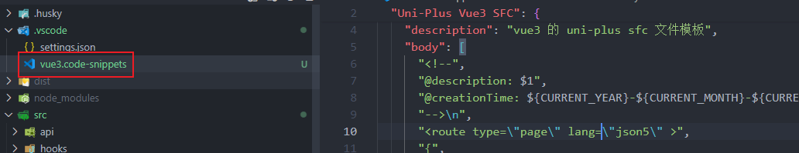
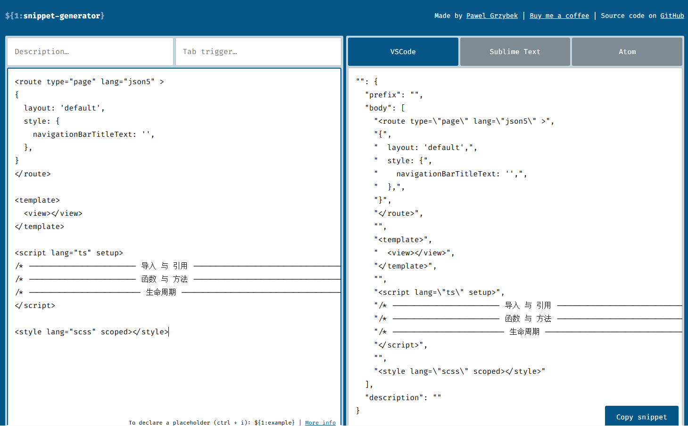
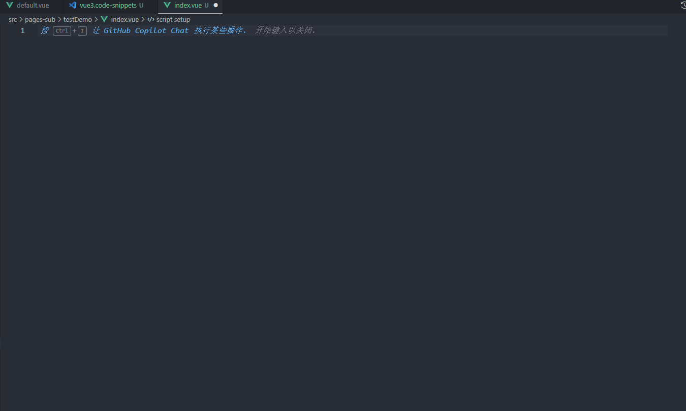

# 11-Snippets篇

## 前言


相信很多同学都用过这个快速生成代码片段的功能

但是就是不知道，这是怎么实现的

其实，这个东西叫 `vscode Snippets`，已经存在很久了

其本质就是事先定义一个代码片段，开发者通过简短的前缀快速将代码

## 语法

 

在 `.vscode` 下定义 `xxx.code-snippets`，`xxx` 可以随便定义

我们就定义为 `vue3.code-snippets`

```json
// .vscode/vue3.code-snippets
{
  "Uni-Plus Vue3 SFC": {
    "scope": "vue",
    "prefix": "v3",
    "description": "vue3 的 uni-plus sfc 文件模板",
    "body": [
      "<!--",
      "@description: $1",
      "@creationTime: ${CURRENT_YEAR}-${CURRENT_MONTH}-${CURRENT_DATE}",
      "-->\n",
      "<route type=\"page\" lang=\"json5\" >",
      "{",
      "  layout: 'default',",
      "  style: {",
      "    navigationBarTitleText: '$2',",
      "  },",
      "}",
      "</route>\n",
      "<template>",
      "  <view>$3</view>",
      "</template>\n",
      "<script lang=\"ts\" setup>",
      "/* ------------------------ 导入 与 引用 ----------------------------------- */",
      "/* ------------------------ 函数 与 方法 ----------------------------------- */",
      "/* ------------------------- 生命周期 -------------------------------------- */",
      "</script>\n",
      "<style lang=\"scss\" scoped></style>\n",
    ],
  }
}
```

文件开头，通常要加一个文件注释，加了文件注释，方便以后查找页面，直接搜索描述就能找到了

而且可以根据时间判断代码编写时，方便 `bug` 追踪

```vue
<!--
@description: 这个是一个测试页面
@creationTime: 2025-01-23
-->
```

`Uni-Plus Vue3 SFC` 代码片段的名称，这是用于区分不同代码片段，可以随便定义

`scope` 生效范围，不写的话是所有语言都生效

`prefix` 触发代码片段的前缀

`body` 代码片段的主体，需要插入的内容 `${1}、${2}` 是占位符号，输入后按 tab键，跳到其他占位符

`description` 代码片段的描述，便于识别

`body` 一个字符串就是一行，换行使用 `\n`，注意字符串中加特殊符号要加 `\` 转义

可以能有同学说，这个 `body` 一个个写，写到什么时候呀，太麻烦了

别急，有神器：[snippet generator](https://snippet-generator.app/?description=&tabtrigger=&snippet=&mode=vscode)



把模板放左边，直接生成 `Snippets`，完美~

## 使用



编写的页面的时候，我们只需输入 `v3`，然后回车就能生成代码片段

按 `tab` 光标就跳到占位符位置

`<script>` 中的代码，建议是分成三个部分，导入、函数、生命周期

这样编写没那么容易乱
