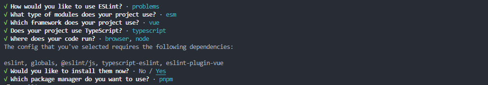
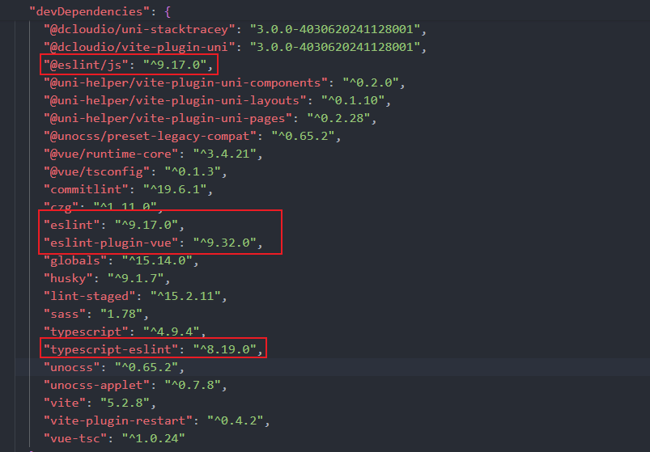
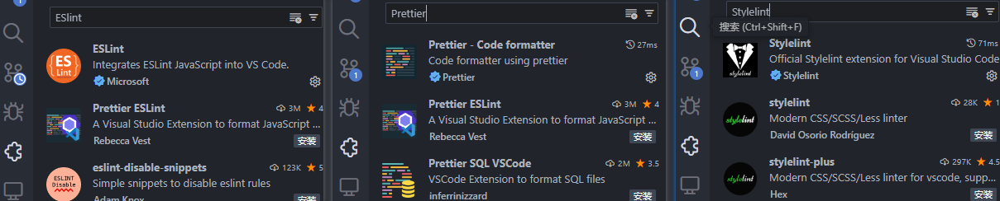
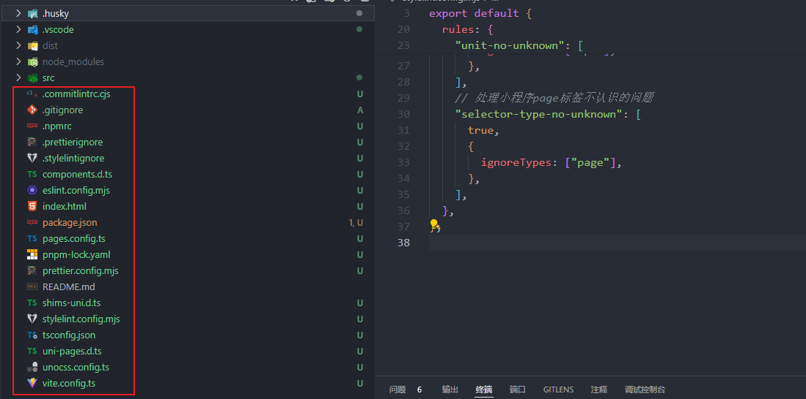
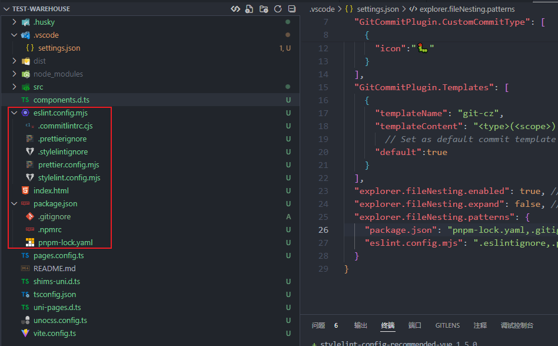

# 12-规范篇

## 前言

像 `Vue` 的脚手架，比如 `npm create vue@latest` 就已经集成好了，代码规范与格式化的插件

但是 `uniapp` 的启动项目是没有默认配置这些东西的，没办法~

我们只能自己配置了，主要配置三个方面的东西

- `ESlint` 做语法检查
- `Prettier` 格式化代码
- `Stylelint` `CSS` 语法检查 与 `CSS` 属性自动排序

>【注意】`ESlint` 与 `Prettier` 会有一些冲突，到时需要解决一下

最后，还会介绍一些 `Vscode` 的相关插件以及一些配置方法

## ESlint

### 安装 ESlint

```shell
pnpm create @eslint/config@latest
```

 

> 【注意】`Where does your code run`? 这里有 `browser、node` 两个选项，要使用 空格 把 `node` 也选上

如果 `package.json` 有这些插件，那么恭喜你，安装成功了~

 

### 配置 eslint.config.mjs

`eslint` 安装完成后，会默认生成 `eslint.config.mjs` 这个文件，不是以前的 `.eslintrc.cjs` 了

注意，这个文件配置是最新 `V9.x` 版本的，与以前的版本是不兼容的

```javascript
/* eslint.config.mjs */ 
export default [
    { 配置对象 },
    扩展插件1,
    扩展插件2,
    { 扩展插件2的配置对象 },
    扩展插件3,
    { 扩展插件3的配置对象 },
]
```

`eslint.config.mjs` 采用了最新的扁平式写法，我们按照上面这种格式再来看 `eslint` 生成的 `eslint.config.mjs`

```javascript
/* eslint.config.mjs */ 
import globals from "globals";
import pluginJs from "@eslint/js";
import tseslint from "typescript-eslint";
import pluginVue from "eslint-plugin-vue";

/** @type {import('eslint').Linter.Config[]} */
export default [
  // 配置对象，全局 files
  {files: ["**/*.{js,mjs,cjs,ts,vue}"]},
  {languageOptions: { globals: {...globals.browser, ...globals.node} }},
  // @eslint/js 扩展插件
  pluginJs.configs.recommended,
  // typescript-eslint 扩展插件
  ...tseslint.configs.recommended,
  // eslint-plugin-vue 扩展插件
  ...pluginVue.configs["flat/essential"],
  // eslint-plugin-vue 配置对象属性
  {files: ["**/*.vue"], languageOptions: {parserOptions: {parser: tseslint.parser}}},
];
```

其实说白了，就是配置项用 `{}` 括起来

- 全局属性配置 写前面

- 插件配置项 写插件后面

需要注意的是，这个扁平化结构的配置顺序很重要，同属性的后面会覆盖前面，比如

```javascript
export default [
  // 配置对象 1
  {
    ignores: ['src/uni_modules/', 'src/static/', '.vscode', '.husky'],
    files: ['**/*.{js,mjs,cjs,ts,vue}'],
    rules: {
      'no-unused-vars': 'off',
      // 加了命名空间 'import-x/'，避免与其他扩展插件发生冲突
      'import-x/no-named-as-default-member': 'off',
    }
  },
  // 配置对象 2
  {
    rules: {
      'import-x/no-named-as-default-member': 'error'
    }
  }
]
```

因为，配置对象 1、配置对象 2 都有 `import-x/no-named-as-default-member` ，那么根据合并原则

最终全局规则：`'import-x/no-named-as-default-member': 'error'`

### 忽略 不需要校验的文件

在 `V9.x` 版本中，`.eslintignore` 已经被弃用了，现在只需要在 `eslint.config.mjs` 配置 `ignores` 即可

```javascript
// eslint.config.mjs

export default [
  {
    ignores: ['src/uni_modules/', 'src/static/', '.vscode', '.husky']
  }
  // ...
]
```

当然，你要是说我一定要创建 `.eslintignore` 文件，`ESlint` 也做了这个兼容，但是后续版本可能就不支持了，所以没必要在这上面浪费时间

### ESlint 扩展插件

> - [un-ts/eslint-plugin-import-x](https://github.com/un-ts/eslint-plugin-import-x) 防止文件路径和导入名称拼写错误的问题，优化 `import` 导包顺序
> - [eslint-import-resolver-typescript](https://link.juejin.cn/?target=https%3A%2F%2Fgithub.com%2Fimport-js%2Feslint-import-resolver-typescript)  让 `eslint-plugin-import-x` 能够支持 `typescript` 版本

安装一下

```shell
pnpm add eslint-plugin-import-x eslint-import-resolver-typescript -D
```

在 `eslint.config.mjs` 中配置

```javascript
// eslint.config.mjs
import eslintPluginImportX from "eslint-plugin-import-x";
// 其他导入 ...

export default [
  // 其他配置 ...
  eslintPluginImportX.flatConfigs.recommended,
  eslintPluginImportX.flatConfigs.typescript,
  {
    files: ['**/*.{js,mjs,cjs,jsx,mjsx,ts,tsx,mtsx}'],
    ignores: ['eslint.config.mjs'],
    languageOptions: {
      parser: tsParser,
      ecmaVersion: 'latest',
      sourceType: 'module'
    },
    rules: {
      'no-unused-vars': 'off',
      'import-x/no-dynamic-require': 'warn',
      'import-x/no-nodejs-modules': 'warn'
    }
  }
]
```

## Prettier

### 安装 Prettier

```shell
pnpm add prettier -D
```

### 配置 prettier.config.mjs

```javascript
// prettier.config.mjs

export default {
  // 不尾随分号
  semi: false,
  // 使用单引号
  singleQuote: true,
  // 多行逗号分割的语法中，最后一行不加逗号
  trailingComma: "none",
  // 行尾风格，设置为auto
  endOfLine: "auto",
  // 一行最多 100 字符
  printWidth: 120,
  // 使用 2 个空格缩进
  tabWidth: 2,
  // 不使用缩进符，而使用空格
  useTabs: false,
  // 单个参数的箭头函数不加括号 x => x
  arrowParens: "avoid",
  // 对象大括号内两边是否加空格 { a:0 }
  bracketSpacing: true,
  // 忽略html中的空格
  htmlWhitespaceSensitivity: "ignore",
};
```

### 创建 .prettierignore

```tex
# Logs
logs
*.log

# Editor directories and files
.vscode
.idea
**/*.svg

# projects
.husky
node_modules
src/uni_modules/
src/static/
dist/

# uniapp 插件生成的文件
src/pages.json
src/manifest.json
```

### 解决 ESlint 与 Prettier 冲突

其实 [Prettier 官网](https://prettier.io/docs/en/integrating-with-linters)已经给出了解决方案，可以通过安装插件的方式进行解决

- `eslint-config-prettier` 关闭所有不必要或可能与 `Prettier` 冲突的规则。这个插件需要与 `eslint-plugin-prettier` 配合来使用
- `eslint-plugin-prettier` 将 `Prettier` 作为 `ESlint` 的扩展来使用，成为 `ESlint` 语法检查规则的扩展部分

安装一下

```shell
pnpm add eslint-plugin-prettier eslint-config-prettier -D
```

`eslint.config.mjs` 中导入配置

```javascript
// eslint.config.js

// 导入这个可以一次性设置 `eslint-plugin-prettier` 和 `eslint-config-prettier` 
import eslintPluginPrettierRecommended from 'eslint-plugin-prettier/recommended'

module.exports = [
  // 其它配置 ...
  ...eslintPluginPrettierRecommended
]
```

## Stylelint

### 安装 Stylelint

自 `Stylelint V15.x` 开始，已经开始弃用与 `prettier` 冲突的风格规范了，`V16` 版本后已经删除了这些规则了

所以，我们直接安装最新 `V16.x` 之后的版本，这样也就不必解决与 `prettier` 的冲突问题了

```shell
pnpm create stylelint -D
```

安装 `stylelint` 会默认安装 `stylelint-config-standard`

### 配置 stylelint.config.mjs

安装完成后会自动创建一个 `.stylelintrc.json` 为了和 ESlint 与 Prettier 配置文件同一个风格，并且 Stylelint 也支持 mjs 格式

所以，我们把 `.stylelintrc.json` 重命名为 `stylelint.config.mjs`，并修改下配置

```javascript
// prettier.config.mjs

export default {
  extends: [
    'stylelint-config-standard'
  ],
  overrides: [
    // 扫描 .vue/html 文件中的<style>标签内的样式
    {
      files: ['**/*.{vue,html}'],
      customSyntax: 'postcss-html'
    },
    {
      files: ['**/*.{css,scss}'],
      customSyntax: 'postcss-scss'
    }
  ],
  rules: {
    'no-empty-source': null,
    // 处理不认识 rpx 问题
    'unit-no-unknown': [
      true,
      {
        ignoreUnits: ['rpx']
      }
    ],
    // 处理小程序page标签不认识的问题
    'selector-type-no-unknown': [
      true,
      {
        ignoreTypes: ['page']
      }
    ]
  }
}
```

### 创建 .stylelintignore

```tex
node_modules
src/uni_modules/
src/static/
dist/

**/*.svg
```

### Stylelint 扩展插件

> 这里推荐 4款 扩展插件
>
> - `stylelint-config-recommended` 之前自动安装的 `stylelint-config-standard` 样式校验过于严格，现在换成这个比较不严格的
> - `stylelint-config-recommended-scss` `sass` 样式校验
> - `stylelint-config-recommended-vue` 针对 `vue` 文件扩展解析和规则，比如解决例如 `vue` 插值语法产生的 `Unknown word (CssSyntaxError)` 错误
> - `sass-embedded` `Vite` 更推荐使用这个插件来代替 `Sass`，这样就不用安装 `postcss`，`postcss-html` 和 `postcss-scss`

```shell
pnpm remove stylelint-config-standard
pnpm add stylelint-config-recommended stylelint-config-recommended-scss stylelint-config-recommended-vue sass-embedded -D
```

接下来在 `stylelint.config.mjs` 中导入下配置，注意 `extends` 的顺序，后导入的覆盖前面的规则

```javascript
// stylelint.config.mjs

export default {
  extends: [
    'stylelint-config-recommended',
    'stylelint-config-recommended-scss',
    'stylelint-config-recommended-vue',
  ],
  overrides: [
    // 扫描 .vue/html 文件中的<style>标签内的样式
    {
      files: ['**/*.{vue,html}'],
      customSyntax: 'postcss-html'
    },
    {
      files: ['**/*.{css,scss}'],
      customSyntax: 'postcss-scss'
    }
  ],
  rules: {
    'no-empty-source': null,
    // 处理不认识 rpx 问题
    'unit-no-unknown': [
      true,
      {
        ignoreUnits: ['rpx']
      }
    ],
    // 处理小程序page标签不认识的问题
    'selector-type-no-unknown': [
      true,
      {
        ignoreTypes: ['page']
      }
    ]
  }
}
```

## Vscode

### ESlint、Prettier、StyleLint 配套插件



为了让项目中的其他开发者，也能安装这些插件，可以在 `.vscode` 下创建 `extensions.json` 文件，这样打开项目的时候就会推荐安装这些插件了

```json
{
  "recommendations": [
    // 推荐安装的插件
    "dbaeumer.vscode-eslint",
    "esbenp.prettier-vscode",
    "stylelint.vscode-stylelint",
  ]
}
```

### 配置 settings.json

在项目的根目录创建 `.vscode/settings.json` 文件，用于覆盖 `vscode` 的设置

```json
// settings.json
{
  "editor.formatOnPaste": false,
  // 保存时执行格式化
  "editor.formatOnSave": true,
  // 保存时指定插件操作
  "editor.codeActionsOnSave": {
    "source.fixAll": "never",
    "source.fixAll.eslint": "explicit",
    "source.fixAll.stylelint": "explicit"
  },
  // 设置默认用prettier插件进行代码格式化
  "editor.defaultFormatter": "esbenp.prettier-vscode",
  // stylelint 校验的文件格式
  "stylelint.validate": ["css", "less", "postcss", "scss", "vue", "sass", "vue", "html"]
}
```

这样只是在这个项目中生效，如果项目所有项目都生效就需要把这个配置，添加到 vscode 全局设置中。

### 文件折叠

你会发现，随着我们引入的插件越多，插件的配置文件也越多，看起来比较乱

 

vscode 中有一个配置，可以把文件像文件夹一样折叠起来，在 `.vscode/settings.json` 文件中编写这个配置

```json
{
  "explorer.fileNesting.enabled": true, // 开启文件嵌套
  "explorer.fileNesting.expand": false, // 默认折叠
  "explorer.fileNesting.patterns": {
    "package.json": "pnpm-lock.yaml,.gitignore,,.npmrc",
    "eslint.config.mjs": ".eslintignore,.prettierignore,.stylelintignore,.commitlintrc.*,prettier.*,stylelint.*"
  }
}
```

 
