# 12-Git提交篇

## 如何统一团队的 git 提交规范

当团队的成员都严格按照 git提交规范来提交时，可以保证每一次提交都比较清晰明了

查找对应 bug 的时候，也能快速定位。更重要的是我们能够认识到规范的重要性，并坚持规范的开发习惯

要统一团队的 git 提交规范，可以从两个方面入手

- 制定规范
- 校验规范

而要做到这些，相应的工具是必不可少的，这篇文章将会介绍到

如何在 git 提交时进行代码校验 与 git commit message 校验所用到的工具

以及如何在命令行提交 与 GUI 提交的 git commit message 的生成工具

最后，还会使用自动化生成更新日志的工具

## 命令行提交

既然要统一提交规范，那么我们就得在提交过程中进行约束，这个提交过程我们可以理解为 `Vue、react` 中的生命周期

通常我们在两个git生命周期钩子中进行约束

- `commit` 前
- `commit` 时

想要拿到这些生命周期钩子，我们得安装 `husky` 这插件

```shell
pnpm add --save-dev husky
```

安装完成之后，我们可以通过命令行快速构建， `husky` 所需脚本

```shell
pnpm exec husky init
```

构建完了之后，会在生成一个 `.husky` 文件

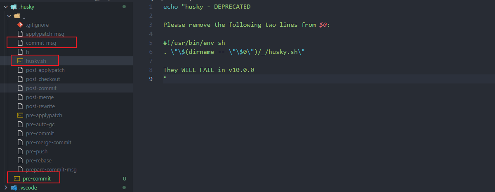

我们主要看三个文件 `pre-commit`、`commit-msg`、`husky.sh`

**pre-commit**

`commit` 前的 `git` 生命周期钩子配置文件，可以使用 `lint-staged` 来调用 ESlint、Prettier、Stylelint 进行文件校验

我们先安装 `lint-staged`

```shell
pnpm add lint-staged -D
```

安装完成之后，在 `package.json` 配置一下 `prettier、eslint、stylelint` 的执行命令

```json
{
  "lint-staged": {
    "**/*.{vue,js,ts,jsx,tsx,mjs,cjs,html,json,md}": [
      "prettier --write"
    ],
    "**/*.{vue,js,ts,jsx,tsx,mjs,cjs}": [
      "eslint --cache --fix"
    ],
    "**/*.{vue,css,scss,html}": [
      "stylelint --fix"
    ]
  },
}
```

接下来，再配置一下 `.husky/pre-commit` 文件

```bash
# pre-commit

# Run the pre-commit hook
npx --no-install -- lint-staged
```

当 `commit` 提交前会执行 `lint-staged` 命令，而 `lint-staged` 对应的就是上面 `prettier、eslint、stylelint` 的执行命令

也就是说，执行前先检查下，代码是否符合格式

> 这是 `husky V9` 的最新配置，

改一下，`src/pages/index/index.vue` 文件，触发 `eslint` 校验，然后提交

**commit-msg**

这个是 `commit` 时 `git` 生命周期钩子，主要校验 `commit`的 `message` 信息是否符合标准

为了满足需求，我们需要安装两个插件

- `@commitlint/cli` 用于校验 Git 提交信息是否符合规范
- `commitlint-config-git-commit-emoji` `message` 信息提供 `emoji` 支持，有 `emoji` 才是 `YYDS`

 ```shell
pnpm install @commitlint/cli commitlint-config-git-commit-emoji -D
 ```

接下来我们在项目根目录下创建 `commitlint.config.cjs`

```javascript
/* commitlint.config.cjs */

module.exports = {
  extends: ['git-commit-emoji'],
  prompt: {
    skipQuestions: ['scope', 'body', 'breaking', 'footer'], // 跳过 scope、body、breaking、footer 三个问题
    allowEmptyIssuePrefixs: false, //  不允许空 issue 前缀
    allowCustomIssuePrefixs: false, //  不允许自定义 issue 前缀
    userEmoji: true, // 允许使用 emoji
    emojiAlign: 'left', // emoji 位于左边

    messages: {
      type: '选择你要提交的类型 :',
      subject: '填写简短精炼的变更描述 :\n',
      confirmCommit: '是否提交或修改commit ?'
    },

    types: [
      { value: 'init', name: '🎉 init: 初始化项目', emoji: '🎉' },
      { value: 'feat', name: '✨ feat: 新增功能', emoji: '✨' },
      { value: 'fix', name: '🐞 fix: 修复bug', emoji: '🐞' },
      { value: 'docs', name: '📃 docs: 文档变更', emoji: '📃' },
      { value: 'style', name: '🌈 style: 代码格式（仅仅修改了空格、缩进、逗号等等，不改变代码逻辑）', emoji: '🌈' },
      { value: 'refactor', name: '🦄 refactor: 代码重构，没有加新功能或修复bug', emoji: '🦄' },
      { value: 'perf', name: '🎈 perf: 代码优化，比如提升性能、体验', emoji: '🎈' },
      { value: 'test', name: '🧪 test: 添加疏漏测试或已有测试改动', emoji: '🧪' },
      { value: 'build', name: '🔧 build: 构建流程、外部依赖变更 (如升级 npm 包、修改打包配置等)', emoji: '🔧' },
      { value: 'ci', name: '🐎 ci: 修改 CI 配置，例如对k8s、docker的配置文件的修改', emoji: '🐎' },
      { value: 'chore', name: '🐳 chore: 对构建过程或辅助工具和库的更改 (不影响源文件、测试用例)', emoji: '🐳' },
      { value: 'revert', name: '↩ revert: 回滚 commit', emoji: '↩' }
    ]
  }
}

```

首先，这个配置文件主要包括三个部分

- `extends`
- `messages`
- `types`

为了引入 `emoji` 提交方式的插件支持，我们安装了 `commitlint-config-git-commit-emoji`，我们就需要配置 `extends: ['git-commit-emoji']`

`prompt` 就是一些功能性配置，一个完整的 AngularJS Git提交规范包括下面这个几个

```javascript
<type>(<scope>): <subject> //消息头
<BLANK LINE> //空行
<body> //正文
<BLANK LINE> //空行
<footer> //消息尾
```

但是，实在太多东西，通常我们写 `message` 信息时基本就一句话

所以，我只保留了 `type、subject`，也即是 `skipQuestions: ['scope', 'body', 'breaking', 'footer']`

`userEmoji、emojiAlign` 的作用就是为了开启 `emoji` 配置支持，然后我们在 `types` 里面才可以配置 `emoji` 属性

而最后的 messages 就最简单了，只每个功能的提示文本，也就是下面这个

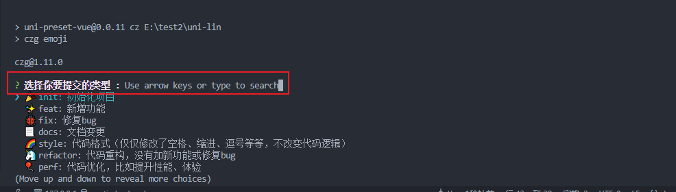 

**husky.sh**

这个文件主要是配置一下，一些敏感操作

比如，限制我们代码不能直接提交到 `master` 分支

```sh
# 获取当前分支的名称，并将其存储在 branch 变量中
branch="$(git rev-parse --abbrev-ref HEAD)"

# 限制直接提交到主分支
if [ "$branch" = "master" ]; then
  echo "您不能直接提交到 master 主分支"
  exit 1
fi
```

到了这一步，我们只是把提交规则限制做好了，具体的规范提交信息怎么来呢？

需要使用这个插件 `czg` 这个插件

```shell
pnpm add czg -D 
```

在 `package.json` 写一下执行命令

```json
{
    "scripts": {
        "cz": "czg emoji"
    }
}
```

这样我们就完美配置，git 提交配置规范了，现在来测试一下

```shell
git add .
pnpm cz
```

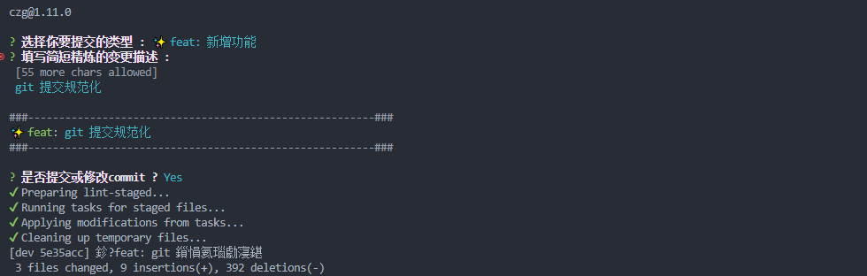 

如果，我们按规范来提交会怎么样呢？

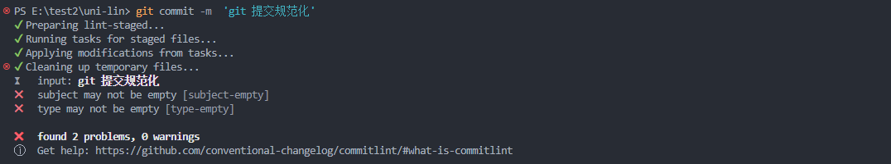 

很明显，不规范的提交，都会报错

那如果不使用命令行呢，我们使用 GUI 工具呢？我们使用 vscode 中的 `Git History` 插件提交试试看

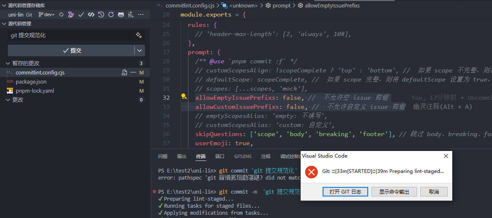

一样是会报错的，我们看下，命令输出

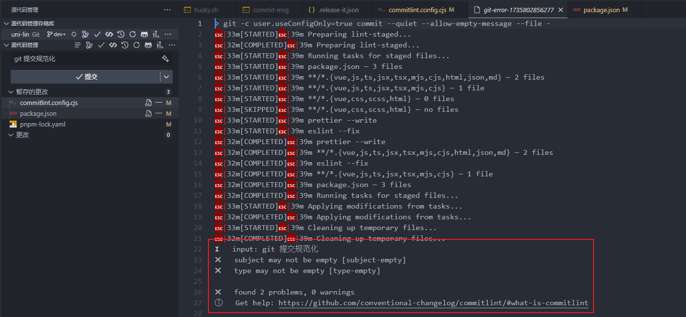

和命令行操作的错误输出一致

## GUI 工具提交

如果我们直接使用命令行来提交代码虽然也不难，但是萝卜青菜各有所爱，一部分同学喜欢 GUI 的方式进行提交

这里推荐使用 `VScode` 的 `git-commit-plugin` 插件，直接在 `VScode` 插件商店就可以找到

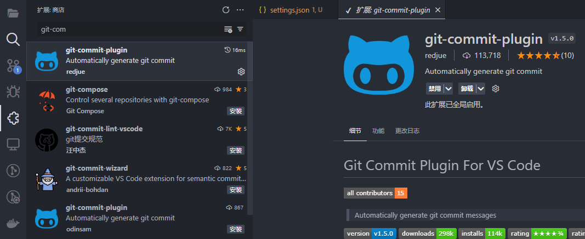 

使用的话，也非常简单啊，我们 `git add .`或者使用 `Git History` 插件点击 `+` 号

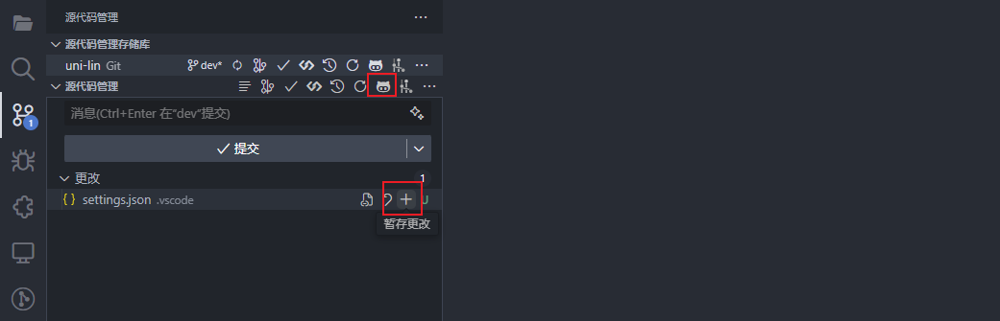 

之后，我们可以根据需要，选择提交类型

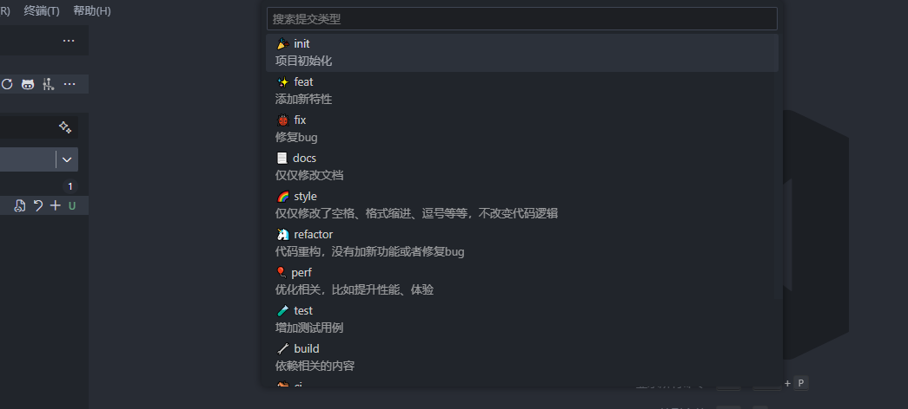根据提交情况对 `1、2、3、4` 进行选择性填写 

填完后选择，完成编写 (`Complete`)

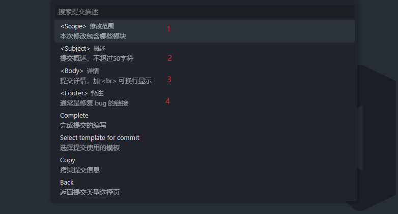 

选择完成后，生成 commit 信息，接下来我们就正常的提交了

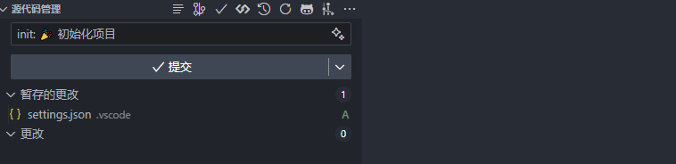 

当然啦，如果你想要自定义自己风格的提交方式也是可以的

首先，我们在根目录建立 `.vscode/settings.json` 用于配置当前项目的 `VScode` 的自定义配置

可以根据自己的需要更换，相关配置

```json
// settings.json
{
  "cSpell.words": [
    "Attributify"
  ],
  "GitCommitPlugin.ShowEmoji": true, // 提交是否显示 emoji 符号
  "GitCommitPlugin.MaxSubjectCharacters": 20, // 提交 Subject 最大字符数
  "GitCommitPlugin.CustomCommitType": [ // 自定义提交类型
    // {
    //   "key": "fix", 
    //   "label": "fix",
    //   "detail": "fix",
    //   "icon":"🐛"`
    // }
  ],
  "GitCommitPlugin.Templates": [ // 自定义提交模板
    // {
    //   "templateName": "git-cz",
    //   "templateContent": "<type>(<scope>):<space><icon><space><subject><enter><body><enter><footer>",
    //   "default":true
    // }
  ],
}
```

> 【注意】
>
> 这个插件只是用于生成 `commit` 信息，并不会提交检查等功能
>
> 检查功能还是得靠 `pre-commit` 时的 `lint-staged` 来调用 ESlint、Prettier、Stylelint 进行文件校验
>
> 如果你是 IDEA 可以使用 [git commit message helper](https://juejin.cn/post/7343811223208050729?searchId=202412261555268F40C7F051D2D2DA677A)来规范的你的提交

## 自动化生成更新日志

在 `gitee` 上随便找个项目，这样的日志他是怎么来的，是一个个手写的吗？

显然，不是那就是自动生成的，那怎么生成呢？

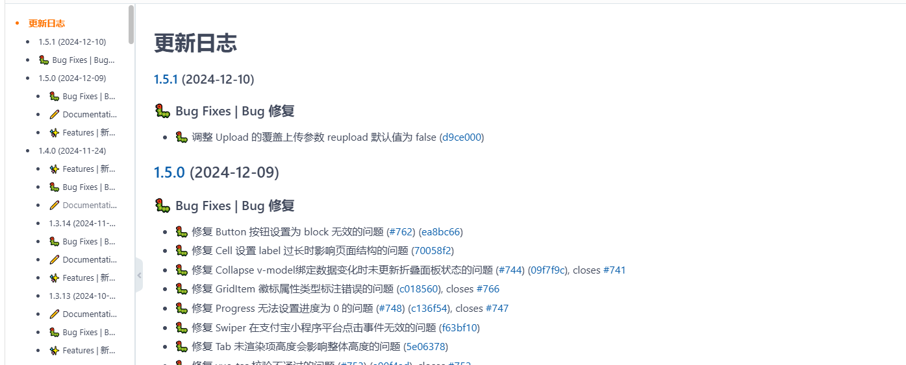

先安装下插件

```shell
pnpm add @release-it/conventional-changelog -D
```

接下来我们在项目根目录写一下配置文件 `.release-it.json`

```json
{
  "plugins": {
    "@release-it/conventional-changelog": {
      "emoji": true,
      "emojiPosition": "before",
      "infile": "CHANGELOG.md",
      "ignoreRecommendedBump": true,
      "strictSemVer": true
    }
  },
  "npm": {
    "publish": false
  },
  "git": {
    "commitMessage": "🐳 chore: release v${version}"
  },
  "github": {
    "release": false,
    "draft": false
  }
}
```

需要在 `package.json` 配置一下执行命令

```json
{
    "scripts": {
        "release": "release-it",
    }
}
```

测试一下

在此之前，我已经提交了三次代码，这三次代码我就作为一个版本进行发布一个更新日志

我们执行 `pnpm release`

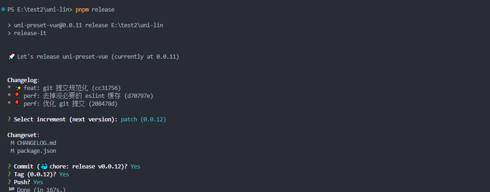 

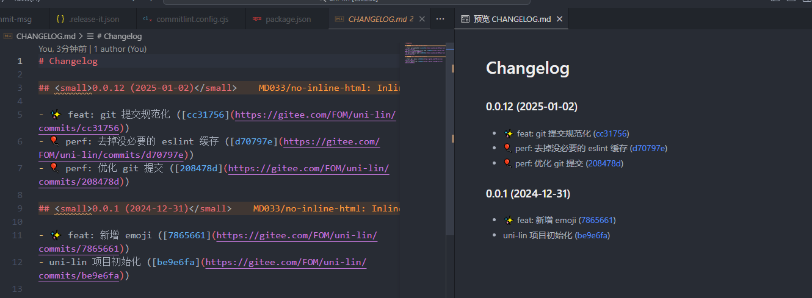

可以看到，我们的更新日志已经生成成功了

这个插件会把上一个版本之后提交的代码都作为了一个版本，生成一个 `tag`，`tag` 的内容都是根据每次提交的 `message` 信息决定的

我们在 `gitee` 上点击标签，都能看的我们提交标签历史，方便我们以后进行版本定位

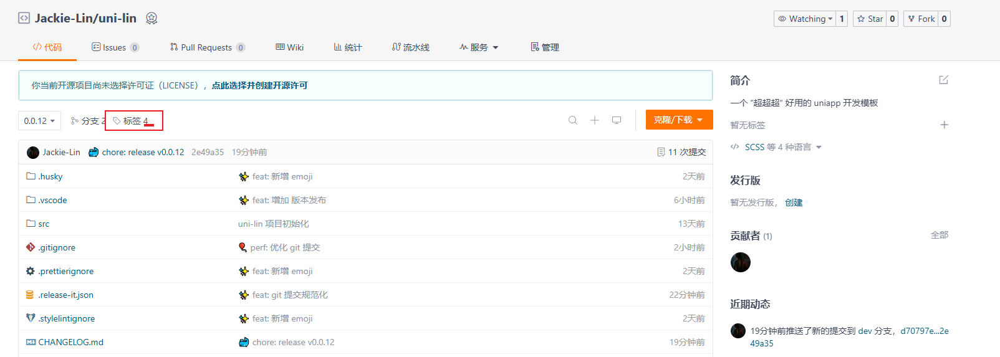

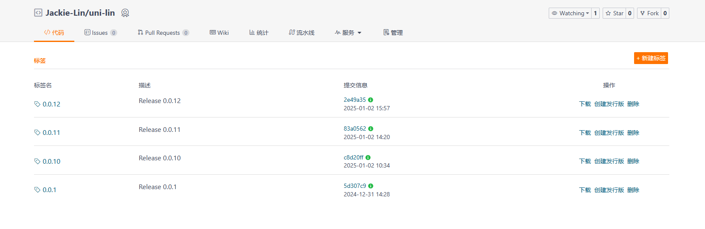

## 总结

这篇文件主要讲到，规范 git 提交信息需要从 git 生命周期入手，可以借助 `husky` 来获取

主要生命周期有二个，可以通过生命周期所属文件进行配置

- `pre-commit` 配合 `lint-staged` 插件进行 `commit` 前的代码检查
- `commit-msg` 配置 `@commitlint/cli、commitlint-config-git-commit-emoji`插件检查 `git commit message` 信息是否符合规范

两种生成规范 `git commit message` 的方式

- 命令行：`czg`

- GUI ：`git-commit-plugin`

最后我们使用 `@release-it/conventional-changelog` 生成规范性的更新日志
