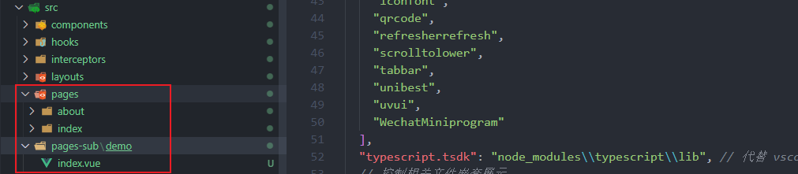
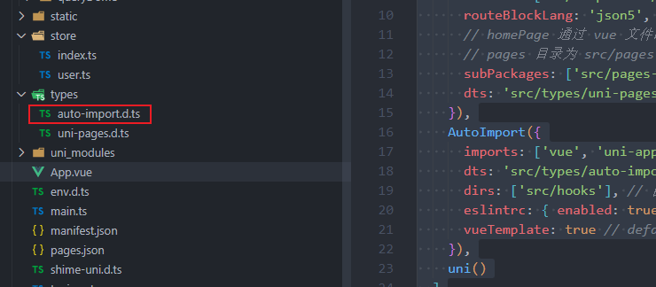
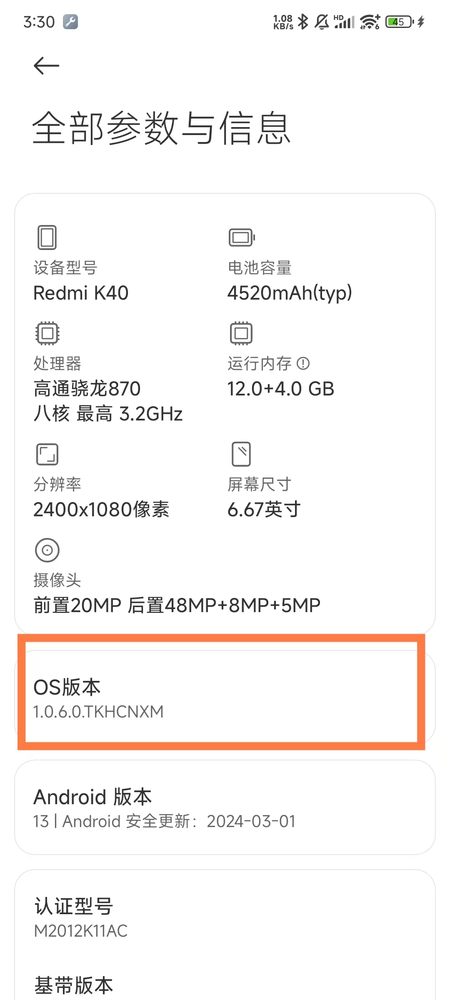
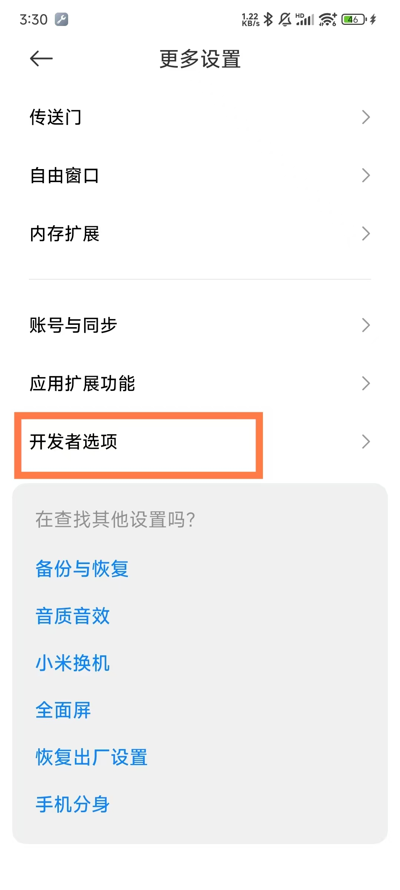
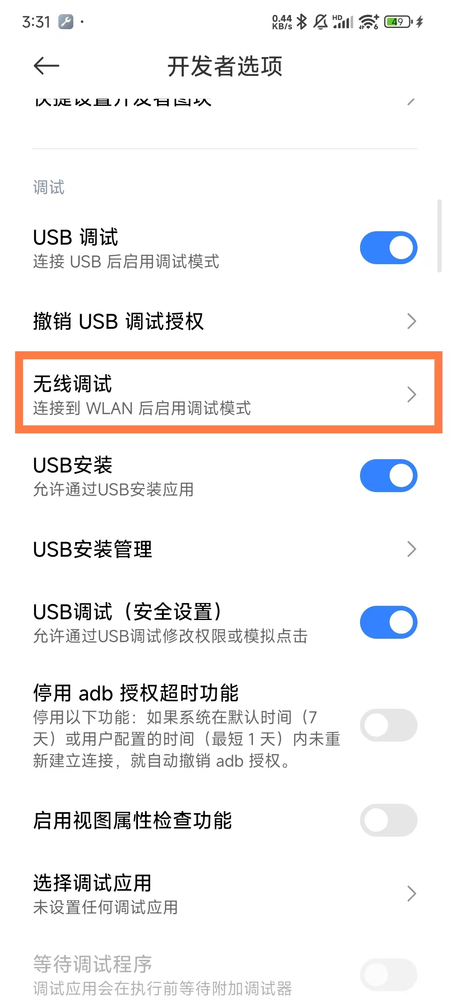
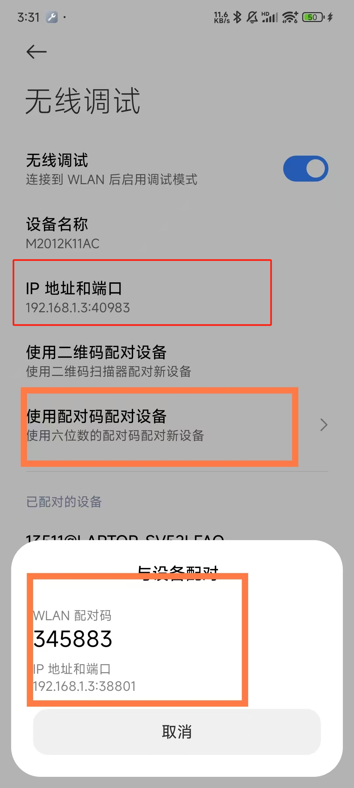
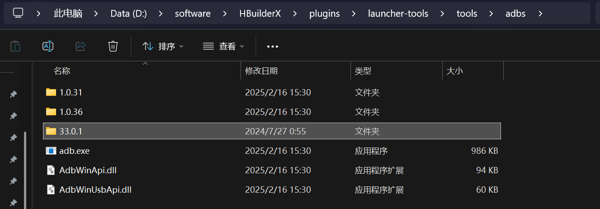
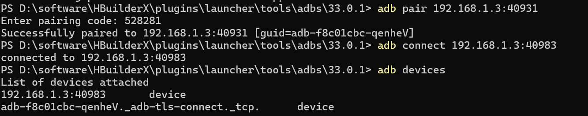
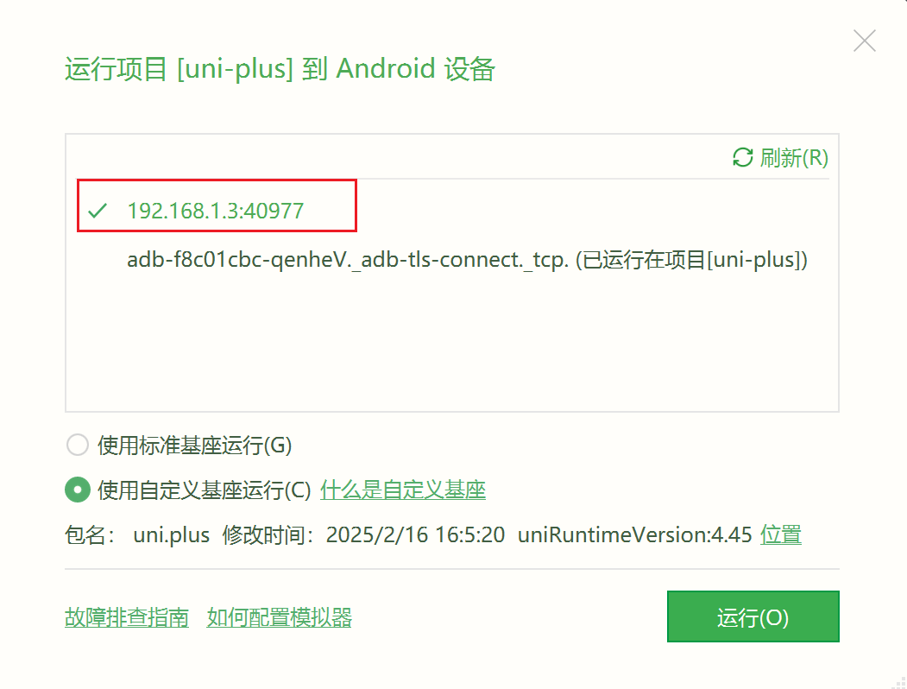

# 14-优化篇

## 分包优化

困于微信小程序限制，包的大小被限制在 2M，而我们的项目文件打包后超出了这个限制大小

为了解决这个问题，微信小程序也提出分包的解决方案，但是需要遵循下面的规则（[微信官方规则](https://developers.weixin.qq.com/miniprogram/dev/framework/subpackages/basic.html)）

**打包原则**

- 声明 `subPackages` 后，将按 `subPackages` 配置路径进行打包，`subPackages` 配置路径外的目录将被打包到主包中
- 主包也可以有自己的 `pages`，即最外层的 pages 字段。
- `subPackages` 的根目录不能是另外一个 `subPackages` 内的子目录
- `tabBar` 页面必须在主包内

**引用原则**

- `pages-sub-A` 无法 require `pages-sub-B` JS 文件，但可以 require 主包、`pages-sub-A` 内的 JS 文件；使用 [分包异步化](https://developers.weixin.qq.com/miniprogram/dev/framework/subpackages/async.html) 时不受此条限制
- `pages-sub-A` 无法 import `pages-sub-B` 的 template，但可以 require 主包、`pages-sub-A` 内的 `template`
- `pages-sub-A` 无法使用 `pages-sub-B` 的资源，但可以使用主包、`pages-sub-A` 内的资源

通常我们很多情况，并不是一开始就把分包定好的，而是开发一定阶段时，确实已经项目很大才会去分包的，所以在这种情况下

如果我们采用 `uniapp` 官方的方案，我们需要去创建分包文件夹、再去配置 `manifest.json` ，这是网上大多数的解决方案，随便一搜索就有

这里，我们才有一种新的方案进行实现，先安装一个插件 [uni-helper/vite-plugin-uni-pages](https://github.com/uni-helper/vite-plugin-uni-pages)

```shell
pnpm i @uni-helper/vite-plugin-uni-pages -D
```

我们现在需要建立一个分包，那么我在 `src` 目录下建立一个 `pages-sub` 文件夹，当然如果你想要继续分包，可以再建立 `pages-sub-2、pages-sub-3` ...

然后把需要分包的页面放入分包文件夹（不能是 `tabBar` 页面），如果有跳转链接需要替换成分包的路径

 

然后在 `vite.config.ts` 中配置一下

```json
import { defineConfig } from "vite";
import uni from "@dcloudio/vite-plugin-uni";
import UniPages from '@uni-helper/vite-plugin-uni-pages'

export default defineConfig({
  plugins: [
    UniPages({
      exclude: ['**/components/**/**.*'], // 排除的文件
      routeBlockLang: 'json5', // 虽然设了默认值，但是vue文件还是要加上 lang="json5", 这样才能很好地格式化
      // homePage 通过 vue 文件的 route-block 的type="home"来设定
      // pages 目录为 src/pages，分包目录不能配置在pages目录下
      subPackages: ['src/pages-sub'], // 是个数组，可以配置多个，但是不能为pages里面的目录
      dts: 'src/types/uni-pages.d.ts', // 生成的类型文件，默认是 src/types/uni-pages.d.ts
    }),
    uni()
  ],
});
```

需要注意 2 点

1. 默认 `src/pages` 里面的 `vue` 文件都会生成一个页面，如果不需要生成页面可以在 `exclude` 配置中排除
2. 设置分包，可以在 `subPackages` 中加入分包文件夹路径，注意分包的目录不能为 `src/pages` 里面的子目录，并且不能是 `tabbar` 页面

设置主页，我们可以采用这样的写法，如果不是主页，不写 `type` 或者为 `page` 即可

```vue
<!-- 使用 type="home" 属性设置首页，其他页面不需要设置，默认为page -->
<!-- 推荐使用json5，更强大，且允许注释 -->
<route lang="json5" type="home">
{
  style: {
    navigationStyle: 'custom',
    navigationBarTitleText: '首页',
  },
}
</route>

<template>
  <div>
    <h1>主页</h1>
  </div>
</template>
```

除了分包的功能，还可以与 [@uni-helper/vite-plugin-uni-layouts](https://uni-helper.js.org/vite-plugin-uni-layouts) 配合实现类似 `Nuxt` 的 `layouts` 系统，具体详情看本专栏的 **Layout篇**

虽然我们只列举了微信小程序的做法，但是不止微信小程序可以做分包优化，QQ 小程序、百度小程序 ... 都可以做[分包优化](https://uniapp.dcloud.net.cn/collocation/manifest.html#关于分包优化的说明)

> PS: 如果你想了解更多 `uni-helper/vite-plugin-uni-pages` 的用法可以看 [这里](https://github.com/uni-helper/vite-plugin-uni-pages)

## 上传优化

> 【注意】这个优化只针对 **微信小程序上传** 进行的优化

**如何使用网络图片替换本地图片？**

通常我们使用 `uniapp` 开发微信小程序的时候，因为文件太大导致无法上传，即使分包了，还是太多很大一部分原因是本地图片/图标太大

对此，我们需要把图片/图标放到服务器上，然后通过网络图片/图标的形式进行引入

但是，会有这样一个问题

图片图标替换成网络链接后，原来的图片图标怎么办，要删除了吗？

当然是不行的，我们还是保存在原来的位置（比如 `static/img` 中），然后上传到代码仓库上，以后要是出现服务器图片丢失，不就有可以补救了嘛

那不删除，那我打包后，包太大了，使用微信开发者工具无法上传啊~

那我把资源文件，拿出来再打包，打包上传完再放回去不就行啦，也可以，就是比较麻烦呀

要是有一个配置，能在打包的时候，把我的图片/图标的存放文件夹忽略掉，不打包进去，不就行啦！

想法很美好，现实很残酷，可惜，uniapp 没有**打包时**忽略资源文件的配置，但是微信小程序有一个配置，可以在**上传时**忽略打包后的文件的配置

比如，我想忽略 `static/img` 文件夹下的所有文件，原生小程序中只需要在 `project.config.json` 配置这个就可以了

 

`uniapp` 中，我们需要在 `manifest.json` 中这样配置

```json
// manifest.json
{
    "mp-weixin" : {
        "packOptions": {
            "ignore": [
                // 这里就是需要忽略的文件/文件夹
                {
                    "type": "folder",
                    "value": "static/img"
                }
            ]
        }
    },
}
```

如果你使用了 `@uni-helper/vite-plugin-uni-manifest` 插件，那就需要在 `manifest.config.ts` 中配置

```typescript
import { defineManifestConfig } from '@uni-helper/vite-plugin-uni-manifest'

export default defineManifestConfig({
  /* 小程序特有相关 */
  'mp-weixin': {
    packOptions: {
      ignore: [
        // 这里就是需要忽略的文件/文件夹
        {
          type: "folder",
          value: "static/img"
        }
      ]
    }
  }
})
```

这样就会把配置同步到 `manifest.json` 中，打包后会生成微信小程序 `project.config.json` 的配置项


之后，使用开发者工具上传一下，记得把 **压缩代码、过滤文件** 这个 4个选项勾上能更好的减少上传代码的体积

 

如果你不想每次都勾选，也可以在 `manifest.json` 中进行配置，上面的配置就会自动勾选了

```json
{
    "mp-weixin" : {
        setting: {
          minifyWXML: true, // 上传代码时自动压缩wxml文件
          minifyWXSS: true, // 上传代码时自动压缩样式文件
          minified: true, // 上传代码时自动压缩脚本文件
          ignoreUploadUnusedFiles: true, // 上传时过滤无依赖文件
        }
    }
}
```


点击上传后，可以看到上传时 `static/img` 文件夹下的文件都被忽略了，完美 😎

## 导入优化

```typescript
import { ref } from 'vue'
const name = ref('name')
```

每次编写响应式数据的时候都得引入 ref 就很麻烦有没有什么办法，就是不用写导入，就直接能用了

那就得使用 `unplugin-auto-import` 了

```shell
pnpm add unplugin-auto-import -D
```

使用这个也很简单，需要在 `vite.config.ts` 配置下

```typescript
import { defineConfig } from 'vite'
import uni from '@dcloudio/vite-plugin-uni'
import AutoImport from 'unplugin-auto-import/vite'

export default defineConfig({
  plugins: [
    AutoImport({
      imports: ['vue', 'uni-app'],
      dts: 'src/types/auto-import.d.ts',
      dirs: ['src/hooks'], // 自动导入 hooks
      eslintrc: { enabled: true },
      vueTemplate: true // default false
    }),
    uni()
  ]
})
```

配置好了，我们重启下，然后只要其他文件保存了有需要导入，就会自动生成 `auto-import.d.ts` 文件

 

【注意】如果还是没有自动生成这个文件就自己建一个

还有一个问题，我们这样写并且运行是没问题了，但是提交时，`eslint` 校验不通过啊~

再配置一下，`eslint.config.mjs`

需要注意，这是 `eslint V9` 以上的版本的写法用扁平化写法，与旧版本有很大差别，旧版本的配置就不写了，网上一搜索很多

```typescript
// eslint.config.mjs

import { readFile } from 'node:fs/promises'

const autoImportFile = new URL('./.eslintrc-auto-import.json', import.meta.url)
const autoImportGlobals = JSON.parse(await readFile(autoImportFile, 'utf8'))

const config = [
  {
    languageOptions: {
      globals: {
        ...autoImportGlobals.globals
      }
    }
  }
]

export default config
```

## 调试优化

通常我们调试 `APP` (安卓) 都是使用 `USB` 线连接调试太麻烦了

从 `Android 11` 开始[USB调试](https://so.csdn.net/so/search?q=USB调试&spm=1001.2101.3001.7020)新增了无线调试功能，需要搭配 `adb 30.0.0` 及以上版本使用，请确认你的系统和 [adb](https://so.csdn.net/so/search?q=adb&spm=1001.2101.3001.7020) 是否符合要求

`adb` 最新版本下载入口： [SDK Platform Tools版本说明](https://developer.android.google.cn/studio/releases/platform-tools)

下面以 **红米K40** 为例，快速点击 OS 版本，进入开发者模式

 

保证手机和电脑在同一局域网的情况下，进入开发者选项开启 `USB` 无线调试。

 

 

开启之后点击无线调试，可以看到 [Android](https://so.csdn.net/so/search?q=Android&spm=1001.2101.3001.7020) 设备无线调试所使用的 `IP` 和 端口 

 

然后，我们把将之前下载好的 `platform-toos` 文件夹移动到 `HBuilderX` 提供的adb目录下：



并重命名为 33.0.1，并打开 CMD 窗口



`adb pair` 连接弹窗中的 `IP` 与 端口号，注意 `pairing code` 就是配对码

`adb connect` 连接非弹框中的 `IP` 与 端口号

`adb devices` 用于查看已连接设备

 

选择这个 `IP + 端口` 的调试即可
