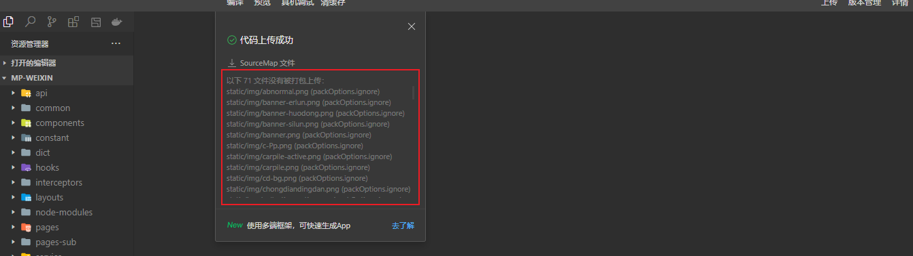

# 14-优化篇

## 分包

## 网络图片替换本地图片

通常我们使用 uniapp 开发微信小程序的时候，因为文件太大导致无法上传，即使分包了，还是太多很大一部分原因是本地图片/图标太大

对此，我们需要把图片/图标放到服务器上，然后通过网络图片/图标的形式进行引入

但是，会有这样一个问题

图片图标替换成网络链接后，原来的图片图标怎么办，要删除了吗？

当然是不行的，我们还是保存在原来的位置（比如 `static/img` 中），然后上传到代码仓库上，以后要是出现服务器图片丢失，不就有可以补救了嘛

那不删除，那我打包后，包太大了，使用微信开发者工具无法上传啊~

那我把资源文件，拿出来再打包，打包上传完再放回去不就行啦，也可以，就是比较麻烦呀

要是有一个配置，能在打包的时候，把我的图片/图标的存放文件夹忽略掉，不打包进去，不就行啦！

想法很美好，现实很残酷，可惜，uniapp 没有**打包时**忽略资源文件的配置，但是微信小程序有一个配置，可以在**上传时**忽略打包后的文件的配置

比如，我想忽略 `static/img` 文件夹下的所有文件，原生小程序中只需要在 `project.config.json` 配置这个就可以了

 

`uniapp` 中，我们需要在 `manifest.json` 中这样配置

```json
// manifest.json
{
    "mp-weixin" : {
        "packOptions": {
            "ignore": [
                // 这里就是需要忽略的文件/文件夹
                {
                    "type": "folder",
                    "value": "static/img"
                }
            ]
        }
    },
}
```

如果你使用了 `@uni-helper/vite-plugin-uni-manifest` 插件，那就需要在 `manifest.config.ts` 中配置

```typescript
import { defineManifestConfig } from '@uni-helper/vite-plugin-uni-manifest'

export default defineManifestConfig({
  /* 小程序特有相关 */
  'mp-weixin': {
    packOptions: {
      ignore: [
        // 这里就是需要忽略的文件/文件夹
        {
          type: "folder",
          value: "static/img"
        }
      ]
    }
  }
})
```

这样就会把配置同步到 `manifest.json` 中，打包后会生成微信小程序 `project.config.json` 的配置项


之后，使用开发者工具上传一下，记得把 **压缩代码、过滤文件** 这个 4个选项勾上能更好的减少上传代码的体积

 

如果你不想每次都勾选，也可以在 `manifest.json` 中进行配置，上面的配置就会自动勾选了

```json
{
    "mp-weixin" : {
        setting: {
          minifyWXML: true, // 上传代码时自动压缩wxml文件
          minifyWXSS: true, // 上传代码时自动压缩样式文件
          minified: true, // 上传代码时自动压缩脚本文件
          ignoreUploadUnusedFiles: true, // 上传时过滤无依赖文件
        }
    }
}
```



点击上传后，可以看到上传时 `static/img` 文件夹下的文件都被忽略了，完美 😎
