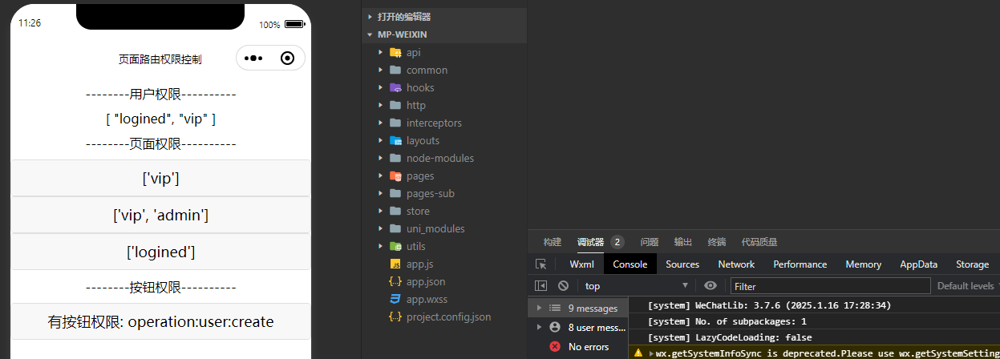

# 15-权限篇

## 前言

权限控制，就前端而言有两种

- 页面权限
- 按钮权限

页面权限的话，还好说，我们可以通过拦截器，来捕获路由信息，判断是否有权限跳转

而按钮权限，`web` 端是 `vue` 是通过自定义指令实现的，但是 `uniapp` 或者准确点来说是微信小程序端，没有自定义指令这个功能

那我们要怎么实现这个功能呢？

为了与 `web` 使用方式类似，可以通过 `vite` 插件系统来实现类似自定义指令的效果，具体实现方式可以看 **按钮权限控制** 部分

## 路由权限控制


```typescript
// src/interceptors/router.ts
import { useUserStore } from '@/store'
import { getPermissionKeysByPath } from '@/utils'

const loginRoute = '/pages/routerDemo/login'

// 获取用户权限标识
const getUserPermissionKeys = () => {
  const userStore = useUserStore()
  return userStore.getUserPermissionKeys
}

/**
 * 实现原理：
 * 1. 或者所有需要登录的路由，存到黑名单，需要在 route-block 配置标识 key，根据 isNeedLogin 判断是否需要登录
 * 2. 在路由跳转前，判断是否需要登录，如果需要登录，判断是否已经登录，如果没有登录，跳转到登录页
 **/
const navigateToInterceptor = {
  invoke({ url }: { url: string }) {
    // 'pages.json' 里面的 path 是 'pages/index/index'
    // url 如果带参数则是 /pages/route-interceptor/index?name=uni-plus，所以需要去掉带的参数、去掉前面的 /
    const path = url.split('?')[0].slice(1) // pages/index/index
    // 用户已有权限
    const userPermissionKeys = getUserPermissionKeys() // ['logined', 'vip']
    // 页面所需权限
    const pageRoutePaths = getPermissionKeysByPath(path) // ['vip']
    // 两个权限取交集，然后交集再与用户权限取补集
    const LackPermissionKeys = pageRoutePaths.filter(item => !userPermissionKeys.includes(item))

    // 如果有权限就放行
    if (LackPermissionKeys.length === 0) {
      return true
    }

    /* ---------- 无权限，对缺少各种权限做处理 --------- */
    // 如果缺少登录权限，跳转到登录页
    if (LackPermissionKeys.includes('logined')) {
      const redirectRoute = `${loginRoute}?redirect=${encodeURIComponent(url)}`
      uni.navigateTo({ url: redirectRoute })
    }
    // 如果缺少其他权限，提示无权限，需要其他权限特殊判定可以继续添加
    else {
      uni.showToast({
        title: '无权限访问',
        icon: 'none'
      })
    }
    return false
  }
}

export const routerInterceptor = {
  install() {
    uni.addInterceptor('navigateTo', navigateToInterceptor)
    uni.addInterceptor('reLaunch', navigateToInterceptor)
    uni.addInterceptor('redirectTo', navigateToInterceptor)
    uni.addInterceptor('switchTab', navigateToInterceptor)
  }
}
```

这里主要实现路由权限，实现了黑名单拦截，权限不够就拦截

*比如现在用户权限是 ['logined', 'vip'] 那么他能进入就只能是 permissionKeys 在 ['logined', 'vip'] 范围里面的路由*

如果页面 permissionKeys 是 ['logined', 'vip', 'admin']，那么这个页面就无法被当前用户访问*

如果页面 permissionKeys 是 ['logined']、['logined', 'vip']，或者没有 permissionKeys 那么这个页面可以被当前用户访问

**用户权限**，通过 `pinia` 去拿，为了保证每次都是拿到最新数据，我们通过一个函数 `getUserPermissionKeys` 进行获取

```typescript
const getUserPermissionKeys = () => {
  const userStore = useUserStore()
  return userStore.getUserPermissionKeys
}
```

**页面权限**，通过 `getPermissionKeysByPath()` 去拿

这个函数，我们在 `src/utils/router.ts` 中实现

```typescript
import { pages, subPackages } from '@/pages.json'

export const getPermissionKeysByPath = (path: string): string[] => {
  let navigateToPage
  if (path.split('/')[0] === 'pages') {
    navigateToPage = pages.find(page => page.path === path)
  } else {
    navigateToPage = subPackages.find((page: Record<string, any>) => page.path === path)
  }
  return navigateToPage ? navigateToPage.permissionKeys || [] : []
}
```

其中页面权限的定义，我们通过 `route-block` 进行实现，也就是这样

```vue
<route lang="json5" type="page">
{
  style: {
    navigationBarTitleText: '页面1'
  },
  permissionKeys: ['vip']
}
</route>
```

然后，跳转到每个页面前先拦截判断，用户权限是否符合页面权限，如果符合，就可以进入页面啦~

```typescript
const navigateToInterceptor = {
  invoke({ url }: { url: string }) {
    // 'pages.json' 里面的 path 是 'pages/index/index'
    // url 如果带参数则是 /pages/route-interceptor/index?name=uni-plus，所以需要去掉带的参数、去掉前面的 /
    const path = url.split('?')[0].slice(1) // pages/index/index
    // 用户已有权限
    const userPermissionKeys = getUserPermissionKeys() // ['logined', 'vip']
    // 页面所需权限
    const pageRoutePaths = getPermissionKeysByPath(path) // ['vip']
    // 两个权限取交集，然后交集再与用户权限取补集
    const LackPermissionKeys = pageRoutePaths.filter(item => !userPermissionKeys.includes(item))

    // 如果有权限就放行
    if (LackPermissionKeys.length === 0) {
      return true
    }

    /* ---------- 无权限，对缺少各种权限做处理 --------- */
    // 如果缺少登录权限，跳转到登录页
    if (LackPermissionKeys.includes('logined')) {
      const redirectRoute = `${loginRoute}?redirect=${encodeURIComponent(url)}`
      uni.navigateTo({ url: redirectRoute })
    }
    // 如果缺少其他权限，提示无权限，需要其他权限特殊判定可以继续添加
    else {
      uni.showToast({
        title: '无权限访问',
        icon: 'none'
      })
    }
    return false
  }
}
```

拦截的核心就是这个函数，对 用户权限与页面权限取交集，交集再与页面权限取补集

```typescript
const LackPermissionKeys = pageRoutePaths.filter(item => !userPermissionKeys.includes(item))
```

比如

- 用户权限：`['vip', 'logined', 'admin']`
- 页面权限：`['vip', 'logined']`

用户权限与页面权限 取交集：`['vip', 'logined']`

页面权限与交集 取补集：`[]`

也就是 `LackPermissionKeys` 为 `[]`

```typescript
// 如果有权限就放行
if (LackPermissionKeys.length === 0) {
  return true
}
```

> 在拦截器函数中返回 true，页面就会跳转，返回 false 就不会跳转

无权限的处理，我们可以通过，判断 `LackPermissionKeys` 有哪些权限，也即用户还需要哪些权限进行单独处理

```typescript
/* ---------- 无权限，对缺少各种权限做处理 --------- */
// 如果缺少登录权限，跳转到登录页
if (LackPermissionKeys.includes('logined')) {
  const redirectRoute = `${loginRoute}?redirect=${encodeURIComponent(url)}`
  uni.navigateTo({ url: redirectRoute })
}
// 如果缺少其他权限，提示无权限，需要其他权限特殊判定可以继续添加
else {
  uni.showToast({
    title: '无权限访问',
    icon: 'none'
  })
}
return false
```

现在只实现对登录的权限控制，缺少登录权限的话，就跳转到登录页，并在跳转路由上加入重定向路径

登录完成后，跳回登录前的页面

现在还需要在 `src/utils/router.ts` 中实现，重定向的功能


```typescript
// src/utils/router.ts
const getLastPage = () => {
  const pages = getCurrentPages()
  return pages[pages.length - 1]
}

const getUrlObj = (url: string) => {
  const [path, queryStr] = url.split('?')

  if (!queryStr) {
    return {
      path,
      query: {}
    }
  }
  const query: Record<string, string> = {}
  queryStr.split('&').forEach(item => {
    const [key, value] = item.split('=')
    query[key] = ensureDecodeURIComponent(value) // 这里需要统一 decodeURIComponent 一下，可以兼容h5和微信y
  })
  return { path, query }
}

export const redirectRouteTo = () => {
  // 获取上一页路由路径
  const lastPage = getLastPage()
  const currRoute = (lastPage as any).$page
  const { fullPath } = currRoute as { fullPath: string }
  // 获取上一页路由路径的 query 参数
  const { query } = getUrlObj(fullPath)
  // 获取上一页路由路径的 query 参数中的 redirect 参数
  const { redirect } = query
  if (redirect) {
    uni.redirectTo({
      url: redirect
    })
    return true
  } else {
    return false
  }
}
```

根据当前路由路径，判定是否有重定向路径 `redirect`，如果有则跳转，没有则返回 `false`（不做任何操作）

我们来测试一下，写下 `index.vue、login.vue、page1.vue、page2.vue、page3.vue` 用于测试


```vue
<!-- src/routerDemo/index.vue -->
<route lang="json5" type="home">
{
  style: {
    navigationBarTitleText: '页面路由权限控制'
  }
}
</route>

<template>
  <div class="w-100vw flex justify-center items-center m-y-20rpx">--------用户权限----------</div>
  <div class="w-100vw flex justify-center items-center m-y-20rpx">{{ getUserPermissionKeys() }}</div>
  <div class="w-100vw flex justify-center items-center m-y-20rpx">--------页面权限----------</div>
  <button @click="goToPage1">['vip']</button>
  <button @click="goToPage2">['vip', 'admin']</button>
  <button @click="goToPage3">['logined']</button>
</template>

<script setup lang="ts">
import { useUserStore } from '@/store'

const getUserPermissionKeys = () => {
  const userStore = useUserStore()
  return userStore.getUserPermissionKeys
}

// 跳转到页面1
const goToPage1 = () => {
  uni.navigateTo({
    url: '/pages/routerDemo/page1'
  })
}

// 跳转到页面2
const goToPage2 = () => {
  uni.navigateTo({
    url: '/pages/routerDemo/page2'
  })
}

// 跳转到页面3
const goToPage3 = () => {
  uni.navigateTo({
    url: '/pages/routerDemo/page3'
  })
}
</script>
```

```vue
<!-- src/routerDemo/login.vue -->
<route lang="json5" type="page">
{
  style: {
    navigationBarTitleText: '登录页'
  }
}
</route>

<template>
  <button @click="login">使用假数据模拟登录</button>
</template>

<script setup lang="ts">
import { useUserStore } from '@/store'
import { redirectRouteTo } from '@/utils'
const userStore = useUserStore()

/* 假登录 */
const login = () => {
  userStore.setUserInfo({
    accessToken: 'fakeAccessToken',
    refreshToken: 'fakeRefreshToken'
  })
  // 如果有重定向路径，跳转才有效
  redirectRouteTo()
}
</script>
```

```vue
<!-- src/routerDemo/page1.vue -->
<route lang="json5" type="page">
{
  style: {
    navigationBarTitleText: '页面1'
  },
  permissionKeys: ['vip']
}
</route>

<template>
  <h1>页面1</h1>
</template>
```

```vue
<!-- src/routerDemo/page2.vue -->
<route lang="json5" type="page">
{
  style: {
    navigationBarTitleText: '页面2'
  },
  permissionKeys: ['vip', 'admin']
}
</route>

<template>
  <h1>页面2</h1>
</template>
```

```vue
<!-- src/routerDemo/page3.vue -->
<route lang="json5" type="page">
{
  style: {
    navigationBarTitleText: '页面3'
  },
  permissionKeys: ['logined']
}
</route>

<template>
  <h1>页面3</h1>
</template>
```

我们来运行一下看下效果


原本我们的用户权限只有 ['vip'] 所以，只能访问 第一个按钮所跳转的页面

第三个按钮是需要登录权限，点击进去因为没有权限，跳转到 登录页，登录完成后，重定向到页面3

回到首页，可以看到用户权限已经变成 ['logined', 'vip']，点击第三个按钮就能直接跳转到页面3了

## 按钮权限控制

`web` 端的按钮权限控制，想必很多同学都用过

```vue
<button v-perms="['operation:user:create']">按钮权限</button>
```

从后端获取权限列表，然后通过自定义指令 `v-perms` 获取到权限字段 `operation:user:create`

如果存在的话就显示元素，否则就隐藏元素

```typescript
// 从后端的获取权限列表，通常获取后存在缓存中，我们使用 pinia 获取
userBtnPermission: ["operation:user:create", "operation:user:update"]
```

由于微信小程序限制，我们没法使用自定义指令，所以我们可以通过 vite 插件的形式

把 `<template>` 中所有 `v-perms="['operation:user:create']"` 都转换成 `v-if="perms(['operation:user:create'])"`

`checkBtnPermission` 是一个全局函数，该函数主要功能是将 “用户按钮权限” 与 “按钮所需权限” 做对比

先在 `src/utils/router.ts` 中编写下 `checkBtnPermission`


```typescript
import { useUserStore } from '@/store'

export const checkBtnPermission = (btnPermissions: string[]) => {
  const store = useUserStore() // 放函数内是为了保证，每次调用都获取最新的用户权限
  const userBtnPermissions = store.getUserBtnPermission // 用户已有按钮权限
  const intersectionPermissions = btnPermissions.filter(item => userBtnPermissions.includes(item)) // 用户已有按钮权限与当前按钮权限的交集
  return !!(intersectionPermissions.length === btnPermissions.length)
}
```

判断其实也很简单哈

就是 “用户按钮权限” 与 “按钮所需权限” 做交集

再判断 ”交集的长度“ 与 ”按钮权限长度“ 是否一致

如果挂载到全局呢？可以通过 `app.config.globalProperties.$perms` 将 `perms` 挂载到全局

```typescript
import { createSSRApp } from 'vue'
import { checkBtnPermission } from './utils'
import App from './App.vue'

export function createApp() {
  const app = createSSRApp(App)
  app.config.globalProperties.$perms = checkBtnPermission
  return {
    app
  }
}
```

接下来就是最关键的部分，`vite` 插件的实现

`vite` 都是放在 `plugins` 配置下导入，而这个插件需要最优化度高一些，那么得传入一些参数，比如 指令名称


在 `src/vite-plugin/vite-plugin-directives.ts` 中我们编写下`vite` 插件

```typescript
import { Plugin } from 'vite'
import { parse } from 'vue/compiler-sfc'

const vitePluginDirectives = ({ directives = 'v-perms' }): Plugin => {
  return {
    name: 'vite-plugin-directives',
    // code 是源码，path 是文件路径
    transform(code, path) {
      try {
        if (!/.vue$/.test(path)) return null //  如果不是vue文件，则返回null
        const parseCode = parse(code) // parse 的作用是将源码解析成 ast
        if (!parseCode) return null //  如果解析失败，则返回null
        if (!parseCode.descriptor?.template?.content) return null // 如果没有模板内容，则返回null

        // 正则匹配 (根据传入的指令名称) /v-perms="([^"]+)"/g
        const reg = new RegExp(`${directives}="([^"]+)"`, 'g') // 匹配指令
        const checkPermsName = directives.slice(2) // 检查函数名称 与 指令名称一致
        const $code = parseCode.descriptor.template.content.replace(reg, `v-if="$${checkPermsName}($1)"`) // 模板内容
        return {
          code: code.replace(parseCode.descriptor.template.content, $code)
        }
      } catch (error) {
        return null
      }
    }
  }
}

export default vitePluginDirectives
```

大家有没有发现，说的高大上一点就是 `vite` 插件

通俗的说不就是一个函数，然后函数里返回一些配置嘛

- `name` 为插件名称
- `transform` 代码转译，这个函数的功能类似于 `webpack` 的 `loader`

`transfrom` 参数

- `code` 源码
- `path` 是文件路径

```typescript
if (!/.vue$/.test(path)) return null //  如果不是vue文件，则返回null
const parseCode = parse(code) // parse 的作用是将源码解析成 ast
if (!parseCode) return null //  如果解析失败，则返回null
if (!parseCode.descriptor?.template?.content) return null // 如果没有模板内容，则返回null
```

先对文件进行判断，我们只需要 `.vue` 结尾的文件，通过正则对路径判断

`parse` 将 源码转成 `ast` 树，方便我们查找

`path、code、parseCode` 内容结构如下

 

 

```typescript
// 正则匹配 (根据传入的指令名称) /v-perms="([^"]+)"/g
const reg = new RegExp(`${directives}="([^"]+)"`, 'g') // 匹配指令
const checkPermsName = directives.slice(2) // 检查函数名称 与 指令名称一致
const $code = parseCode.descriptor.template.content.replace(reg, `v-if="$${checkPermsName}($1)"`) // 模板内容
return {
  code: code.replace(parseCode.descriptor.template.content, $code)
}
```

我们只需对 `tempalte` 中的内容进行判断，并通过正则将 自定义指令 转为 `v-if` 进行判断

并且我们传入了 `directives` 也是就自定义指令的名称，我们通过 `new RegExp` 加到正则中

因为 `directives` 是 `v-xxx` 的结构，替换为 `v-if=$xxx()` 中的函数，需要去掉 `v-`

所以，通过 `slice` 只拿 `v-` 后面的内容

最后，把 替换后的源码 返回

至此，我们的按钮权限就完成了，我们来测试下




我们用户已有按钮权限是 `userBtnPermission: ['operation:user:create', 'operation:user:update']`

而我们定义了两个按钮

- 第一个按钮权限为 `operation:user:create` ，这权限我们有，所以显示在页面上
- 第二个按钮权限为 `operation:user:delete` ，这权限我们没有，所以页面上没有显示

```vue
<button v-perms="['operation:user:create']">有按钮权限: operation:user:create</button>
<button v-perms="['operation:user:delete']">无按钮权限: operation:user:delete</button>
```

## 总结

页面权限，我们主要通过拦截器获取到页面的 `url`

然后去拿 `route-block` 中页面权限，然后和用户已有的页面权限进行对比

之后，通过拦截器函数，返回 `true` 放行，返回 `false` 拦截

并且，对缺少了登录权限进行特殊处理

如果页面缺失了登录权限，就会跳转到登录页，并加上重定向路径

编写重定向函数，登录完成后再重定向回去

后续，可以在这个基础，继续增加缺失特殊权限的处理，比如，页面缺少 `vip` 权限，那就跳到购买 `vip` 的页面等等

按钮权限的话，因为微信小程序没有自定义指令，为了实现这个功能

定义全局判断函数 `checkBtnPermission`，并在 `main.ts` 中注册成全局函数

编写自定义 `vite` 插件

介绍了 匹配文件、源码转 `ast`、源码替换

最终将源码中 `v-perms="['operation:user:create']"` 都转换成 `v-if="perms(['operation:user:create'])"`
