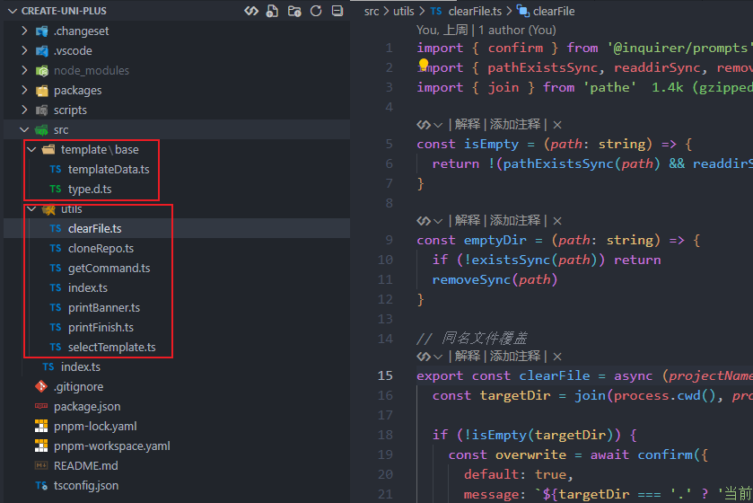
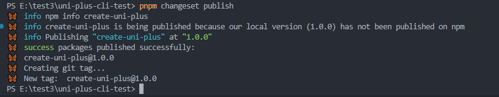

# 16-Cli篇

## 定制脚手架

一般公司往往都会根据公司主要技术栈，预先搭建好自己的一套项目模板，存放在公司的代码仓库中

例如 `template-web、template-h5、tempalte-uniapp` 等，在开发新项目的时候，只需要下载项目模板即可快速进行开发

但每次都得打开公司的代码仓库，找到对应模板进行下载，是麻烦了些~

这时就可以开发一套命令行指令，像 `create-vite-app` 一样能够自己找到对应模板后，

自动下载模板下来，提高项目开发前的一点点体验

## 功能简介

我们即将开发的 `cli` 脚手架应该具备的能力

- 解析命令行能力，能拿到命令行输入的项目名
- 提供命令行交互能力，选择模板
- 根据选择模板的 `git` 地址下载指定的项目模板
- 判断路径是否存在同名文件，提供是否覆盖功能

## 常用 node 包

以下是开发 cli 过程中可能会使用到的包，只简述大概功能，更多细节功能

用到的时候再去查对应文档即可

- `colorette` - 命令行输出着色
- `esbuild` - `cli` 打包
- `git-clone` - 用于下载仓库和执行 `git` 命令，支持 `promise`
- `fs-extra` - `nodejs` 中的 `fs` 替代，用于操作文件
- `prompts` - 解析命令行中 `-n`、`-t`... 等参数
- `@inquirer/prompts` - 命令行交互，提供 `input`、`select` ... 等操作
- `pathe` - 处理路径，与 `path` 类似
- `@changesets/cli` - 打 `tag`，并上传 `cli`包到 `npm`

## 如何开发

### 项目架构解析

 

项目结构设计，我们按模块划分，一个模块只执行一个功能

比如，我们需要一个解析当前命令函数参数的功能，这就是一个模块，我们把这些功能都放在 `utils` 中

我们将要在 `utils` 中实现 6 个功能

- `clearFile` 覆盖同名文件
- `getCommand` 获取命令行参数
- `cloneRepo` 下载模板
- `selectTemplate` 选择模板
- `printBanner` 打印下载完成 `banner`

所有功能将由 `src/utils/index` 统一导出

`template` 主要是编写模板信息，也是下载模板的路径等信息

·

`changeset` 用于发布 `cli` 版本，我们打包后的文件就放在 `packages` 下


我们的 `cli` 使用 `esbuild` 进行打包 ，打包配置就放在这里 `srcipts` 下

介绍完基本的项目架构后，我们正式进入开发阶段~

### 基础架构搭建

先初始化项目

```shell
mkdir uni-plus-cli-test
cd uni-plus-cli-test
npm init
```


接下来我们安装下所需脚手架所需要的依赖

先不一次性安装完成，只安装总的依赖

我们用到了哪个依赖就再安装，方便我们加深印象

```shell
pnpm install typescript @types/node
```

这个两个依赖主要用于，让脚手架支持 `typescript` 语法

因为，我们编写的都是 `typescripte` 文件，我们需要先编译成 `javascripte` 文件才能运行

我才用 `esbuild` 进行打包

```shell
pnpm add esbuild
```

安装完成之后，我们需要编写下打包配置 `scripts/build.js`

```javascript
import { build } from "esbuild";

await build({
  bundle: true,
  entryPoints: ["./src/index.ts"],
  outfile: "./packages/cli/index.cjs",
  format: "cjs",
  platform: "node",
  target: "node18",
  minify: true,
});
```

`package.json` 也需要配置下打包命令

```json
"scripts": {
    "build": "node ./scripts/build.js",
    "dev": "node ./packages/cli/index.cjs"
},
"type": "module",
```


创建完成之后，我们开始先编写 `src/index.ts`，测试下打包是否成功

```typescript
/* 初始化 */
const init = async () => {
  console.log('uni-plus-cli-test');
}

init()
```

```shell
pnpm build
pnpm dev
```


自此我们的基础架构搭建就已经完成，接下来的就是功能的开发阶段~

### 1. 获取命令行信息

获取命令行信息这一小节，我们要实现获取项目名功能，获取项目名可以通过四种方式获取

- 直接获取在命令行末尾的项目名
- 通过 `-n` 或者 `--name` 获取项目名
- 通过命令行输入的方式，获取项目名
- 不输入，则使用默认项目名

要实现这些功能我们需要用到两个插件

- `commander` 获取命令参数
- `@inquirer/prompts` 提供输入、选择、确认等命令行快捷操作

```shell
pnpm add commander @inquirer/prompts
```

编写下功能模块 `getCommand`

```typescript
// src/utils/getCommand.ts

import { Command } from 'commander';
import { input } from '@inquirer/prompts';

export const getCommand = async () => {
  const program = new Command();
  // 获取命令行的参数, 根据参数执行不同的逻辑

  const opts = program
    .name('uni-plus')
    .description('创建项目')
    .argument('[project-name]', '项目名称')
    .helpOption('-h, --help', '查看帮助')
    .option('-n, --name <name>', '项目名称')
    .opts()
  
  program.parse()

  let projectName = program.args[0] ? program.args[0] : opts.name || ''

  // 如果命令行没有项目名，就输入项目名称
  while (!projectName) {
    projectName = await input({ message: '请输入项目名', default: 'uni-plus' });
  }

  return projectName

}
```

`program.opts()` 返回解析后的参数对象 `opts.name` 才能直接拿到 `-n` 后的项目名

`program.args` 可以拿到 `argument` 的项目名称

`argument` 或者 `-n` 都拿不到 项目名 就采用 `@inquirer/prompts` 的 `input` 输入方式获取项目名

如果你想增加功能，可以到 [Commander](https://commander.nodejs.cn/#name)、[@inquirer/prompts](https://www.npmjs.com/package/@inquirer/prompts)中查看其更多用法，难度不大，而且有很多案例的

然后将 `getCommand` 导出，然后在 `src/utils/index.ts` 中统一导出

```typescript
// src/utils/index.ts
export * from './getCommand'
```

`src/index.ts` 引用下 `getCommand` 模块获取项目名，可以直接从 `utils` 统一导入

```typescript
// src/index.ts
import { getCommand } from './utils';

/* 初始化 */
const init = async () => {
  // // 1. 获取文件名称，可以通过命令行获取，命令行没有就手动输入，不输入就使用默认名称
  const projectName = await getCommand()
  console.log('🚀 ~ init ~ projectName:', projectName)
}

init()
```

看来测试下效果，我们通过命令行末尾添加项目名

```shell
pnpm build
```

通过 `-n` 或者 `--name` 获取项目名

通过命令行输入的方式，获取项目名 

不输入，则使用默认项目名 

 

### 2. 选择模板名

我们先定义模板相关信息

```typescript
// src/template/base/type.d.ts

type AtLeastOne<T, U = { [K in keyof T]: Pick<T, K> }> = Partial<T> & U[keyof U]

interface GithubGitee {
  github: string
  gitee: string
}

interface BaseTemplateList {
  title: string // 模板名称
  branch: string // 模板分支
  url: GithubGitee // 模板地址
}

export type TemplateList = BaseTemplateList
```

```typescript
// src/template/base/templateData.ts

import { green } from 'kolorist'
import type { TemplateList } from './type'

export const templateList: TemplateList[] = [
  {
    title: `uni-plus-base${green('(base 项目)')}`,
    branch: 'base',
    url: {
      gitee: 'https://gitee.com/FOM/uni-plus.git',
      github: 'https://github.com/Jackie-Lin/uni-plus',
    },
  },
  {
    title: `uni-plus-demo${green('(demo 项目)')}`,
    branch: 'demo',
    url: {
      gitee: 'https://gitee.com/FOM/uni-plus.git',
      github: 'https://github.com/Jackie-Lin/uni-plus',
    }, // 模板地址
  }
]
```

我们的模板都是根据不同分支来区分的

一个分支对应一种模板

接下来编写下，选择模板模块 `selectTemplate`

```typescript
// src/utils/selectTemplate.ts

import { select } from '@inquirer/prompts';
import { templateList } from '../template/base/templateData'

/* 选择模板，获取模板名称 */
export const selectTemplate = async () => {
  const templateName = await select({
    message: '请选择项目模版',
    choices: templateList.map((item) => {
      return {
        name: item.title,
        value: item.title,
      }
    }),
  });

  return templateName
}
```

```typescript
// src/utils/index.ts

export * from './selectTemplate'
export * from './getCommand'
```

```typescript
// src/index.ts

import { getCommand, selectTemplate } from './utils';

/* 初始化 */
const init = async () => {
  // 1. 获取文件名称，可以通过命令行获取，命令行没有就手动输入，不输入就使用默认名称
  const projectName = await getCommand()
  console.log('🚀 ~ init ~ projectName:', projectName)
  // 2. 选择模板名称
  const templateName = await selectTemplate();
  console.log('🚀 ~ init ~ templateName:', templateName)
}

init()
```

测试一下

```shell
pnpm build
```


### 3. 覆盖同名文件

如果我们本地已经有一个同名的文件夹了

提示 “...是否删除现有文件并继续？”

确认就覆盖，取消就退出

功能明确，我们开干~

由于我们需要操作文件，也需要对文件路径进行操作

那么就要安装这三个插件

- `fs-extra` 对文件进行操作
- `@types/fs-extra` `fs-extra` 插件的类型文件
- `pathe` 对路径进行操作

```shell
pnpm add pathe fs-extra @types/fs-extra
```

```typescript
// src/utils/clearFile.ts

import { confirm } from '@inquirer/prompts';
import { pathExistsSync, readdirSync, removeSync, existsSync } from 'fs-extra'
import { join } from 'pathe'

const isEmpty = (path: string) => {
  return !(pathExistsSync(path) && readdirSync(path).length !== 0)
}

const emptyDir = (path: string) => {
  if (!existsSync(path)) return
  removeSync(path)
}

// 同名文件覆盖
export const clearFile = async (projectName: string) => {
  const targetDir = join(process.cwd(), projectName)

  if (!isEmpty(targetDir)) {
    const overwrite = await confirm({
      default: true,
      message: `${targetDir === '.' ? '当前目录' : `目标目录 "${targetDir}"`} 不为空，是否删除现有文件并继续?`,
    })

    if (!overwrite) {
      process.exit(1)
    } else {
      emptyDir(targetDir)
    }
  }
}
```

该模块主要包含三个函数

- `isEmpty` 路径判空
- `emptyDir` 文件判断空
- `clearFile` 清除文件

先获取文件当前目录与目标目录

然后判断目录是否为空，再根据 `confirm` 命令行快捷操作，选择是否删除同名文件

否就退出，是就删除文件

`existsSync` 与 `pathExistsSync` 区别在于，`existsSync` 可以判断文件是否存在，`pathExistsSync` 只能判断路径是否存在

`join` 拼接路径， `process.cwd()` 获取当前工作目录路径

导出并使用

```typescript
// src/utils/index.ts

export * from './clearFile'
export * from './selectTemplate'
export * from './getCommand'
```

```typescript
// src/index.ts

import { clearFile, getCommand, selectTemplate } from './utils';

/* 初始化 */
const init = async () => {
  // 1. 获取文件名称，可以通过命令行获取，命令行没有就手动输入，不输入就使用默认名称
  const projectName = await getCommand()
  console.log('🚀 ~ init ~ projectName:', projectName)
  // 2. 选择模板名称
  const templateName = await selectTemplate();
  console.log('🚀 ~ init ~ templateName:', templateName)
  // 3. 同名文件夹不为空，是否覆盖
  await clearFile(projectName)
}

init()
```

为了测试效果，我们先在根目录建立一个 `test-project` 文件夹，并写入 `index.ts` 文件


```shell
pnpm build
```


可以看到，有同名文件夹的时候，就会提示是否删除，选择是就会被删除

选择否，会退出命令行，功能完美实现~

### 4. 下载模板

通过远程下载模板需要通过插件来实现，当然可以使用手写，如果有同学感兴趣的话，可以留言~

我会根据情况，补上手写，现在我们使用插件的方式来写一下

需要用到三个插件

- `cli-spinner` 通常用于命令行加载动画
- `git-clone` 克隆仓库
- `colorette` 设置打印样式

```typescript
pnpm add colorette git-clone cli-spinner
```

```typescript
// src/utils/cloneRepo.ts

import { Spinner } from 'cli-spinner'
import gitClone from 'git-clone/promise'
import { greenBright } from 'colorette'
import { templateList } from '../template/base/templateData'
import { readJson, remove, writeJSON } from 'fs-extra'
import { join } from 'pathe'
import type { TemplateList } from '../template/base/type'

// 下载模板
export const coloneRep = async (projectName: string, templateName: string) => {
  const targetDir = join(process.cwd(), projectName)
  const templateData = templateList.find(v => v.title === templateName) as TemplateList

  const repoUrl = templateData.url.gitee
  const branchName = templateData.branch

  const spinner = new Spinner('正在下载中... %s')
  spinner.setSpinnerString('|/-\\')
  spinner.start()

  await gitClone(repoUrl, projectName, { checkout: branchName })

  await remove(join(targetDir, '.git'))

  const packageJson = await readJson(join(targetDir, 'package.json'))
  packageJson.name = projectName

  await writeJSON(join(targetDir, 'package.json'), packageJson, { spaces: 2 })

  spinner.stop(true)

  console.log();
  console.log(greenBright('模板下载完成'))
}
```

根据 项目名与模板名称，拿到 仓库下载地址、与所属分支

使用 `Spinner` 设置加载动画，`new Spinner('正在下载中... %s')` 中 `%s` 是动画的占位符

`spinner.setSpinnerString` 会从第一字符到最后一个字符循环切换，并填入 `%s`，从而实现动画效果

`gitClone(远程仓库地址, 项目名称, 分支名称)` 是用于下载远程仓库，默认是下载到当前目录下

`readJson` 读取本地 `package.json` 信息，并重置 `package.json` 中的项目名

最后使用 `writeJSON` 写入本地 `package.json` ，`spaces: 2` 选项来指定文件内容应该使用两个空格进行缩进

`spinner.stop` 是停止下载动画

`greenBright` 是设置打印颜色为亮绿色

接下来还是一样的，导出使用

```typescript
// src/utils/index.ts

export * from './cloneRepo'
export * from './clearFile'
export * from './selectTemplate'
export * from './getCommand'
```

```typescript
// src/index.ts

import { clearFile, coloneRep, getCommand, selectTemplate } from './utils';

/* 初始化 */
const init = async () => {
  // 1. 获取文件名称，可以通过命令行获取，命令行没有就手动输入，不输入就使用默认名称
  const projectName = await getCommand()
  console.log('🚀 ~ init ~ projectName:', projectName)
  // 2. 选择模板名称
  const templateName = await selectTemplate();
  console.log('🚀 ~ init ~ templateName:', templateName)
  // 3. 同名文件夹不为空，是否覆盖
  await clearFile(projectName)
  // // 4.下载模板
  await coloneRep(projectName, templateName)
}

init()
```

直接看下效果


【注意】如果下载的过程中出现报错，可以尝试使用下面的命令

```shell
git init
```

### 5. 打印 Banner

接下来就简单很多了~

我们需要实现的效果就是，下载完模板之后，显示我们的作者信息，文档地址、gitee 地址等等

 

首先我们先实现，最上面的 `FIGlet` 字体

相信很多同学都见过字体，那他是怎么来的呢？我们可以使用这个网站来生成

[FIGlet 字体生成网站](https://patorjk.com/software/taag)


只要在输入框中输入你想要的生成的文字，就可以在左下角生成

如果你想更多类型的字体，可以点击 `Test All`


然后选择你喜欢的字体类型，输入 `uni-plus`, 选择 `Sub-Zero` 字体


```typescript
// src/utils/printBanner.ts

/* 打印 banner */
export const printBanner = (projectName: string) => {
  console.log('🚀 ~ printBanner ~ projectName:', projectName)
  console.log(`
    
 __  __     __   __     __     ______   __         __  __     ______    
/\ \/\ \   /\ "-.\ \   /\ \   /\  == \ /\ \       /\ \/\ \   /\  ___\   
\ \ \_\ \  \ \ \-.  \  \ \ \  \ \  _-/ \ \ \____  \ \ \_\ \  \ \___  \  
 \ \_____\  \ \_\\"\_\  \ \_\  \ \_\    \ \_____\  \ \_____\  \/\_____\ 
  \/_____/   \/_/ \/_/   \/_/   \/_/     \/_____/   \/_____/   \/_____/ 
                                                                        

  `);
}
```

```typescript
// src/utils/index.ts

export * from './cloneRepo'
export * from './clearFile'
export * from './selectTemplate'
export * from './getCommand'
export * from './printBanner'
```

```typescript
// src/index.ts

import { clearFile, coloneRep, getCommand, printBanner, selectTemplate } from './utils';

/* 初始化 */
const init = async () => {
  // 1. 获取文件名称，可以通过命令行获取，命令行没有就手动输入，不输入就使用默认名称
  const projectName = await getCommand()
  // 2. 选择模板名称
  const templateName = await selectTemplate();
  // 3. 同名文件夹不为空，是否覆盖
  await clearFile(projectName)
  // 4.下载模板
  await coloneRep(projectName, templateName)
  // 5. 打印 uni-plus Banner
  await printBanner(projectName)
}

init()
```

执行一下，看看

```shell
pnpm build
```

 

这打印的是个啥呀，和我们想的输出结果不一样啊~

为什么呢？

细看这个打印信息，可以发现，基本上都是 `/` 斜杠，几乎没有 `\` 反斜杠

原来我们的字体组成，是有很多 `\` 反斜杠的

这些蓝色的都是反斜杠，这些都没有被打印出来~

是因为 `console.log` 这个打印函数无法直接打印反斜杠，需要转义才能打印出来  

那要怎么解决呢？


可以这样，在 `vscode` 中按 `ctrl + F`，调出页面查找、替换快捷工具

然后，我们把 "单反斜杠" 替换为 "双反斜杠"

 

从新跑一下，得到了预期的效果

```shell
pnpm build
```

 

再完善一下 `src/utils/printBanner.ts`

```typescript
import { lightCyan, green } from 'kolorist'
import process from 'node:process'
import fse from 'fs-extra'
import path from 'node:path'

/* 打印 banner */
export const printBanner = (projectName: string) => {
  const pkgJson = fse.readJSONSync(path.join(process.cwd(), `${projectName}/package.json`));
  const version = pkgJson.version;

  const figLet = ` __  __     __   __     __     ______   __         __  __     ______
/\\ \\/\\ \\   /\\ "-.\\ \\   /\\ \\   /\\  == \\ /\\ \\       /\\ \\/\\ \\   /\\  ___\\
\\ \\ \\_\\ \\  \\ \\ \\-.  \\  \\ \\ \\  \\ \\  _-/ \\ \\ \\____  \\ \\ \\_\\ \\  \\ \\___  \\
 \\ \\_____\\  \\ \\_\\\\"\\_\\  \\ \\_\\  \\ \\_\\    \\ \\_____\\  \\ \\_____\\  \\/\\_____\\
  \\/_____/   \\/_/ \\/_/   \\/_/   \\/_/     \\/_____/   \\/_____/   \\/_____/
`
  const info = `
  作者: 大麦大麦
  文档: https://jackie-lin.github.io/uni-plus-doc
  掘金: https://juejin.cn/user/2368772393149325
  gitee: https://gitee.com/FOM/uni-plus.git
  github: https://github.com/Jackie-Lin/uni-plus
  @version: v${version}
  `

  console.log()
  console.log('------------------------------------------------------------------------');
  console.log(lightCyan(green(figLet)));
  console.log(info);
  console.log('------------------------------------------------------------------------\n');
}
```

`readJSONSync` 获取 `package.json` 中的版本号，然后打印出来

`lightCyan(green())` 作用是让字体变成浅蓝色与绿色混合，变得比较醒目一点

现在重新编译执行

```shell
pnpm build
```


### 6. 打印 完成提示

我们都下载完成了，得加一个默认的让用户去安装依赖的提示

 

这个很简单，我们就直接写了

```typescript
// src/utils/printFinish.ts

/* eslint-disable no-console */
import { bold, green } from 'kolorist'

/* 打印完成提示 */
export const printFinish = (projectName: string) => {
  console.log(
    `  ${bold(green(`cd ${projectName}`))}`
  )
  console.log(`  ${bold(green('pnpm install'))}`)
  console.log(`  ${bold(green('pnpm dev:h5'))}`)
  console.log();
}
```

```typescript
// src/utils/index.ts

export * from './cloneRepo'
export * from './printFinish'
export * from './clearFile'
export * from './selectTemplate'
export * from './getCommand'
export * from './printBanner'
```

```typescript
// src/index.ts

import { clearFile, coloneRep, getCommand, printBanner, printFinish, selectTemplate } from './utils';

/* 初始化 */
const init = async () => {
  // 1. 获取文件名称，可以通过命令行获取，命令行没有就手动输入，不输入就使用默认名称
  const projectName = await getCommand()
  // 2. 选择模板名称
  const templateName = await selectTemplate();
  // 3. 同名文件夹不为空，是否覆盖
  await clearFile(projectName)
  // 4.下载模板
  await coloneRep(projectName, templateName)
  // 5. 打印 uni-plus Banner
  await printBanner(projectName)
  // 6. 打印完成提示
  await printFinish(projectName)
}

init()
```

执行一下

```shell
pnpm build
```


### 7. cli 脚手架发布

首先，要明确一点，我们的脚手架发布到 `npm` 上只需要打包好的文件

也即是 `packages/cli/index.cjs`

那只有单一的 .cjs 文件是无法直接启动的，需要有一个 package.json 进行配置

```shell
cd .\packages\cli\
npm init -y
```

```json
{
  "name": "create-uni-plus",
  "version": "0.0.1",
  "main": "index.js",
  "packageManager": "pnpm@9.15.2",
  "type": "module",
  "publishConfig": {
    "access": "public"
  },
  "author": "大麦大麦 <1351123861@qq.com>",
  "license": "MIT",
  "description": "An easy way to quickly build the uniapp project",
  "bin": {
    "create-uni-plus": "index.cjs"
  },
  "files": [
    "index.cjs"
  ],
  "scripts": {
    "dev": "node index.cjs"
  },
  "homepage": "https://github.com/Jackie-Lin/create-uni-plus",
  "repository": {
    "type": "git",
    "url": "git+https://github.com/Jackie-Lin/create-uni-plus.git"
  },
  "bugs": "https://github.com/Jackie-Lin/create-uni-plus/issues",
  "keywords": []
}
```

`name` 是设置为`create-uni-plus` ，这个名称已经被我注册了，你可以改一下你自己的名称再上传，不然会报错

还有就是，名字要以 `create-` 开头

```shell
pnpm create uni-plus
```

`pnpm create` 会默认把后面的 `uni-plus` 拼接成 `create-uni-plus` 并运行

`publishConfig` 设置 `npm` 包为公共包，私有包要钱

`type` 要设置为 `module`

`bin` 这个是设置执行命令，也就是说执行 `create-uni-plus` 这个命令就会运行 `index.cjs` 这个文件

`bin` 还需要和 `#!/usr/bin/env node` 配合，才能让编译器知道，`index.cjs` 需要使用 `node` 环境去执行

所以，需要在 `src/index.ts` 的最顶部中加入 `#!/usr/bin/env node`

```typescript
#!/usr/bin/env node
import { clearFile, coloneRep, getCommand, printBanner, printFinish, selectTemplate } from './utils';

/* 初始化 */
const init = async () => {
  // 1. 获取文件名称，可以通过命令行获取，命令行没有就手动输入，不输入就使用默认名称
  const projectName = await getCommand()
  // 2. 选择模板名称
  const templateName = await selectTemplate();
  // 3. 同名文件夹不为空，是否覆盖
  await clearFile(projectName)
  // 4.下载模板
  await coloneRep(projectName, templateName)
  // 5. 打印 uni-plus Banner
  await printBanner(projectName)
  // 6. 打印完成提示
  await printFinish(projectName)
}

init()
```

还需要在 `packages/cli` 与 项目根目录 各写一个 `README.md` 作为我们这个脚手架的使用手册

你可以参考我写的，也可以使用自己编写一个

````txt
# ✨ create-uni-plus


## 🔗 相关链接

- [📘 uniPlus 使用文档](https://jackie-lin.github.io/uni-plus-doc/)
- [💻 create-uni-plus GitHub 仓库](https://github.com/Jackie-Lin/create-uni-plus)
- [🚀 create-uni-plus Gitee 仓库](https://gitee.com/FOM/create-uni-plus)
- [🐛 create-uni-plus 问题反馈](https://github.com/Jackie-Lin/create-uni-plus/issues)

## 🌼 简介

用于快速搭建 `uniapp` 前端项目的命令行工具

## 📋️ 模版

- 快速生成 `Vue3 + TS + Vite + Pinia + ESLint + Prettier + Lint-staged + commitLint` 的模板

## 📦 选择类型

### `uni-plus-base`(base 项目)

所有的衍生项目都基于 `base` 项目，推荐使用 `base` 项目，因为 `base` 项目没有太多功能，只是基础配置。

如果你需要的功能很多，推荐你直接去修改 `demo` 项目

### `uni-plus-demo`(demo 项目)

这个项目包括了

- `echarts` 图表案例
- `pinia` 状态管理案例
- 权限控制案例
- `Layout` 布局案例
- 请求使用案例（包括分页、下拉更新、上拉加载更多）
- ...

## 🛠️ 使用

```bash
# 直接创建项目，项目名为 my-project
pnpm create uni-plus my-project

# 查看帮助
pnpm create uni-plus --help

# 设置文件名
pnpm create uni-plus my-project --name my-project
```
````


都搞定之后呢，得把仓库上传到 远程仓库，因为一些原因哈~

`github` 太慢了，所以我们使用 `gitee` 进行上传代码


因为我已经创建过了，所以有提示，同学们可以自定义项目名进行创建

然后到我们项目中

```shell
git init
```


然后执行，你们仓库中的这句命令

先登录 `npm`，方便我们后续上传

```shell
npm adduser
```

 

按 `Enter` 键，就会跳到浏览器进行授权，授权后就登录成功了

【注意】如果你出现，下面类似的错误，就是你的npm源，是代理源所以导致无法登录

 

使用 `nrm` 切换源即可

没有 `nrm` 可以使用 `npm install nrm` 安装下

 

如果，切换后还是不行，那就退出编译器重新打开

现在安装下，npm 包版本控制依赖

```shell
pnpm add @changesets/cli prettier-plugin-organize-imports prettier-plugin-packagejson -D
pnpm changeset init
```

安装完成之后，项目根目录就会多一个 `.changeset` 目录


在项目根目录创建一个 `pnpm-workspace.yaml`，让 `changeset` 知道我们是要上传那一部分到 `npm` 上

```yaml
packages:
  - 'packages/*'
```

项目根目录创建 `.gitignore`

```ty
node_modules/
```

然后上传

```shell
git add .
git commit -m '初始化项目，创建 create-uni-plus'
git push -u origin "master"
```

`changeset` 上传打包好的脚手架到 `npm`

```shell
pnpm changeset add
```


`patch` 小版本 `0.0.1 -> 0.0.2`

`minor` 中版本 `0.0.1 -> 0.1.0`

`major` 大版本 `0.0.1 -> 1.0.0`

我们通过上下键，选择大版本 `major`，按 `Enter` 键确认


依次输入 `Summary`，然后一直回车即可，完成之后，在 `.changeset` 中就会多出一个 `wet-roses-kneel.md` 来记录当前变更信息


然后执行 `version` 命令来生成最终的 `CHANGELOG.md` 还有更新版本信息

```shell
pnpm changeset version
```


上传到 `gitee` 远程仓库，并将 cli 上传到 npm

```shell
git add .
git commit -m 'create-uni-plus 1.0.0'
git push -u origin "master"

pnpm changeset publish
```

 

我们来到 `npm` 官网，可以看到 `create-uni-plus` 脚手架已经完美创建完成啦~


需要源码对照学习的同学，可以看下面的链接

[create-uni-plus github 仓库地址](https://github.com/Jackie-Lin/create-uni-plus)

## 总结

这一篇我们搭建了一个，用于创建 `uni-plus` 模板项目的脚手架

用 `pnpm workspace + changeset + esbuild` 方案

从脚手架的架构设计，到具体的功能实现，以及到最后的打包发布

基本上跑通了，一个脚手架开发的一整个流程

后续，有时间的话，还会讲解下 npm 包开发~
