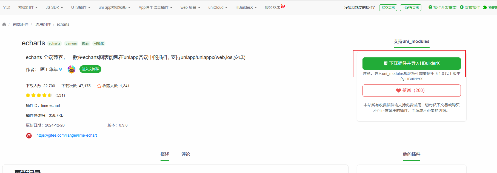
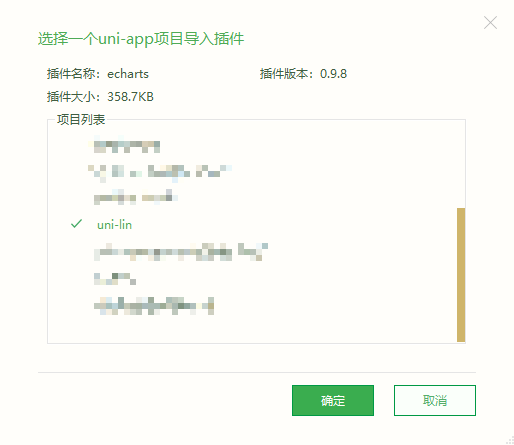
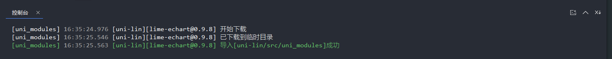
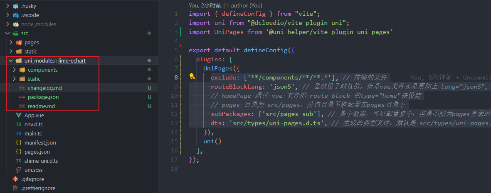
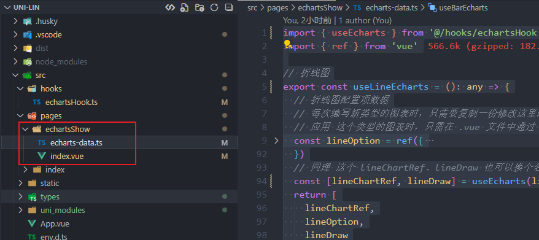
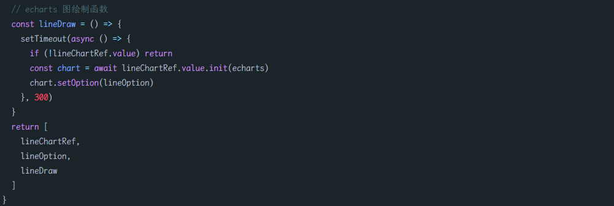
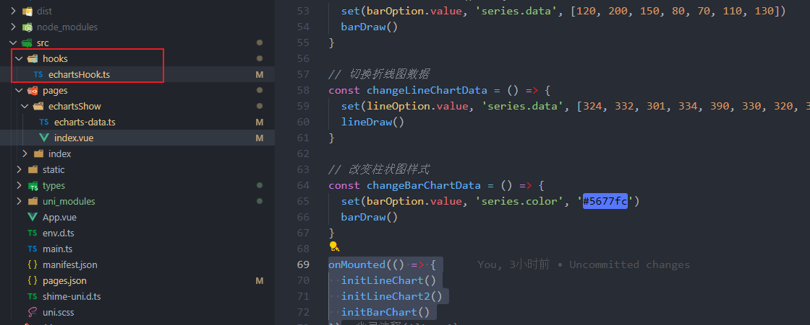

# 17-Echarts篇

## 前言 提要

我们这个项目框架选择图表主要涉及三个方面

- 插件体积
- 兼容性
- 文档是否健全，用法是否简单易学

在此，我比较推荐 [LimeUi](https://limeui.qcoon.cn/#/echart)，这是一个基本兼容全端的组件库，主要是图表组件

因为 `limeUi` 对 `Echarts、Antv F2` 等图表做了兼容处理，从而能在 `uniapp` 中使用

我们这篇文章就主要来介绍，如何使用这个组件库来引入百度图表，并且进行进一步封装

## 安装 Echarts

在插件市场中导入 百度图表兼容插件



 





可以看到在 `src` 目录下多了 `uni_modules` 文件夹，并且已经引入了 `lime-echart` 插件

需要支持非小程序的，还需要安装 `echarts`

```shell
pnpm add echarts
```

【注意】

- 🔔 必须使用hbuilderx 3.4.8-alpha及以上
- 🔔 echarts 5.3.0及以上

## 封装 Hooks

我们先来看一下，[百度图表兼容插件](https://ext.dcloud.net.cn/plugin?id=4899)是如何使用的，只讲 `Vue3` 部分，因为使用方式其实大差不差，可以触类旁通

在 `.vue` 文件的 `<template>` 中引入 `l-echart`

```html
<template>
    <view style="width:300rpx; height:300rpx">
        <l-echart ref="chartRef" />
    </view>
</template>
```

根据不同环境在  `<script setup lang='ts'>`  导入 `echarts`

```javascript
// 小程序 二选一 
// 插件内的 二选一 
const echarts = require('../../uni_modules/lime-echart/static/echarts.min');
// 自定义的 二选一 下载后放入项目的路径
const echarts = require('xxx/xxx/echarts');

//~~~~~~~~~~~~~~~~~~~~~~~~~~~~~~~~~~~~~~~~~~~~~~~~~~~
// 非小程序 
// 需要在控制台 输入命令：npm install echarts
import * as echarts from 'echarts'
```

最后是调用，主要是配置 `echarts` 参数 与 获取 `l-echart` 实例并渲染

```javascript
const chartRef = ref(null)
const option = {
    tooltip: {
        trigger: 'axis',
        axisPointer: {
            type: 'shadow' 
        },
        confine: true
    },
    legend: {
        data: ['热度', '正面', '负面']
    },
    grid: {
        left: 20,
        right: 20,
        bottom: 15,
        top: 40,
        containLabel: true
    },
    xAxis: [
        {
            type: 'value',
            axisLine: {
                lineStyle: {
                    color: '#999999'
                }
            },
            axisLabel: {
                color: '#666666'
            }
        }
    ],
    yAxis: [
        {
            type: 'category',
            axisTick: { show: false },
            data: ['汽车之家', '今日头条', '百度贴吧', '一点资讯', '微信', '微博', '知乎'],
            axisLine: {
                lineStyle: {
                    color: '#999999'
                }
            },
            axisLabel: {
                color: '#666666'
            }
        }
    ],
    series: [
        {
            name: '热度',
            type: 'bar',
            label: {
                normal: {
                    show: true,
                    position: 'inside'
                }
            },
            data: [300, 270, 340, 344, 300, 320, 310],
        },
        {
            name: '正面',
            type: 'bar',
            stack: '总量',
            label: {
                normal: {
                    show: true
                }
            },
            data: [120, 102, 141, 174, 190, 250, 220]
        },
        {
            name: '负面',
            type: 'bar',
            stack: '总量',
            label: {
                normal: {
                    show: true,
                    position: 'left'
                }
            },
            data: [-20, -32, -21, -34, -90, -130, -110]
        }
    ]
};

onMounted( ()=>{
    // 组件能被调用必须是组件的节点已经被渲染到页面上
    setTimeout(async()=>{
        if(!chartRef.value) return
        const myChart = await chartRef.value.init(echarts)
        myChart.setOption(option)
    },300)
})
```

可以看到，使用难度并不大，但是明显可以看出 `echarts` 参数配置过多了，如果一个两个还好，要是有 6个 以上可能代码就很难阅读

所以，不建议直接在 `.vue` 文件中直接编写 `Echarts` 图表，因为实在太多东西了，可能你就几个图表，但是代码已经一大**了

那该怎么做呢？我的建议是：绘制图表的大多数配置我们新建一个 `ts` 文件进行维护，`.vue` 文件只处理数据部分

对此，我们可以通过自定义 `hooks` 思想来封装

在 `src/pages/echartsShow` 目录下创建 `echarts-data.ts` 并写一个渲染 "折线图" 的 `hooks`

 

```typescript
const echarts = require('../../uni_modules/lime-echart/static/echarts.min')
import { ref } from 'vue'

// 折线图
export const useLineEcharts = (): any => {
  // 折线图的实例
  const lineChartRef = ref(null)
  // 折线图配置项数据
  const lineOption = ref({
    xAxis: {
      data: [12, 13, 10, 13, 9, 23, 21, 32, 12, 15, 13, 10],
      boundaryGap: false,
      axisTick: {
        show: false
      },
      axisLine: {
        show: true,
        lineStyle: {
          color: "#0C4787"
        }
      },
      axisLabel: {
        show: true,
        color: '#000000'
      }
    },
    grid: {
      left: 5,
      right: 16,
      bottom: 5,
      top: 20,
      containLabel: true
    },
    tooltip: {
      trigger: 'axis',
      axisPointer: {
        type: 'cross'
      },
      padding: [5, 10]
    },
    yAxis: {
      axisTick: {
        show: false
      },
      splitLine: {
        show: false
      },
      axisLine: {
        show: true,
        lineStyle: {
          color: "#0C4787"
        }
      },
      axisLabel: {
        show: true,
        color: '#000000'
      }
    },
    series: {
      smooth: true,
      type: 'line',
      data: [12, 13, 10, 13, 9, 23, 21, 32, 12, 15, 13, 10],
      animationDuration: 2800,
      animationEasing: 'cubicInOut',
      symbol: 'circle',
      color: "#fed42b",
      symbolSize: 8,
      lineStyle: {
        color: '#fed42b', //改变折线颜色
      },
      areaStyle: {
        color: {
          type: 'linear',
          x: 0,
          y: 0,
          x2: 0,
          y2: 1,
          colorStops: [
            {
              offset: 0,
              color: '#fed42b', // 0% 处的颜色
            },
            {
              offset: 1,
              color: 'rgba(254, 212, 43, 0.1)', // 100% 处的颜色
            },
          ],
          global: false, // 缺省为 false
        },
      },
    }
  })
  // echarts 图绘制函数
  const lineDraw = () => {
    setTimeout(async () => {
      if (!lineChartRef.value) return
      const chart = await lineChartRef.value.init(echarts)
      chart.setOption(lineOption)
    }, 300)
  }
  return [
    lineChartRef,
    lineOption,
    lineDraw
  ]
}
```

上面的自定义 `hooks` 其实很简单，就是定义两个变量、一个函数

- `lineChartRef` 用于 `<l-echart>` 绑定 `ref` 获取实例
- `lineOption` 用于配置 `echats` 参数
- `lineDraw` 初始化并渲染

封装自定义 `hooks` 约定俗成使用 `use` 作为函数名的开头

并且需要注意的是，很多人不知道 `hooks` 与 `utils` 的区别，把 `hooks` 与 `utils` 写混了

- `utils` 函数：不涉及响应式的函数
- `Vue3` 自定义 `Hooks`：涉及 `Vue3` 的一些响应式 `api`，比如 `ref、reactive、computed、watch、onMounted`

上面的 `hooks` 最妙的就是最后的返回，返回是一个数组，那为什么不能返回一个对象呢？

因为返回一个对象，返回名就是固定（虽然可以再自定义，但是麻烦），如果你返回一个数组，只需要注意顺序，名字随便定，而且容易复用

```typescript
const [state, setState] = useState(initialState)
```

用过 `react` 的小伙伴一定使用过 `useState` 这个 `hooks`，它就是返回一个数组，这样讲是不是好理解多了

  

**【进一步优化】**初始化与渲染函数、图表实例是不是可以再精简，怎么改进呢？

可以定义一个公共 `hooks` 来处理绘制函数、图表实例

`

```typescript
// echartsHook.ts
// 小程序中引入 echarts
const echarts = require('../uni_modules/lime-echart/static/echarts.min')
// APP 引入 echarts
// import * as echarts from 'echarts'

import { ref } from 'vue'

// echarts 图表 Hook
export const useEcharts = (options): any => {
  // echarts 图实例
  const chartRef = ref(null)
  // echarts 图绘制函数
  const draw = () => {
    setTimeout(async () => {
      if (!chartRef.value) return
      const chart = await chartRef.value.init(echarts)
      chart.setOption(options.value)
    }, 300)
  }
  // 这里就封装巧妙之处，如果是对象，那么需要重命名，而是是数组，无需重命名
  return [
    chartRef,
    options,
    draw
  ]
}
```

我们把 `options` 当作一个参数传入公共 `hooks`，这样 `echarts-data.ts` 也就只需要处理 `option` ，而且最后，导出也只需导出 `useEcharts(option)` 即可

这样做的好处就是，以后要是需要修改渲染函数，只需要改公共部分就可以了

```typescript
// echarts-data.ts
import { useEcharts } from '@/hooks/echartsHook'
import { ref } from 'vue'

// 折线图
export const useLineEcharts = (): any => {
  // 折线图配置项数据
  // 每次编写新类型的图表时，只需要复制一份修改这里的配置即可
  // 应用 这个类型的图表时，只需在 .vue 文件中通过 set 修复数据即可，或者简单的样式修改，如果样式过于复杂，可以重新建立一个 linkHookB 等等
  const option = ref({
    xAxis: {
      data: [12, 13, 10, 13, 9, 23, 21, 32, 12, 15, 13, 10],
      boundaryGap: false,
      axisTick: {
        show: false
      },
      axisLine: {
        show: true,
        lineStyle: {
          color: "#0C4787"
        }
      },
      axisLabel: {
        show: true,
        color: '#000000'
      }
    },
    grid: {
      left: 5,
      right: 16,
      bottom: 5,
      top: 20,
      containLabel: true
    },
    tooltip: {
      trigger: 'axis',
      axisPointer: {
        type: 'cross'
      },
      padding: [5, 10]
    },
    yAxis: {
      axisTick: {
        show: false
      },
      splitLine: {
        show: false
      },
      axisLine: {
        show: true,
        lineStyle: {
          color: "#0C4787"
        }
      },
      axisLabel: {
        show: true,
        color: '#000000'
      }
    },
    series: {
      smooth: true,
      type: 'line',
      data: [12, 13, 10, 13, 9, 23, 21, 32, 12, 15, 13, 10],
      animationDuration: 2800,
      animationEasing: 'cubicInOut',
      symbol: 'circle',
      color: "#fed42b",
      symbolSize: 8,
      lineStyle: {
        color: '#fed42b', //改变折线颜色
      },
      areaStyle: {
        color: {
          type: 'linear',
          x: 0,
          y: 0,
          x2: 0,
          y2: 1,
          colorStops: [
            {
              offset: 0,
              color: '#fed42b', // 0% 处的颜色
            },
            {
              offset: 1,
              color: 'rgba(254, 212, 43, 0.1)', // 100% 处的颜色
            },
          ],
          global: false, // 缺省为 false
        },
      },
    }
  })
  return useEcharts(option)
}
```

## 使用 Hooks

我们来看下，如何调用这个 `hooks`

```vue
<!--
@description: Echarts 图表 dome
-->

<route type="home" lang="json">{
  "style": {
    "navigationBarTitleText": "图表 dome",
    "navigationBarTextStyle": "black",
    "navigationBarBackgroundColor": "#ffffff",
    "backgroundColor": "#ffffff"
  }
}</route>

<template>
  <view>折线图1</view>
  <view style="width:300rpx; height:300rpx">
    <l-echart ref="lineChartRef" />
  </view>
  <button @click="changeLineChartData">切换折线图1数据</button>
</template>

<script setup lang='ts'>
import { onMounted } from 'vue';
import { useBarEcharts } from './echarts-data';
import { set } from 'lodash-es'
// 使用 hooks 进行调用
const [ lineChartRef, lineOption, lineDraw ] = useLineEcharts()

// 初始化 折线图表1
const initLineChart = () => {
  lineDraw()
}

// 切换折线图数据
const changeLineChartData = () => {
  set(lineOption.value, 'series.data', [324, 332, 301, 334, 390, 330, 320, 302, 301, 334, 390, 330])
  lineDraw()
}

onMounted(() => {
  initLineChart()
})

</script>
```

如果你看到这个 `<route>` 有点懵，可以看到下 **Layout篇**

```javascript
const [ lineChartRef, lineOption, lineDraw ] = useLineEcharts()
```

我们使用了自定义 hooks 使用起来是不是清爽多了，只需要调用 useLineEcharts，就把 `<l-echart ref="lineChartRef" />` 绑定了

```typescript
set(lineOption.value, 'series.data', [324, 332, 301, 334, 390, 330, 320, 302, 301, 334, 390, 330])
```

修改数据，推荐使用 `lodash-es` 中的 `set` 来编写，方便知道修改的是哪个结构的数据

这样封装的本质就是把 **数据处理** 与 **复杂样式配置**隔离开来，当然简单样式也是可以在数据处理这里修改，不必过于死板~

如果你想要继续加一个同类型的折线图，只是数据不一样，可以直接再调用 `useLineEcharts`，解构出来的名字换一下就可以

```html
<view style="width:300rpx; height:300rpx">
 <l-echart ref="lineChartRef2" />
</view>
```

```typescript
const [ lineChartRef2, lineOption2, lineDraw2 ] = useLineEcharts()

// 初始化 折线图表2
const initLineChart2 = () => {
  lineDraw2()
}

onMounted(() => {
  initLineChart2()
})
```

如果要多一种图表，比如 柱状图，在 `echarts-data.ts` 导出一个新 `hooks` 改下 `option` 的内容，调用方式还是其他的一样

```typescript
// echarts-data.ts
export const useBarEcharts = (): any => {
  const option = ref({
    xAxis: {
      data: ['Mon', 'Tue', 'Wed', 'Thu', 'Fri', 'Sat', 'Sun'],
      axisTick: {
        show: false
      },
      axisLine: {
        show: true,
        lineStyle: {
          color: "#0C4787"
        }
      },
      axisLabel: {
        show: true,
        color: '#000000'
      }
    },
    grid: {
      left: 5,
      right: 16,
      bottom: 5,
      top: 20,
      containLabel: true
    },
    tooltip: {
      trigger: 'axis',
      axisPointer: {
        type: 'cross'
      },
      padding: [5, 10]
    },
    yAxis: {
      axisTick: {
        show: false
      },
      splitLine: {
        show: false
      },
      axisLine: {
        show: true,
        lineStyle: {
          color: "#0C4787"
        }
      },
      axisLabel: {
        show: true,
        color: '#000000'
      }
    },
    series: {
      type: 'bar',
      data: [120, 200, 150, 80, 70, 110, 130],
      animationDuration: 2800,
      animationEasing: 'cubicInOut',
      color: "#fed42b",
      barWidth: 10,
      itemStyle: {
        barBorderRadius: [3, 3, 0, 0]
      }
    }
  })
  return useEcharts(option)
}
```

```html
<view style="width:300rpx; height:300rpx">
   <l-echart ref="barChartRef" />
</view>
```

```typescript
const [ barChartRef, barOption, barDraw] = useBarEcharts()

// 初始化 柱状图表
const initBarChart = () => {
  // set(barOption.value, 'series.data', [120, 200, 150, 80, 70, 110, 130])
  barDraw()
}

onMounted(() => {
  initBarChart()
})
```

## 总结

`uniapp` 要使用 `echarts` 等图库，得使用第三方插件实现，比如 `LimeUi` 的百度图表插件

`echarts` 的配置参数太多了，都写在 `.vue` 中影响维护与阅读，所有把数据与样式分层，建立 `echarts-data.ts` 维护样式层

数据处理就写 `.vue` 中即可

注意自定义 `hooks` 函数要以 `use` 开头，并且注意 `utils` 与 `hooks` 的区别

- `utils` 函数：不涉及响应式的函数
- `Vue3` 自定义 `Hooks`：涉及 `Vue3` 的一些响应式 `api`，比如 `ref、reactive、computed、watch、onMounted`

还提到，`hooks` 函数返回数组是为了更好的复用

`hooks` 中有很多类似的地方，可以适当的抽离成一个公共 `hooks`，进行引用，以后修改的时候，也不必所有图表 `hooks` 都改一遍
