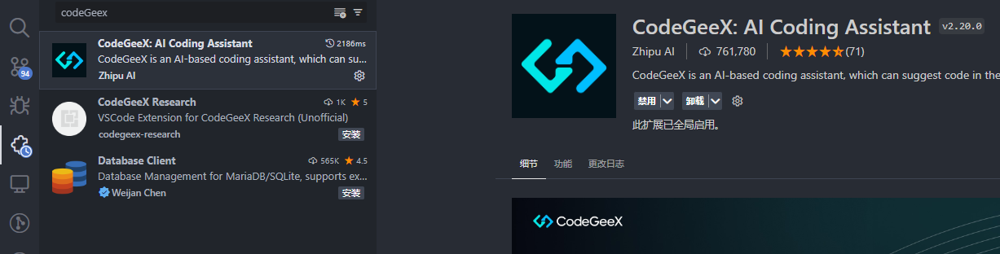
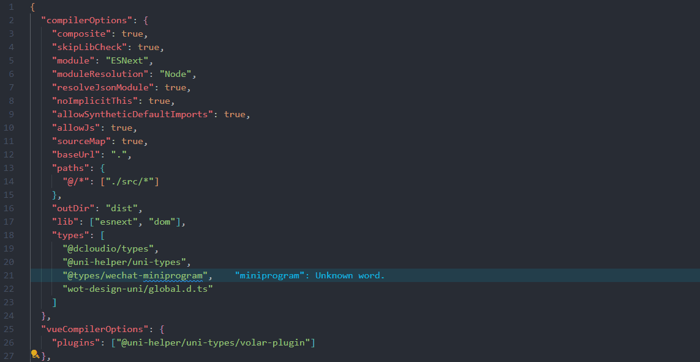
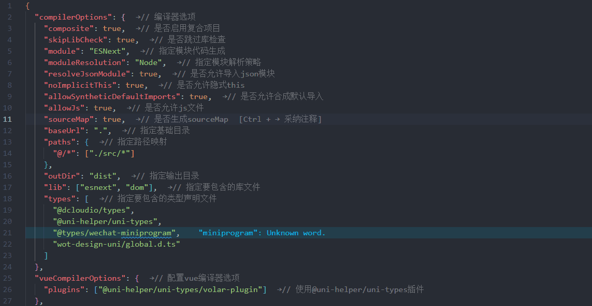

# 18-AI辅助开发篇

## 安装

vscode 插件市场直接搜索，下载即可

如果觉得不安全，可以部署本地模型，百度一下搜索 `CodeGeex 本地模型` 就有很多教部署的文章了

## 使用技巧

### 1. 幽灵提示快速立即代码含义

插件安装完成后，我在一个文件中按 `Alt + a` 就可以触发幽灵注释了

这些注释是不会保存在文件中的，如果你希望某些注释，可以使用 `Ctrl + →` 保留注释

### 2. 注释生成代码

比如我需要一个获取单月天数的函数，我可以先写一个注释，然后回车，就可以看到生成的代码了

如果你觉得这个代码可以，就可以使用 `tab键` 进行保留

不满意可以继续写，比如我需要定义的是一个箭头函数，而不是具名函数

我就继续写，直到它生成箭头函数，就按 `tab键` 就可以了

 

## 本地部署

待续...
