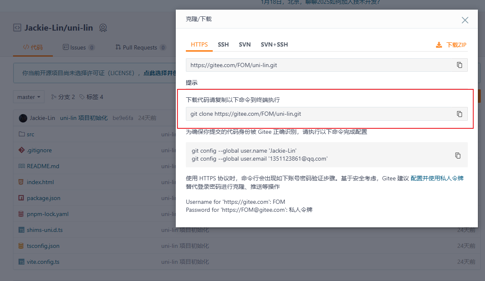
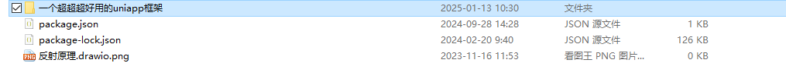

# 19-分支管理篇

## 分支的使用

## 扩展

克隆仓库本地（中文重命名）

通常我们的仓库名称都是非中文的，但是有时时间久了，我都忘了这个项目是干嘛的了。还得去线上仓库看看备注，比较麻烦~

我们可以在克隆链接后面加中文名（项目名本地重定义），这样克隆下来的就是中文项目名称，也不会影响线上名称



```shell
git clone https://gitee.com/DaMaiCoding/uni-plus.git 一个超超超好用的uniapp框架
```

 
