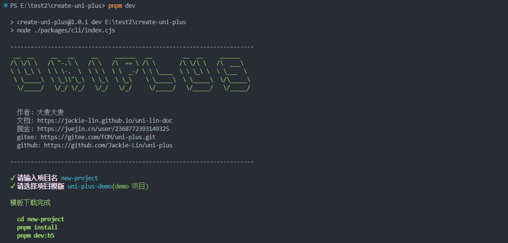
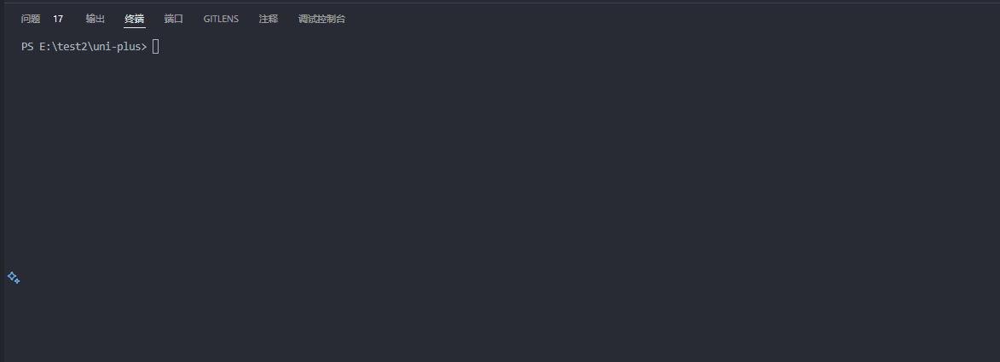
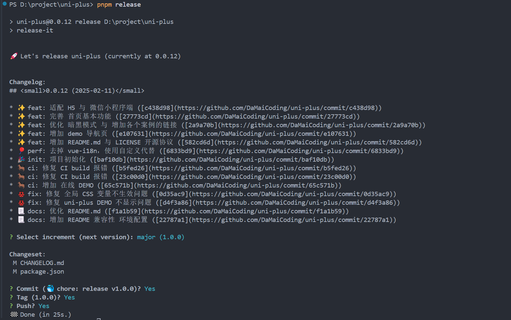
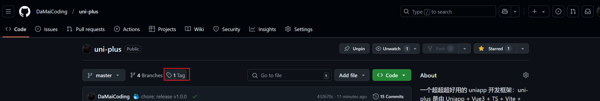
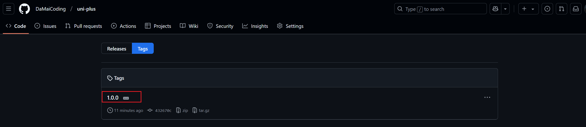
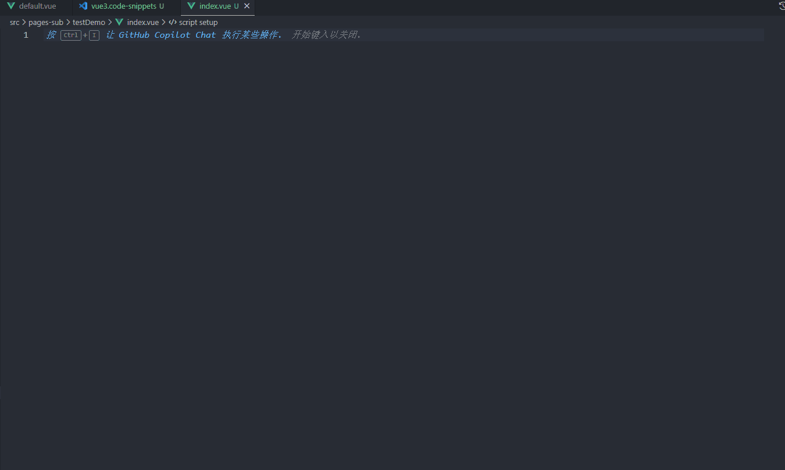
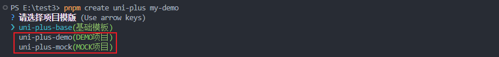

# 2-快速开始

## 目标

如果你是为了学习前端工程化，那么你可以根据，指南顺序依次学习，每一章都有一个预开始项目

可以自己下载下来，然后根据文章进行学习，要是遇到什么不懂的问题可以去掘金私信我，也可以加下交流群交流

我在掘金上也同步了，这些文章，你可以看看对应文章中的评论区有没有你想要的答案

当然啦，如果你不想学，想拿来用就用，也是可以的，可以通过脚手架，直接构建就可以啦~

也可以通过 `github、gitee` 进行下载

## 使用

### 1. 脚手架创建项目

使用 pnpm 使用脚手架快速生成项目模板，`pnpm create uni-plus -n <项目名>`

如果你不使用 `-n <项目名>` ，会进入命令行交互模式，输入文件名

```shell
pnpm create uni-plus -n uni-plus
# 或者
npx create-uni-plus -n uni-plus
npm create uni-plus -n uni-plus
```

【注意】如果无法创建项目，可以是有缓存，可以加上 `@latest`

```shell
pnpm create uni-plus@latest -n uni-plus
```

我们来实际跑一下

 

### 2. 入门

该项目有两个模板，一个是 `base` 模板，一个是 `demo` 模板

`demo` 模板是基于 `base` 模板进行扩展的

想快速入门的话，可以下载 `demo` 模板，然后使用查看文档教程

大概看一遍就能大致理解，模板的大致结构与组成了

### 3. 使用模板项目

到底该如何使用这个模板呢？

我认为说的再多，也不如实际使用项目模板，做一个项目实战入门快

大家可以看 **项目实战篇**，亲手做一个项目

后续我会在 b站更新 项目实战篇 的视频

### 4. commit

`commit` 的话，为了规范提交流程，不使用直接提交方式

采用 `cz` 提交，运行下面的命令，就会有提示，按提示走就行

```shell
git add .
pnpm cz
git push origin dev
```

具体，实现方式和提交细节，可以看 `Git`提交篇



### 5. Log 与 Tag 生成

```shell
pnpm release
```

直接输入上面命令，就会让你选择，你想要 `tag` 类型，有下面三种

`patch` 小版本 `0.0.1 -> 0.0.2`

`minor` 中版本 `0.0.1 -> 0.1.0`

`major` 大版本 `0.0.1 -> 1.0.0`

`push` 选择 `Yes` 之后，就会自动上传 `CHANGELOG.md` 并且帮我们打好 `tag`







### 6. Vscode Snippets

在 `.vue` 文件中，输入 `v3` 按 `Enter` 就可以快速生成页面模板

具体实现原理可以看 `Snippets`篇



## DEMO 学习

为了让同学们能更快的上手这个框架

也是准备丰富的案例供学习参考~

需下载两个项目

- `uni-plus-demo` 提供案例学习
- `uni-plus-mock` 为 `demo` 请求部分，提供 `mock` 数据

  
