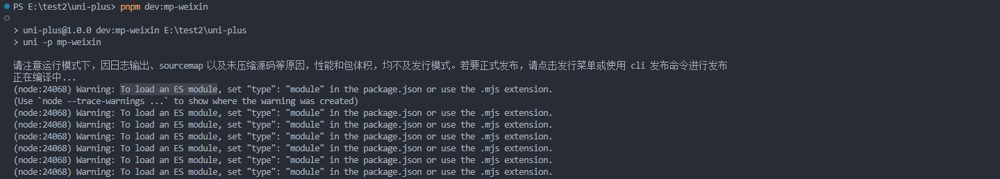

# 21-常见问题

## 控制台 warning



如果你控制台，出现这么些警告，是因为 `unocss` 版本 `0.59.X` 后不再提供 `commonjs`版 的代码

而 `@dcloudio/vite-plugin-uni` 采用的是 `commonJS` 的方式

本项目的解决方案采用的是 动态引入的方式

```typescript
const UnoCss = await import('unocss/vite').then(i => i.default);
```

所以，要解决这个报错，还得将 `node` 升到 `22` 才能不报 `warning`

【问题解决 Issues】：<https://github.com/dcloudio/uni-app/issues/4815>
