# 3-样式篇

## 为什么要使用 Unocss

[UnoCSS](https://unocss.nodejs.cn/)

为什么前端开发中，要用到 `unocss` 这样的一种原子 `css` 呢？

对比，用 `sass` 语法编写，与 `unocss` 原子 `css` 编写

```vue
<!-- sass  -->
<template>
 <div class="card">
        <div class="name">
         ...    
     </div>
        <div class="list">
         ...    
     </div>
    </div>
</template>

<style lang="scss">
    .card {
        ...
        .name {...}
        .list {...}
    }
</style>
```

```vue
<!-- unocss  -->
<template>
 <div class="flex justify-center items-center">
        <div class="font-size-14px bold">
         ...
     </div>
        <div class="font-size-12px color-#f2f2f2">
         ...    
     </div>
    </div>
</template>
```

`unocss` 写起来更快，而且最重要的是

如果你正在开发一个页面，某个卡片样式很复杂，但是其他页面上有，你要使用怎么办，当然是 `cv` 一下啦

但是用 `scss` 编写的话，你还得去定义类名，还得去找类名对应的样式，`DOM` 结构不复杂还好

要是复杂的，等下可能卡片内的一些 `DOM` 结构得删除，那类名也得删除，麻烦啊~

如果你用 `unocss`，直接 `cv DOM` 结构，不要的结构直接删除，马上就能看的效果，爽~

用 `uniapp` 开发，能不能也引入 `unocss` 呢？

当然可以啦，那要怎么做呢？

## Unocss 配置

**搭建环境**

- `node v18.16.0`
- `pnpm v8.62`

我们的项目是根据 `uniapp` 最初始的官方 `cli` 脚手架模板生成，并且我们的项目要支持 `Vue3 + ts`，所以执行的命令如下

```shell
npx degit dcloudio/uni-preset-vue#vite-ts uni-plus
```

`uniapp` 官方链接：[点击跳转 - quickstart-cli](https://uniapp.dcloud.net.cn/quickstart-cli.html)

安装下依赖，并运行到 `H5`

```shell
pnpm install
pnpm dev:h5
```

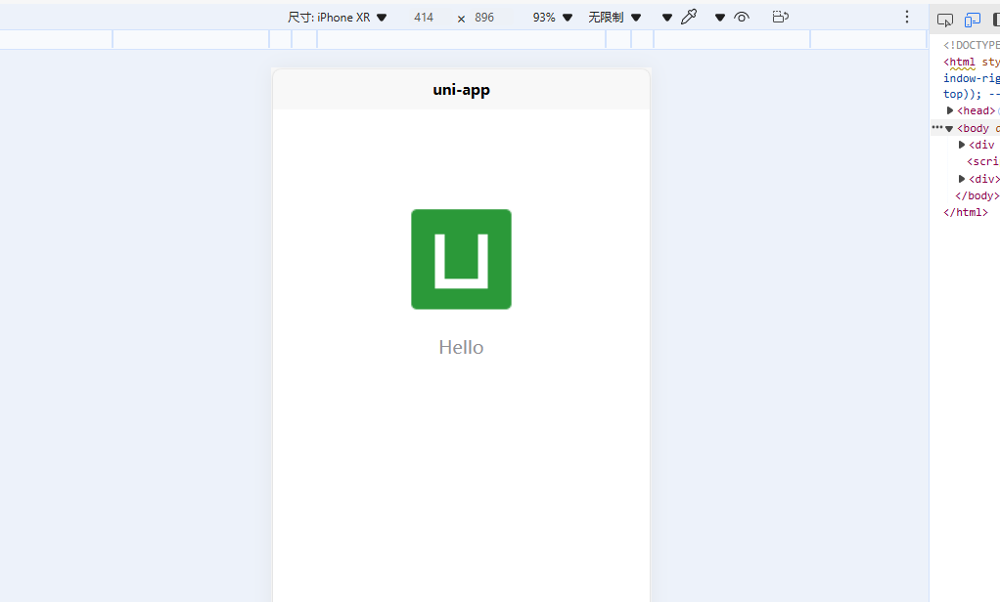 

好了，现在我们来安装下 `unocss`

```shell
pnpm add unocss -D
```

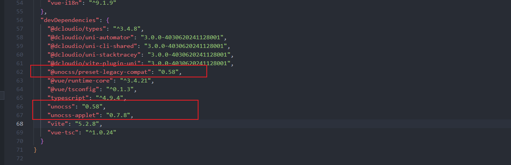

为了兼容 0.57 以前的版本，并且兼容小程序，我们需要再安装两个插件

```shell
pnpm add @unocss/preset-legacy-compat@ -D # 兼容 0.57 以前的版本
pnpm add unocss-applet@0.7 -D # 兼容小程序
```

为什么要 `unocss-applet` 安装指定版本的呢？

我们后面扩展时再说，先继续

在 `vite.config.ts` 中引入下 `unocss`，这是 `unocss >= 0.59` 的引入方式

这是因为 `unocss0.59.x` 已经不支持 `commonjs` 了，仅仅支持 `ESM`（只使用 `ESM` 来管理模块依赖，不再支持 `CommonJS` 或 `AMD` 等其他模块化方案），可以查看《[unocss的发布变更日志](https://github.com/unocss/unocss/releases/tag/v0.59.0)》

```typescript
import { defineConfig } from "vite";
import uni from "@dcloudio/vite-plugin-uni";

export default defineConfig(async () => {
  const UnoCSS = (await import('unocss/vite')).default
  return {
    plugins: [
      uni(),
      UnoCSS(),
    ],
  }
});
```

`unocss < 0.59` 是这样的引入方式

```typescript
import { defineConfig } from "vite";
import uni from "@dcloudio/vite-plugin-uni";
import UnoCSS from 'unocss/vite'

export default defineConfig({
  plugins: [
    uni(),
    UnoCSS(),
  ],
});
```

然后，在 `main.ts` 中引入即可

```typescript
import { createSSRApp } from "vue";
import App from "./App.vue";
import 'uno.css'

export function createApp() {
  const app = createSSRApp(App);
  return {
    app,
  };
}
```

接下来我们需要一个在根目录增加一个 `unocss.config.ts` 文件

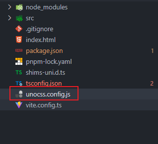  

然后填入一下配置信息

```javascript
import {
  type Preset,
  defineConfig,
  presetUno,
  presetAttributify,
  presetIcons,
  transformerDirectives,
  transformerVariantGroup,
  SourceCodeTransformer,
} from "unocss";

import {
  presetApplet,
  presetRemRpx,
  transformerApplet,
  transformerAttributify,
} from 'unocss-applet'

// 判断是否是小程序
const isApplet = process.env?.UNI_PLATFORM?.startsWith("mp-") ?? false;

const presets: Preset[] = [];
const transformers: SourceCodeTransformer[] = []

// 先判断是不是小程序，如果是小程序，则使用小程序的预设和转换器
if (isApplet) {
  // 使用小程序预设
  presets.push(
    // 小程序用官方预设
    presetApplet(),
    // 小程序用 rpx 预设
    presetRemRpx()
  );
  transformers.push(
    // 小程序用 @apply 功能
    transformerApplet(),
    // 小程序，解决与第三方框架样式冲突问题
    transformerAttributify({
      // 小程序，解决与第三方框架样式冲突问题
      prefixedOnly: true, // 只支持以 `ul-` 开头的类名
      prefix: "ul",
    }),
  )
} else {
  presets.push(
    // 非小程序用官方预设
    presetUno(),
    // 解决与第三方框架样式冲突问题
    presetAttributify({
      prefixedOnly: true, // 只支持以 `ul-` 开头的类名
      prefix: "ul",
    }),
  );
  transformers.push(
    // 启用 @apply 功能，比如： 
    // .custom-div { @apply text-center my-0 font-medium } => 
    // .custom-div { margin-top: 0rem; margin-bottom: 0rem; text-align: center; font-weight: 500;}
    transformerDirectives(),
    // 启用 () 分组功能，比如： 
    // <div class="hover:(bg-gray-400 font-medium) font-(light mono)"/> => 
    // <div class="hover:bg-gray-400 hover:font-medium font-light font-mono"/>
    transformerVariantGroup(),
  )
}

export default defineConfig({
  // presets 是预设
  presets: [
    ...presets,
  ],
  // transformers 是转换器
  transformers: [
    ...transformers,
  ],
  // shortcuts 自定义样式快捷方式
  // 具体使用方法，在需要使用到 flex justify-center items-center 这个几个类名时，只需要写一个 flex-center 即可
  shortcuts: [
    { "flex-center": "flex justify-center items-center" },
    { "flex-col-center": "flex justify-center items-center flex-col" }
  ],
  // rules 的作用是：在全局范围内添加自定义规则
  // 下面的配置适用于有安全区域的设备（如 iPhone X 上的刘海屏）
  // 具体使用也很简单，在需要使用安全区域的元素上添加 p-safe 类名即可
  rules: [
    [
      "p-safe",
      {
        padding:
          "env(safe-area-inset-top) env(safe-area-inset-right) env(safe-area-inset-bottom) env(safe-area-inset-left)",
      },
    ],
    ["pt-safe", { "padding-top": "env(safe-area-inset-top)" }],
    ["pb-safe", { "padding-bottom": "env(safe-area-inset-bottom)" }],
    [
      "ptb-safe", {
        "padding-top": "env(safe-area-inset-top)",
        "padding-bottom": "env(safe-area-inset-bottom)"
      }
    ]
  ],
});
```

我们再改一下，`src/pages/index.vue`

```vue
<template>
  <view class="flex-col-center">
    <image class="logo" src="/static/logo.png" />
    <view class="text-area">
      <text class="title">{{ title }}</text>
    </view>
  </view>
</template>

<script setup lang="ts">
import { ref } from 'vue'
const title = ref('Hello')
</script>

<style>

.logo {
  height: 200rpx;
  width: 200rpx;
  margin-top: 200rpx;
  margin-left: auto;
  margin-right: auto;
  margin-bottom: 50rpx;
}

.text-area {
  display: flex;
  justify-content: center;
}

.title {
  font-size: 36rpx;
  color: #8f8f94;
}
</style>
```

我们使用了 `flex-col-center` 这个多类名的简写

`pnpm dev:mp-weixin` 编译一下 h5、微信小程序 

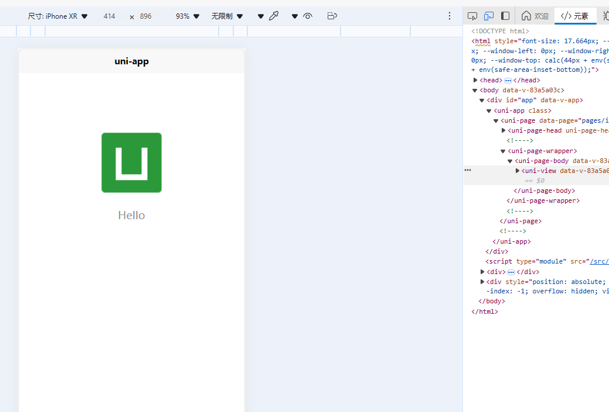 

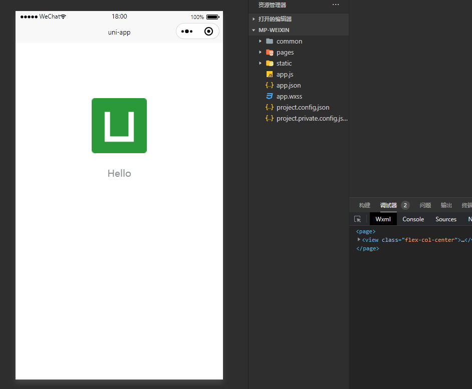 

都是居中显示的，都没问题，接下来，我们来了解下这个配置文件

我们把导出的配置，折叠下

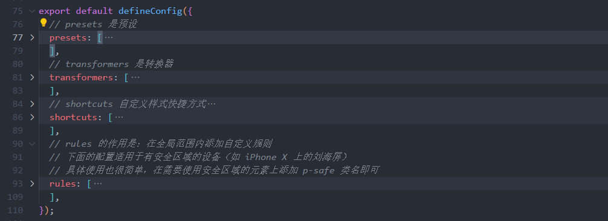 

可以看到核心配置就是 4个 `presets、transformers、shortcuts、rules`

其中 `rules（自定义规则）、shortcuts（快捷方式）`

### rules、shortcuts

```typescript
 rules: [
    [
      "p-safe",
      {
        padding:
          "env(safe-area-inset-top) env(safe-area-inset-right) env(safe-area-inset-bottom) env(safe-area-inset-left)",
      },
    ],
    ["pt-safe", { "padding-top": "env(safe-area-inset-top)" }],
    ["pb-safe", { "padding-bottom": "env(safe-area-inset-bottom)" }],
 ],
```

看下 `rules` 的配置，可以看出，其作用是将 `CSS` 属性/值定义为一个类名，为 `unocss` 扩展类名

多个属性，也可以写在一个类名中

```typescript
["pt-safe", { "padding-top": "env(safe-area-inset-top)" }],
["pb-safe", { "padding-bottom": "env(safe-area-inset-bottom)" }],
    
// 等价于
    
[
   "ptb-safe", {
       "padding-top": "env(safe-area-inset-top)",
       "padding-bottom": "env(safe-area-inset-bottom)"
   }
]
```

那 `shortcuts` 配置呢？

```javascript
shortcuts: [
 { "flex-center": "flex justify-center items-center" },
 { "flex-col-center": "flex justify-center items-center flex-col" }
]
```

`shortcuts` 配置的作用，就是为 多个类名 设置一个**简写**

```html
<div class="flex-center">
  <p class="text-xl">居中显示的文本</p>
</div>

<!--等价于-->

<div class="flex justify-center items-center">
  <p class="text-xl">居中显示的文本</p>
</div>
```

`rules` 只可以写 `CSS` 属性/值，`shortcuts` 是提高 `rules` 的利用率，且降低写太多重复的 `class`

而 `presets（预设）、transformers（转换器）` 主要作用引入 预设与转换器 的一些功能

也就是下面这些

```typescript
import {
  type Preset,
  defineConfig,
  presetUno,
  presetAttributify,
  presetIcons,
  transformerDirectives,
  transformerVariantGroup,
  SourceCodeTransformer,
} from "unocss";

import {
  presetApplet,
  presetRemRpx,
  transformerApplet,
  transformerAttributify,
} from 'unocss-applet'
```

```typescript
const isApplet = process.env?.UNI_PLATFORM?.startsWith("mp-") ?? false;
```

然后通过，isApplet 判断是否是小程序，从而引入不同预设与转换器的功能

下面是一些预设与转换器的说明

### presets、transformers

#### 1. presetAttributify

可以直接通过属性的方式编写样式

```html
<div flex="~ col" justify="center" items="center" bg="blue-500" text="white">
  <p text="xl">通过属性样式居中</p>
</div>
```

- `flex="~ col"` 表示使用 flex 布局并设置为列方向
- `justify="center"` 和 `items="center"` 用于水平和垂直居中
- `bg="blue-500"` 设置背景颜色
- `text="white"` 设置文本颜色

#### 2. presetAttributify、transformerAttributify

启用了 `presetAttributify`，并将属性化的前缀设置为 `ul-`，防止与其他框架的样式冲突。

```typescript
presetAttributify({
  prefix: "ul",
  prefixedOnly: true, // 只支持以 `ul-` 开头的类名
}),
```

```html
<a text="red">This conflicts with links' `text` prop</a>
<!-- 转换为 -->
<a ul-text="red">Text color to red</a>
```

还可以通过以下方式禁用对某些属性的扫描

```typescript
presetAttributify({
  ignoreAttributes: [
    'text'
    // ...
  ]
})
```

如果我们是在小程序中，就需要使用 `transformerAttributify` 进行配置

```typescript
transformerAttributify({
  prefix: "ul",
  prefixedOnly: true, // 只支持以 `ul-` 开头的类名
}),
```

`presetAttributify` 用于 h5，`transformerAttributify` 用于小程序

#### 3. transformerVariantGroup、transformerDirectives

`transformerVariantGroup` 允许多个 CSS 类组合在一起

```html
<div class="hover:(bg-gray-400 font-medium) font-(light mono)">
  unocss 的分组
</div>
```

`transformerDirectives` 可以使用 `@apply` 来应用预设样式

```vue
<style>
  .custom-style {
    @apply bg-blue-500 text-white rounded-lg;
  }
</style>
<template>
  <div class="custom-style">
   应用 @apply 指令的样式
  </div>
</template>
```

#### 4. presetApplet、presetRemRpx

在小程序环境中，使用了 `presetApplet()` 和 `presetRemRpx()`，将 `rem` 转换为 `rpx`

```html
<div class="mt-4 text-xl bg-red-500 p-4">
  小程序中的样式实例
</div>
```

- 在小程序环境中，`mt-4` 会转换为 `margin-top: 32rpx`，即 16px，即 `4个单位 = 1rem = 32rpx = 16px`
- `text-xl` 会转换为相应的字体大小，适应小程序环境的单位

## 小结

`unocss` 的 4个 配置核心是

- `presets` 设置默认单位转换，`4个单位 = 1rem = 32rpx = 16px`
- `transformers` 增加 `@apply`、分组功能、属性化及其冲突解决
- `shortcuts` 将多个类名合成一个简写
- `rules` 定义额外的样式类名

## 扩展

### 为什么要 `unocss-applet` 安装指定版本的呢？

因为与 `unocss-applet` 8.0 以后的版本 在 `uniapp` 直接配置会报错

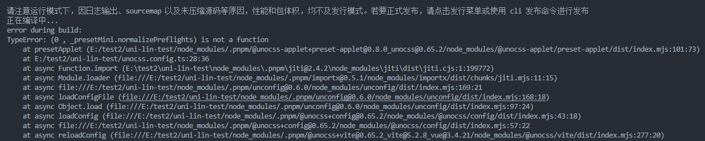查了下，直接这样配置，然后执行 `pnpm dev:mp-weixin`

就会报上面的错误，如果去掉 `presetApplet()` 就不会报错

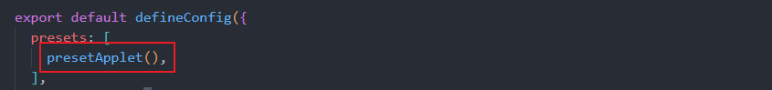 

我查了最新 0.8.5 的文档，直接按他们配置，还是一样的报错，不知道有没有大佬解决过这个问题？

下面是，[0.8.5](https://github.com/unocss-applet/unocss-applet) 文档的配置

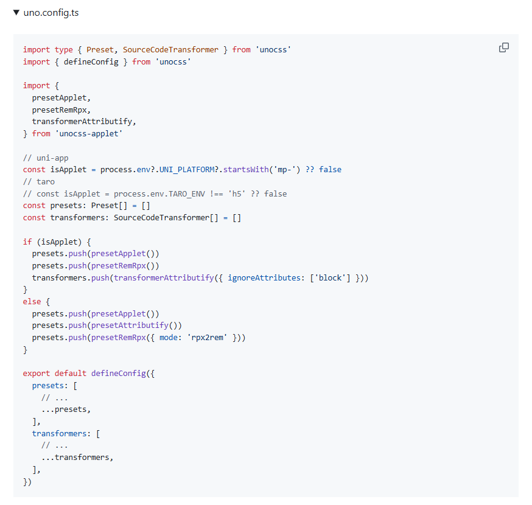 

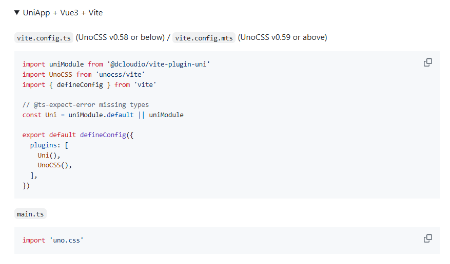 

### unocss 那么多类名，怎么知道样式的类名是什么？

我们可以使用这个网站进行查询 [UnoCSS Interactive Docs](https://unocss.dev/interactive/)

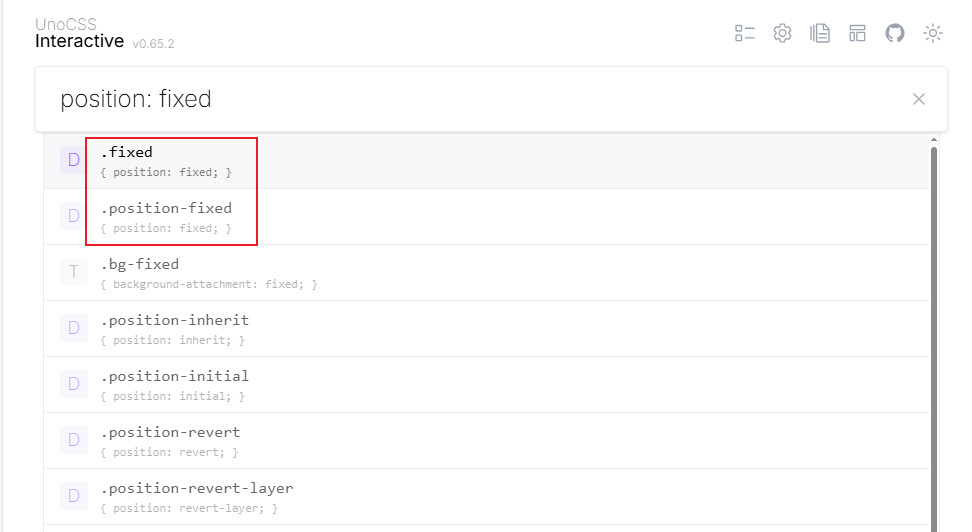 

输入你需要的样式，自然就能查出来了，多用几次就熟悉了，也可以看下官网，大致的类名写法

其实语法与 [Tailwind CSS](https://tailwindcss.com/) 类似，用过 `Tailwind CSS` 的同学，学习起来基本没什么难度~

### VSCode unocss 语法提示插件？

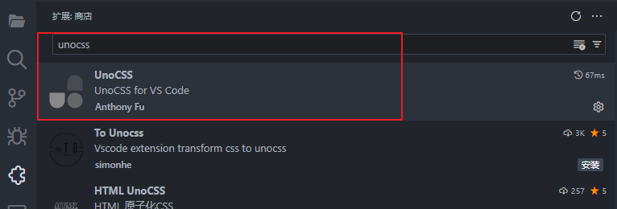 

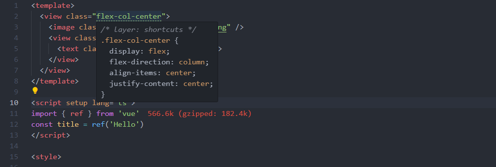 

### 实际开发过程中，如何根据设计图定义尺寸？

以蓝湖例，我们可以把 UI 设置指定宽度为 750rpx = 375px，也就是 iphone 6/7/8 的宽度

当然，你也可以让 UI 直接出一个 750px 的设计图（二倍图清晰点）

写样式的时候，比如按钮是 200rpx * 80rpx，就可以这样写，直接后面接单位 rpx

```html
<button class="w-200rpx h-80rpx"></button>
```

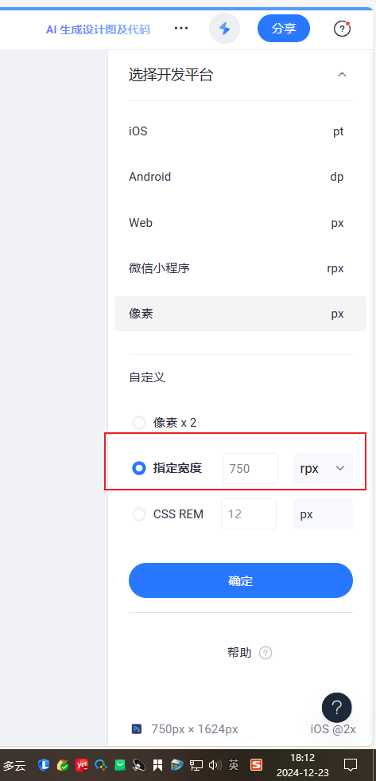 

如果我们是微信小程序、H5 开发，我们可以把模拟器也设置成这个尺寸

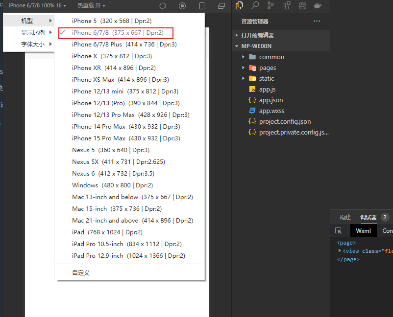 

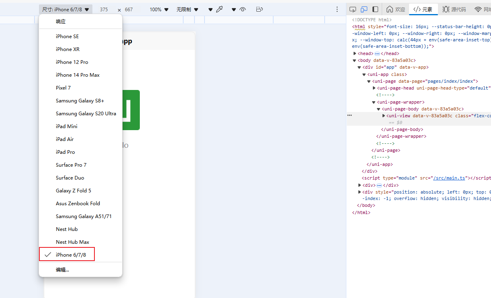

这样，我们按 UI 图给的尺寸就能完美匹配了

### 安装 Sass，便于复杂样式编写

```shell
pnpm add sass@1.78 -D
```

为什么要安装 `Sass 1.78` 版本的，这是因为最新的 Sass 废弃了一批API，很多 UI库 都还没做兼容，所以还是安装 `1.78`及其以前的版本
