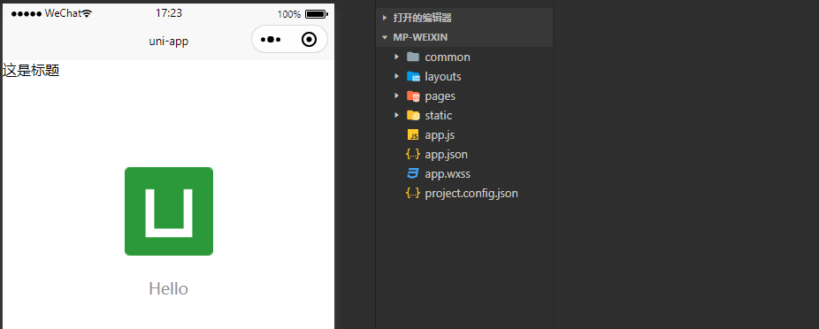
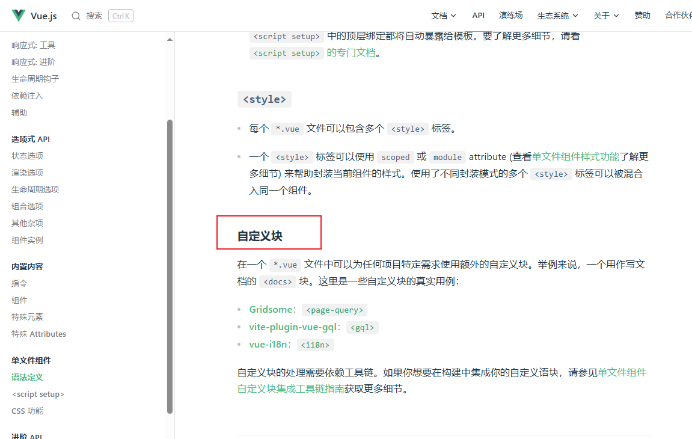
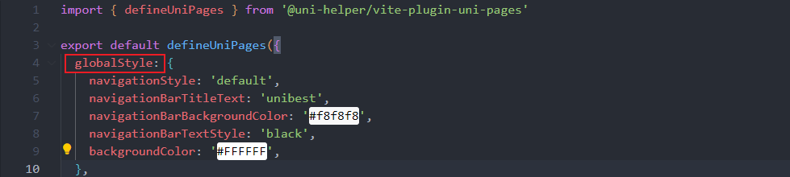
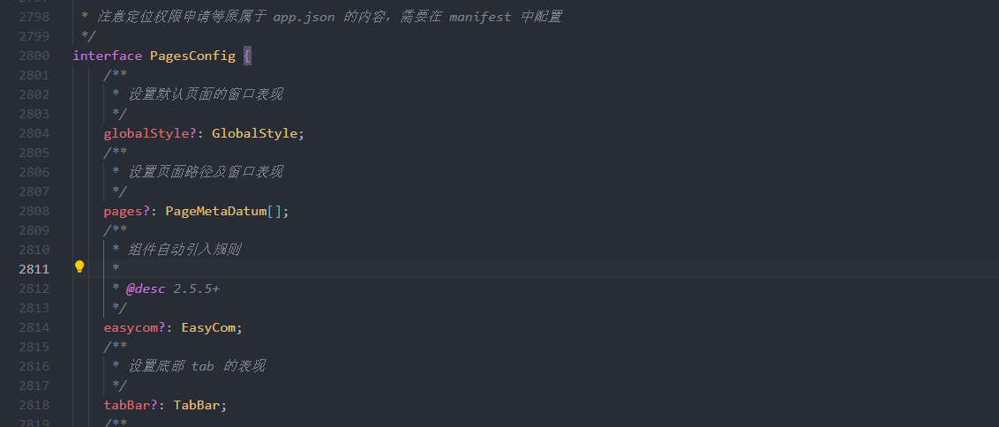

# 4-Layout篇

## 安装

```shell
pnpm i -D @uni-helper/vite-plugin-uni-layouts
```

## 使用

### 配置

```typescript
// vite.config.ts
import { defineConfig } from 'vite'
import uni from '@dcloudio/vite-plugin-uni'
import UniLayouts from '@uni-helper/vite-plugin-uni-layouts'

export default defineConfig({
  plugins: [
      UniLayouts(), 
      uni()
  ],
})
```

【注意】

- `UniLayouts()` 需要在 `uni()` 前面不然，不会生效的

### 创建布局

在 `src/layouts` 下创建布局

```vue
<!-- default.vue -->
<template>
  <h1>这是标题</h1>
  <slot>main</slot>
</template>
```

### 应用布局

在 `pages.json` 中的页面中添加 `layout` 配置

```json
{
 "pages": [
  {
   "path": "pages/index/index",
            // 在这里定义
   "layout": "default",
   "style": {
    "navigationBarTitleText": "uni-app"
   }
  }
 ],
 "globalStyle": {
  "navigationBarTextStyle": "black",
  "navigationBarTitleText": "uni-app",
  "navigationBarBackgroundColor": "#F8F8F8",
  "backgroundColor": "#F8F8F8"
 }
}
```

### 运行

```shell
pnpm dev:mp-weixin
```

 

【注意】

- 如果编译没有效果，可以是 `dist` 中的编译文件 `dev` 没更新，只要把 `dev` 文件夹删除，再次执行就能出来了

**如果是不想使用布局呢？**

`layout` 设置为 `false`，或者直接不要写 `layout`

```json
{
    "pages": [
        {
            "path": "pages/index/index",
            // "layout": false,
            "style": {
                "navigationBarTitleText": "uni-app"
            }
        }
    ],
}
```

然后我们执行，我们打开微信开发者工具看下效果

 

没有去掉前面的标题啊，这是怎么回事？

这是因为 `@uni-helper/vite-plugin-uni-layouts` 这个插件并没有热更新

怎么才能热更新，这个待以后有时间更新下~

这种 `layout` 布局写法类似于 `Nuxt layouts` 写法，如果不了解 `Nuxt`

可以看下这篇文章[教你用 vite+nuxt+pinia+vueuse 搞定前端SSR项目翘首期盼](https://juejin.cn/post/7170746000112353293#heading-16)，简单入门下

我们在使用 **自定义顶部导航栏** 和 **自定义底部选项卡**非常有用

如果，你还想更深入的使用，可以参考官方文档 [vite-plugin-uni-layouts](https://github.com/uni-helper/vite-plugin-uni-layouts)

### 路由配置优化

每次我们写一个文件的时候，都得去 `pages.json`，编写下路由，太过麻烦了

如果，我们能直接在 `.vue` 文件中就把路由配置好，这样是不是就更简单方便了

可以使用 [@uni-helper/vite-plugin-uni-pages](https://github.com/uni-helper/vite-plugin-uni-pages)

这个插件，使用 `Vue` 的 `SFC` 自定义块，用于定义路由数据

```vue
<route type="home" lang="json5">
    {
       "style": { "navigationBarTitleText": "home" }
    }
</route>

<template>...</template>
<script>...</script>
<style>...</style>
```



[单文件组件语法定义](https://cn.vuejs.org/api/sfc-spec)

安装

```shell
pnpm add @uni-helper/vite-plugin-uni-pages -D 
```

配置 `vite.config.ts`

```typescript
// vite.config.ts
import { defineConfig } from 'vite'
import Uni from '@dcloudio/vite-plugin-uni'
import UniPages from '@uni-helper/vite-plugin-uni-pages'

export default defineConfig({
  plugins: [
      UniPages(), // 需要在 Uni() 前面，不然不会生效
      Uni()
  ],
})
```

创建 `pages.config.ts` 文件

```typescript
// pages.config.ts
import { defineUniPages } from '@uni-helper/vite-plugin-uni-pages'

export default defineUniPages({
  // 你也可以定义 pages 字段，它具有最高的优先级
  pages: [],
  // 定义全局属性
  globalStyle: {
    navigationBarTextStyle: 'black',
    navigationBarTitleText: '@uni-helper',
  },
})
```

使用

```vue
<!-- index.vue -->
<!-- 使用 type="home" 属性设置首页 -->
<route type="home" lang="json5">
{
  "style": { 
    "navigationBarTitleText": "index" 
   }
}
</route>
```

`lang` 属性可以指定解释器，支持的解释器有：`JSON、JSON5、YAML`

推荐 `JSON5`，因为使用这个, 能更好的格式化，`vscode` 不会出现一些语法警告提示

你想要了解更多语法可以到官方文档看看 [@uni-helper/vite-plugin-uni-pages 官方文档](https://github.com/uni-helper/vite-plugin-uni-pages)

你可能会有这样的疑问，我搞了这么多配置，就是只是为了在 `.vue` 中写路由配置，感觉增加了好多学习成本啊

你可以看到 `pages.config.ts` 他是一个 ts 文件，那么他就是有相关的类型定义，这就方便我们阅读和修改代码配置了

 

比如说，我想知道全局样式配置有哪些，鼠标移到 `globalStyle`处按住 `Alt + 点击鼠标左键`，就可以进入到相应的类型定义文件中，就能够清晰了解到这个属性的大致



## 总结

这篇文章，主要讲 `uni-helper` 的两个插件

`@uni-helper/vite-plugin-uni-layouts`提供类 `Nuxt` 的 `layouts` 系统

在需要自定义导航栏、自定义底部 `tabbar` 的场景下是非常好用的

虽然自定义组件也可以实现，但是每次都要在 `template` 中加入组件有点不太优雅

`@uni-helper/vite-plugin-uni-pages` 提供`.vue` 文件中通过自定义块 `<route>`

来配置路由功能，搭配 `layouts` 使用堪称绝配
