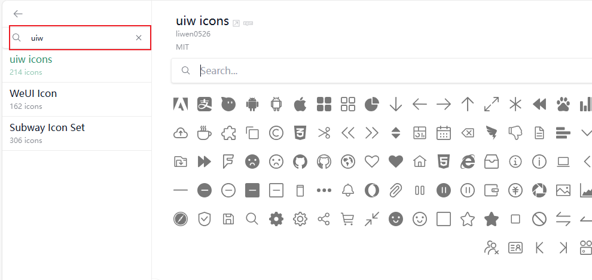
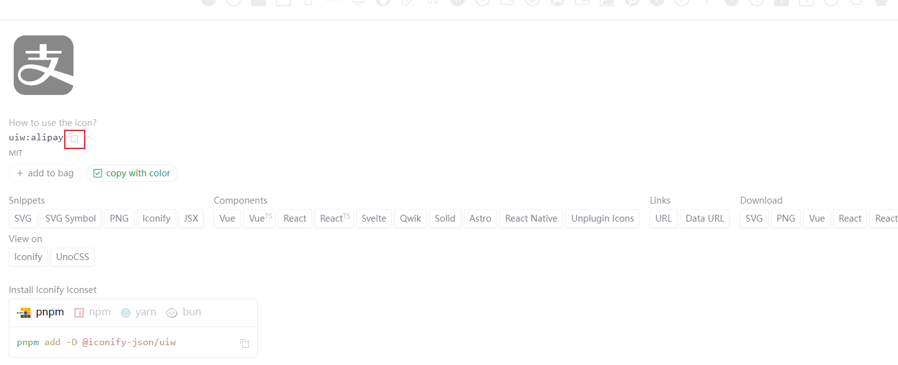

# 5-图标篇

## unocss 图标

### 环境配置

用 `Unocss Icons` 来使用图标的话，建议采用 [iconify](https://icones.js.org/collection/uiw) 的图标

所有图标库安装

```shell
pnpm add -D @iconify-json
```

部分安装，`pnpm add -D @iconify-json/[库名]`，这里我们选择 `iconify` 中的 `uiw` 图标库

```shell
pnpm add -D @iconify-json/uiw
```

需要配置一下 `unocss.config`

```typescript
export default defineConfig({
  presets: [
     // 支持图标，需要搭配图标库，eg: @iconify-json/uiw
     presetIcons({
        scale: 1.2, // 图标大小
        warn: true, // 警告
        prefix: ['i-'], // 图标前缀
        // 额外的 CSS 属性来控制图标的默认行为，默认内联图标
        extraProperties: {
          display: 'inline-block',
          'vertical-align': 'middle'
        }
     })
  ]  
})
```

### 基本使用

使用也是很简单的，我们先去 [iconify](https://icones.js.org/collection/uiw) 的网站找下图标，搜索 `uiw` 图标库

 

点击支付宝图标，然后复制图标名称



```vue
<template>
  <div class="w-100vw flex justify-center items-center p-y-20rpx">--------unocss 图标----------</div>
  <div class="flex justify-center gap-3 text-5xl text-blue-300">
    <!-- 类目最前面加 i-  -->
    <!-- 写法一：i-图标库名称-图标名称 -->
    <i class="i-uiw-alipay" />
    <!-- 写法二：i-图标库名称:图标名称 -->
    <i class="i-uiw:apple" />
  </div>
</template>
```

使用的话，有两种写法

- i-图标库名称-图标名称，比如 `i-uiw-alipay`
- i-图标库名称:图标名称，比如 `i-uiw:apple`

## 传统图标

```vue

<template>
  <div class="w-100vw flex justify-center items-center p-y-20rpx">--------传统图标----------</div>
  <div class="flex justify-center items-center gap-3">
    
    
  </div>
</template>
```

传统图标的写法建议还是使用 `img` 如果是单色的话，用 `svg` 比较好，毕竟可以切换颜色

切换颜色的方法就是直接，在路径后面加 `color=%23faa5a2` ，`%23` 其实就是将 `#` 进行了 `URL` 编码了

如果是彩色图标的话，还是用 `png` 吧!

## 小结

我们讲了两种图标使用方式，但是我相信日常开发中还是用到第二种比较多

第一个虽然方便，但是如果 `UI` 是定制化，并且比较复杂精细的图标，你做成 `iconify` 图库也是很费力的一件事情

所以建议就是，独立开发的话，就使用 `Unocss Icons` 省时省力，公司的话还是才是传统方案吧~
