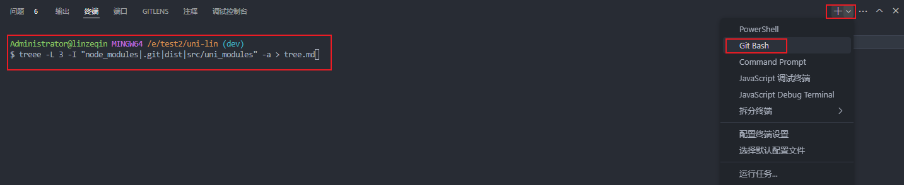

# 6-目录结构篇

## 🛠️ 生成工具

`window` 上有一个 `tree` 命令，可以生成目录树

但是，有一个问题就是，使用 `-I node_modules` 忽略文件夹的时候，会报 `参数太多 - node_modules`

所以，我们采用另一个工具 `tree-node-cli`

```shell
npm install -g tree-node-cli
```

然后我们就可以来生成目录结构了

```shell
treee -L 3 -I "node_modules|.git|dist|src/uni_modules" -a > tree.md
```

- `-L` 层数
- `-I` 忽略文件夹
- `-a` 打印所有文件，包括隐藏文件
- `>` 将目录结构信息保存到 `xxx`

【注意】执行命令的时候不要使用 `vscode` 等编译器的 `powershell`，会输出乱码，需要切换成 `Git Bash`



## 📦 目录结构

```tex
├── .env
├── .env.development
├── .env.production
├── .eslintrc-auto-import.json
├── .husky
│   ├── _
│   │   ├── applypatch-msg
│   │   ├── commit-msg
│   │   ├── h
│   │   ├── husky.sh
│   │   ├── post-applypatch
│   │   ├── post-checkout
│   │   ├── post-commit
│   │   ├── post-merge
│   │   ├── post-rewrite
│   │   ├── pre-applypatch
│   │   ├── pre-auto-gc
│   │   ├── pre-commit
│   │   ├── pre-merge-commit
│   │   ├── pre-push
│   │   ├── pre-rebase
│   │   └── prepare-commit-msg
│   └── pre-commit
├── .npmrc
├── .prettierignore
├── .release-it.json
├── .stylelintignore
├── .vscode
│   ├── settings.json
│   └── vue3.code-snippets
├── CHANGELOG.md
├── README.md
├── commitlint.config.cjs
├── components.d.ts
├── eslint.config.mjs
├── index.html
├── package.json
├── pages.config.ts
├── pnpm-lock.yaml
├── prettier.config.mjs
├── shims-uni.d.ts
├── src
│   ├── App.vue
│   ├── api
│   │   ├── loginApi.ts
│   │   └── testApi.ts
│   ├── env.d.ts
│   ├── hooks
│   │   ├── useEcharts.ts
│   │   └── useRequest.ts
│   ├── http
│   │   └── httpClient.ts
│   ├── interceptors
│   │   ├── index.ts
│   │   ├── request.ts
│   │   └── router.ts
│   ├── layouts
│   │   ├── default.vue
│   │   ├── foot.vue
│   │   └── head.vue
│   ├── main.ts
│   ├── manifest.json
│   ├── pages
│   │   ├── echartsShow
│   │   ├── index
│   │   ├── layoutDemo
│   │   ├── piniaDemo
│   │   ├── queryDemo
│   │   └── routerDemo
│   ├── pages-sub
│   │   ├── subDemo
│   │   └── testDemo
│   ├── pages.json
│   ├── shime-uni.d.ts
│   ├── static
│   │   ├── local
│   │   └── onLine
│   ├── store
│   │   ├── index.ts
│   │   └── user.ts
│   ├── types
│   │   ├── auto-import.d.ts
│   │   └── uni-pages.d.ts
│   ├── typings.ts
│   ├── uni.scss
│   ├── uni_modules
│   │   └── lime-echart
│   ├── utils
│   │   ├── index.ts
│   │   ├── qs.ts
│   │   └── router.ts
│   └── vite-plugin
│       └── vite-plugin-directives.ts
├── stylelint.config.mjs
├── tsconfig.json
├── unocss.config.ts
└── vite.config.ts
```
