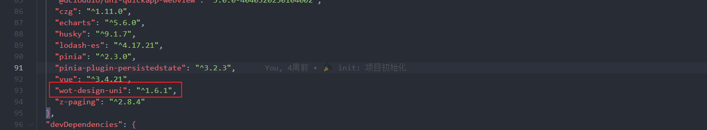

# 7-UI库篇

## UI库 如何替换？

如何替换，其实也不难，这里我们教一个通用的替换方法

首先，我们去 `package.json` 中看，我们的安装的是哪个组件库



比如我安装的就是 `wot-design-uni` 组件库

你可能就要问了，我怎么知道那个插件是 `UI` 库呢？

现在都是 `AI` 时代啦~

你可以使用 `AI` 辅助啊

你复制整个 `package.json` 的内容，然后问 `AI` 哪个是 `UI` 库，这不就出来啦


然后，我们就去搜索引擎搜索一下，这个组件库的文档


通常文档都有一个(快速上手/快速入门/开始使用...)的教程，总结一下，具体配置就是下面这几个了


那么如果我们要卸载这个组件库的话，那么我们只需要把项目中 `wot-design-uni` 组件库 对应的需要配置的删除，也是就上面的方案1 和 `Volar`

然后卸载 `wot-design-uni` 即可

```shell
pnpm remove wot-design-uni
```

怎么安装新 `UI` 库呢？

还是去找 `UI` 库的文档，比如我选择的组件库 [uni-ui](https://uniapp.dcloud.net.cn/component/uniui/uni-ui.html)


一样的也教了我们怎么安装和配置，只要照着配置安装就搞定了
