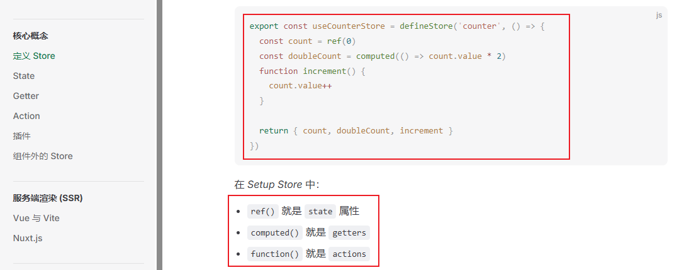

# 8-状态篇

## Pinia 与 持久化

安装

```shell
pnpm add pinia pinia-plugin-persistedstate@3.2.3
```

`pinia-plugin-persistedstate` 是持久化插件

为什么 `pinia-plugin-persistedstate` 需要指定版本？

因为 `pinia-plugin-persistedstate V4.x` 以上的版本与 `pinia` 一起使用会报错

## 配置

建立 `src/store/index.ts`

```typescript
import { createPinia } from 'pinia'
import { createPersistedState } from 'pinia-plugin-persistedstate' // 数据持久化

// 持久化把数据放在本地存储中
const store = createPinia()
store.use(
  createPersistedState({
    storage: {
      getItem: uni.getStorageSync,
      setItem: uni.setStorageSync,
    },
  }),
)

export default store

// 模块统一导出
export * from './user'
```

因为 `pinia-plugin-persistedstate` 自带的本地存储`api` 无法适配所有平台，直接使用 `uniapp` 的本地存储API来适配

配置下 `main.ts`

```typescript
import { createSSRApp } from "vue";
import App from "./App.vue";
import store from "./store"; // 1. 导入这个

export function createApp() {
  const app = createSSRApp(App);
  app.use(store) // 2. 使用 store
  return {
    app
  };
}
```

## 使用

比如我们需要缓存用户信息，建立 `src/store/user.ts`

```typescript
import { defineStore } from 'pinia'
import { ref } from 'vue'

type UserInfo = {
  userName?: string,
  userId?: string,
  avatar?: string,
  token?: string,
  refreshToken?: string,
}

// 初始用户数据，可用户初始化
const initState = {
  userName: 'uni-plus',
  userId: '',
  avatar: '',
  token: '',
  refreshToken: '',
  // ...
}

export const useUserStore = defineStore(
  'user',
  // Setup Store 写法，Vue3 推荐用这个种方法写
  () => { 
    const userInfo = ref<UserInfo>({ ...initState })

    // 设置用户信息 可设置部分信息（比如更新 token）
    const setUserInfo = (val: UserInfo): void => {
      userInfo.value = { ...userInfo.value, ...val }
    }

    // 清除用户信息
    const clearUserInfo = (): void => {
      userInfo.value = { ...initState }
    }

    return {
      userInfo,
      setUserInfo,
      clearUserInfo,
    }
  },
  {
    persist: true, // 是否持久化
  },
)
```

这种 pinia 的 setup 写法，在[官方文档](https://pinia.vuejs.org/zh/core-concepts/)中就有提到

 

创建 `src/pages/piniaDome/index.ts` ，我们来具体实践下

```vue
<!--
@description: pinia 使用 dome
-->

<route type="home" lang="json">
{
  "style": {
    "navigationBarTitleText": "pinia 使用 dome",
    "navigationBarTextStyle": "black",
    "navigationBarBackgroundColor": "#ffffff",
    "backgroundColor": "#ffffff"
  }
}
</route>

<template>
  <div>用户名：{{ userInfo.userName }}</div>
  <button @click="changeUserName">改变用户名</button>
</template>

<script setup lang='ts'>
/* ------------------------ 导入 与 引用 ----------------------------------- */
import { useUserStore } from '@/store';
import { storeToRefs } from 'pinia';
const store = useUserStore();
const { userInfo } = storeToRefs(store);

// 改变用户名
const changeUserName = () => {
  store.setUserInfo({ userName: 'uni-plus-pro' });
}

onMounted(() => {
  console.log('userInfo', userInfo.value);
})

</script>
```

这里主要涉及两点

- 获取数据
- 修改数据

**获取数据**

使用解构的方式，注意不能直接解构，需要借用 `storeToRefs` 来解构，不然会失去响应式

```typescript
import { storeToRefs } from 'pinia';
const store = useUserStore();
const { userInfo } = storeToRefs(store);
```

```html
<div>用户名：{{ userInfo.userName }}</div>
```

```typescript
console.log('userInfo', userInfo.value);
```

**修改数据**

```typescript
const setUserInfo = (val: UserInfo): void => {
   userInfo.value = { ...userInfo.value, ...val }
}
```

可以调用 `src/store/user.ts` 定义 `setUserInfo` 函数

因为传入的 `val`，在原数据后面展开，所以可以修改其中一个参数，也可以修改多个参数

```typescript
const store = useUserStore();
store.setUserInfo({ userName: 'uni-plus-pro' });
```

## 小结

`pinia` 没什么好说的，主要用于管理不同组件之间的状态

持久化需引用 `pinia-plugin-persistedstate`

为了适配多个平台，我们需要把默认本地存储方法改为 `uni.getStorageSync、uni.setStorageSync`

`pinia` 采用定义数据，采用 `Vue3` 的 `setup` 进行编写更加方便

获取数据需要使用 `storeToRefs` 来解构

修改数据，采用展开运算符，进行合并覆盖
