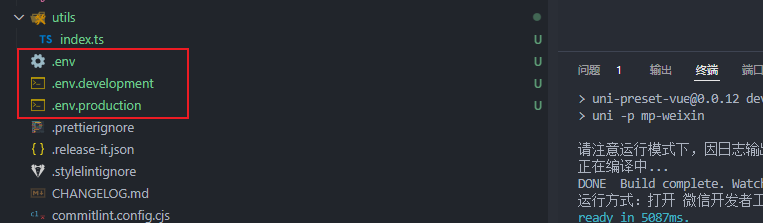
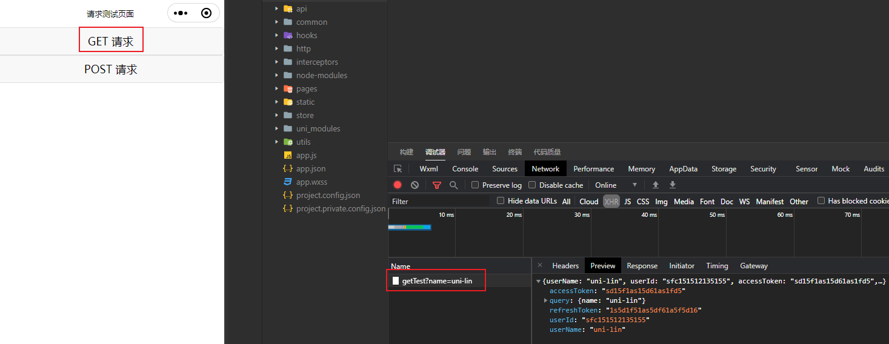
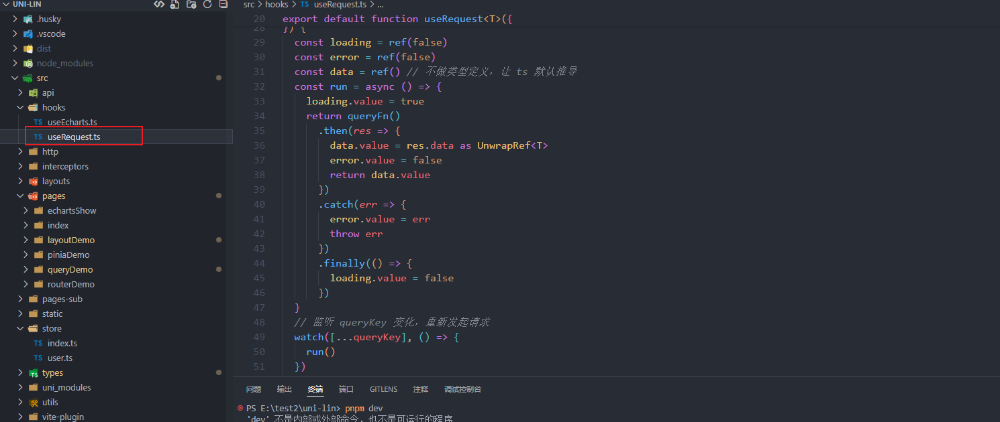

# 9-请求篇

## 环境配置

不同环境，开发环境（dev）、生产环境（pro），每个环境对应的请求基本地址都是不同的，当然还很其他参数也需要配置

这里我们先通过配置环境，来动态修改请求基地址，其他部分会在后续章节进行补充~

我们先在项目根目录下创建 `.env、.env.development、.env.production` 三个文件

 

- `.env` 存放 `.env.development、.env.production` 公共的配置，这个文件暂时先不写
- `.env.development` 开发环境配置
- `.env.production` 生产环境配置

```javascript
// .env.development
VITE_SERVER_BASEURL = 'http://192.168.0.1:3000'
```

```javascript
// .env.production
VITE_SERVER_BASEURL = 'https://api-pro.uni-plus.com' 
```

把这个 `.env、.env.development、.env.production` 折叠一下更好看一点，配置一下 `.vscode/settings.json`

```json
{
  "explorer.fileNesting.enabled": true, // 开启文件嵌套
  "explorer.fileNesting.expand": false, // 默认折叠
  "explorer.fileNesting.patterns": {
     ".env": ".env.*"
  }
}
```

 

要获取，不同环境下的配置，在 vite 下也很简单，可以通过这个语法

```javascript
import.meta.env.VITE_SERVER_BASEURL
```

## 为什么封装？

### 分类

为什么我们需要进行封装，到底要解决什么问题？

可以把这些问题归为三类

- 请求函数封装

- 请求发起前
- 请求完成后（请求失败，也是完成请求）

### 请求前

请求前我们需要解决这个几个问题

- 要不同环境下动态改变 `BaseUrl` 也就请求基地址
- 每次请求，有权限需求的请求需要带 `token`
- `query` 参数封装（因为，`uniapp` 中的 `uni.request` 没法直接带 `query`）

### 请求后

- 状态码全局判断
- 登录校验（无感刷新、失效重登）

## 请求函数封装

先看下请求函数 [uni.request](https://uniapp.dcloud.net.cn/api/request/request)

```javascript
uni.request({
    url, // 请求链接
    header, // 请求头
    timeout, // 超时时间
    method, // 请求方式 get、post ...
    dataType, // 如果设为 json，会对返回的数据进行一次 JSON.parse
    responseType, // 设置响应的数据类型
    data, // body 中的数据
    success: (res) => {
       console.log(res.data);
    }
})
```

每次都这么写，好麻烦啊，而且要是请求有前后关系，那还得嵌套，容易造成回调地狱问题

我们模仿 `axios` 请求方式封装一下 `uni.request`

建立 `src/http/httpClient.ts` 文件，封装 `uni.request`


```typescript
// httpClient.ts
import { CustomRequestOptions } from '@/interceptors/requestInterceptor'
type CustomRequestOptionsOmit = Omit<CustomRequestOptions, 'url' | 'method'>

export default class ApiClient {
  private static http<T>(options: Omit<CustomRequestOptions, 'isBaseUrl'>) {
      return new Promise<ResData<T>>((resolve, reject) => {
      uni.request({
        ...options,
        success: (res: any) => {
          resolve(res.data as ResData<T>)
        },
        fail: err => {
          reject(err)
        }
      })
    })
  }
  // GET
  public static get(url: string, options?: CustomRequestOptionsOmit) {
    return this.http({
      url,
      method: 'GET',
      ...options
    })
  }
  // POST
  public static post(url: string, options?: CustomRequestOptionsOmit) {
    return this.http({
      url,
      method: 'POST',
      ...options
    })
  }
  // PUT
  public static put(url: string, options?: CustomRequestOptionsOmit) {
    return this.http({
      url,
      method: 'PUT',
      ...options
    })
  }
  // DELETE
  public static delete(url: string, options?: CustomRequestOptionsOmit) {
    return this.http({
      url,
      method: 'DELETE',
      ...options
    })
  }
}
```

封装一个 `http` 函数，将 `uni.request` 用一个 `Promise` 包裹返回

这样就可以使用 `Promise` 的链式调用

为了更方便的使用请求，类似于 `axios.get().then()`

四个常见的请求函数 `get、post、put、delete` 里面直接调用 `http` 函数，并且设置 `method`

我们使用 `ApiClient.get()` 就能和 `axios.get()` 一样了


以后我们的请求都写在 `api` 这个文件夹下

导入的时候，将 `ApiClient` 重命名为 `http`，写起来比较简单易懂

```javascript
// testApi.ts
import http from '@/http/httpClient'

/** GET 请求测试 */
export const getTestApi = query => {
  return http.get('/getTest', { query })
}

/** POST 请求测试 */
export const postTestApi = (data, query) => {
  return http.post('/postTest', { data, query })
}
```

```vue
<!-- pages/queryDemo/queryTestDemo.ts -->
<route type="home" lang="json">
{
  "style": {
    "navigationBarTitleText": "请求测试页面",
    "navigationBarTextStyle": "black",
    "navigationBarBackgroundColor": "#ffffff",
    "backgroundColor": "#ffffff"
  }
}
</route>

<template>
  <div>
    <button @click="getTest">GET 请求</button>
    <button @click="postTest">POST 请求</button>
  </div>
</template>

<script setup lang="ts">
import { getTestApi, postTestApi } from '@/api/testApi'

// GET 请求
const getTest = async () => {
  const res = await getTestApi({ name: 'uni-plus' })
  console.log(res)
}

// POST 请求
const postTest = () => {
  const requestTask = postTestApi({ name: 'uni-plus' }, { id: '123456' })
  requestTask.then(res => {
    console.log(res)
  }).catch(err => {
    console.log(err)
  })
}
</script>
```

我们运行下，看下效果




有时候，我们在跳转页面，需要取消请求

`uni.request` 就有自带的取消请求方法 [abort()](https://uniapp.dcloud.net.cn/api/request/request.html#abort)

```typescript
var requestTask = uni.request({
 url: 'https://www.example.com/request', //仅为示例，并非真实接口地址。
 complete: ()=> {}
});
requestTask.abort();
```

如果希望返回一个 `requestTask` 对象，需要至少传入 `success / fail / complete` 参数中的一个

而我们要怎么把 `abort()` 方法封装进 `Promise` 中呢？

可以这样写吗？

```javascript
private static http<T>(options: Omit<CustomRequestOptions, 'isBaseUrl'>) {
    let requestTask
    const promise = new Promise<ResData<T>>((resolve, reject) => {
    uni.request({
      ...options,
      success: (res: any) => {
        resolve(res.data as ResData<T>)
      },
      fail: err => {
        reject(err)
      }
    })
    promise.abort = requestTask.abort()
  })
}
```

如果是 `js` 那是可以，但是如果你是 `ts` 就出现 `promise` 没有 `abort` 的类型的问题

如果我们要加入这个类型，就要做额外的类型定义，太麻烦了

`Pomise` 我们只需要 `then、catch、finally` 这几个方法，那么我们可以这样写


`promise.then.bind(promise)` 执行返回的 `then` 函数时，绑定的上下文是 `promise` 而不是返回的对象

`promise.catch.bind(promise)、promise.finally.bind(promise)`也是一样，这样返回对象的 `then、catch、finally` 方法就和 `promise` 一样

`...promise` 是为了补全 `primise` 原有的一些属性，这样就不会取消类型缺失的问题

最后，再加入我们自定义的 `abort` 取消请求函数就可以了~

我们来测试一下

```vue
<route type="home" lang="json">
{
  "style": {
    "navigationBarTitleText": "请求测试页面",
    "navigationBarTextStyle": "black",
    "navigationBarBackgroundColor": "#ffffff",
    "backgroundColor": "#ffffff"
  }
}
</route>

<template>
  <div>
    <button @click="getTest">GET 请求</button>
    <button @click="postTest">POST 请求</button>
    <button @click="cancelRequest">取消 请求</button>
  </div>
</template>

<script setup lang="ts">
import { getTestApi, postTestApi } from '@/api/testApi'

// GET 请求
const getTest = async () => {
  const res = await getTestApi({ name: 'uni-plus' })
  console.log(res)
}

// POST 请求
let requestTask = null
const postTest = () => {
  requestTask = postTestApi({ name: 'uni-plus' }, { id: '123456' })
  requestTask.then(res => {
    console.log(res)
  }).catch(err => {
    console.log(err)
  })
}

// 取消 请求
const cancelRequest = () => {
  // 取消请求
  requestTask.abort()
}
</script>
```


请求前，我们需要使用慢速3G，让接口慢一点到达，这样我们点击取消请求才有效果


可以看到，我们点击了 `post` 请求后，进入 `pending` 状态，然后我们点击取消请求，就变成 `canceled` 状态

至此我们请求接口的封装，就完成了~

## 请求前的封装

既然是请求封装，先看下请求函数 [uni.request](https://uniapp.dcloud.net.cn/api/request/request)

```javascript
uni.request({
    url, // 请求链接
    header, // 请求头
    timeout, // 超时时间
    method, // 请求方式 get、post ...
    dataType, // 如果设为 json，会对返回的数据进行一次 JSON.parse
    responseType, // 设置响应的数据类型
    data, // body 中的数据
    // ...
});
```

也就是说，我们要发起请求，需要为 `uni.request` 填入很多必要参数

我们不可能在每个请求里都填写一遍，这样太麻烦了

我们需要使用一个办法，在每个请求前，就把这些必要的参数填进去

对此我们采用拦截器的方式，对请求参数进行拦截并处理

`uniapp` 已经给我们提供[拦截器](https://uniapp.dcloud.net.cn/api/interceptor.html)

创建 `src/interceptors/requestInterceptor.ts`

```typescript
// requestInterceptor.ts
import { qs } from '@/utils'
import { useUserStore } from '@/store'

export type CustomRequestOptions = UniApp.RequestOptions & {
  query?: Record<string, any>
  /** 出错时是否隐藏错误提示 */
  hideErrorToast?: boolean
  isBaseUrl?: boolean
}

const timeout = 30000 // 请求超时时间
const baseUrl = import.meta.env.VITE_SERVER_BASEURL as string // 请求基础路径

// 拦截器配置
const httpInterceptor = {
  // 请求前的拦截
  invoke(options: CustomRequestOptions) {
    // 1. 设置请求路径
    options.url = (options.isBaseUrl === false ? '' : baseUrl) + options.url
    // 2. query 参数处理
    if (options.query) {
      // qs.stringify() 方法将一个 JavaScript 对象或数组转换为一个查询字符串
      // 比如： { name: 'tom', age: 18 } 转换成 name=tom&age=18
      const query = qs.stringify(options.query)
      options.url += options.url.includes('?') ? '&' : '?' + query
    }
    // 3. 请求超时时间设置
    options.timeout = timeout
    // 4. 定义请求返回数据的格式（设为 json，会尝试对返回的数据做一次 JSON.parse）
    ;(options.dataType = 'json'),
      // #ifndef MP-WEIXIN
      (options.responseType = 'json'),
      // #endif
      // 5. 添加请求头标识，可以告诉后台是小程序端发起的请求
      (options.header = {
        ...options.header,
        'Content-Type': 'application/json; charset=utf-8'
        // platform: 'mini-program', 比如 platform 字段可以告诉后台是小程序端发起的请求
      })
    // 6. 添加 token 请求头标识
    const store = useUserStore()
    const { accessToken } = store.userInfo || {}
    if (accessToken) {
      options.header.Authorization = `Bearer ${accessToken}`
    }
    return options
  }
}

export const requestInterceptor = {
  install() {
    // 拦截 request 请求
    uni.addInterceptor('request', httpInterceptor)
  }
}
```

现在我们来对上面的文件进行讲解下

 

- `timeout` 超时时间
- `baseUrl` 基础路径

[uni.addInterceptor('request', httpInterceptor)](https://uniapp.dcloud.net.cn/api/interceptor.html)

其中 `request` 为被拦截函数的名字，上面的将拦截 `uni.request()`

`httpInterceptor` 为拦截函数

请求前的拦截需要把 `url、header、timeout...` 的相关参数都默认填上

而这些操作，都在 `invoke` 中进行

```typescript
// 请求前的拦截
invoke(options: CustomRequestOptions) {
    // 1. 设置请求路径
    options.url = (options.isBaseUrl === false ? '' : baseUrl) + options.url
    // 2. query 参数处理
    if (options.query) {
      // qs.stringify() 方法将一个 JavaScript 对象或数组转换为一个查询字符串
      // 比如： { name: 'tom', age: 18 } 转换成 name=tom&age=18
      const query = qs.stringify(options.query)
      options.url += options.url.includes('?') ? '&' : '?' + query
    }
    // 3. 请求超时时间设置
    options.timeout = timeout;
    // 4. 定义请求返回数据的格式（设为 json，会尝试对返回的数据做一次 JSON.parse）
    options.dataType = 'json';
    // #ifndef MP-WEIXIN
    options.responseType = 'json';
    // #endif
    // 5. 添加请求头标识，可以告诉后台是小程序端发起的请求
    options.header = {
      ...options.header,
      'Content-Type': 'application/json; charset=utf-8'
      // platform: 'mini-program', 比如 platform 字段可以告诉后台是小程序端发起的请求
    }
    // 6. 添加 token 请求头标识
    const store = useUserStore()
    const { accessToken } = store.userInfo || {}
    if (accessToken) {
      options.header.Authorization = `Bearer ${accessToken}`
    }
    return options
 }
```

因为 `uni.request` 没有 `query` 参数，所以到需要对传进来的 `query` 参数做一下处理

把 `query` 参数拼接到请求链接上，从而让 uni.request` 能带 `query` 参数

```typescript
export const requestInterceptor = {
  install() {
    // 拦截 request 请求
    uni.addInterceptor('request', httpInterceptor)
  }
}
```

为了拦截器统一导出，我们在 `interceptors` 下建立 `index.ts`

所有，拦截器由 `index.ts` 统一导出


`requestInterceptor` 导出之后，我们需要在 `main.ts` 引用，这样拦截器才能生效

```typescript
// main.ts
import { createSSRApp } from 'vue'
import { requestInterceptor } from './interceptors'
import App from './App.vue'

export function createApp() {
  const app = createSSRApp(App)
  app.use(requestInterceptor)
  return {
    app
  }
}
```

## 请求后的封装

因为，现在市面上比较常规的请求返回参数来判断状态的有两种方式

- 一种是通过 `statusCode` 进行判断
- 另一种是直接返回 `statusCode: 200`，通过 `data` 中的 `code` 来进行判断


对此，请求后的封装也考虑了这两种方式，并做了处理

 

而且，请求对状态码的判断，除了 `statusCode: 200、code: 0` 返回正确结果

其他都做为异常处理，当前部分只做 `401` 登录失效以及未登录的处理，后续可以根据需要，增加自己业务所需的异常处理

接下去的部分就是 token 失效做无感刷新处理

## token 无感刷新

原理：

当 `token` 失效时，把失效的请求放入请求队列

然后拿 `刷新token` 去换新的 `token`

最后把请求队列的请求重新请求一遍

实现：

```typescript
import { refreshTokenApi } from '@/api/loginApi'
import { CustomRequestOptions } from '@/interceptors/request'
import { useUserStore } from '@/store'

type CustomRequestOptionsOmit = Omit<CustomRequestOptions, 'url' | 'method'>

let refreshing = false // 防止重复刷新 token 标示
let taskQueue = [] // 刷新 token 请求队列

export default class ApiClient {
  private static http<T>(options: Omit<CustomRequestOptions, 'isBaseUrl'>) {
    let requestTask
    const promise = new Promise<ResData<T>>((resolve, reject) => {
      requestTask = uni.request({
        ...options,
        success: async (res: any) => {
          /* -------- 请求成功 ----------- */
          if ((res.statusCode >= 200 && res.statusCode < 300) || res.data.code === 0) {
            return resolve(res.data as ResData<T>)
          }

          /* -------- 无感刷新 token ----------- */
          const store = useUserStore()
          const { refreshToken } = store.userInfo || {}
          // token 失效的，且有刷新 token 的，才放到请求队列里
          if ((res.data.code == 401 || res.statusCode == 401) && refreshToken != '') {
            taskQueue.push(() => {
              resolve(this.http(options))
            })
          }
          if ((res.data.code == 401 || res.statusCode == 401) && refreshToken != '' && !refreshing) {
            refreshing = true
            // 发起刷新 token 请求
            const refreshTokenRes: any = await refreshTokenApi()
            refreshing = false
            // 刷新 token 成功，将任务队列的所有任务重新请求
            if (refreshTokenRes?.data.code == 200) {
              taskQueue.forEach(event => {
                event()
              })
            } else {
              // 刷新 token 失败，跳转到登录页
              uni.showToast({
                title: '登录已过期，请重新登录',
                icon: 'none',
                time: 2500
              })
              // setTimeout(() => {
              //   // 清除 用户信息（包括 token）
              //   store.clearUserInfo()
              //   // 跳转到登录页
              //   uni.navigateTo({ url: '/pages/login/login' })
              // }, 2500)
            }
            // 不管刷新 token 成功与否，都清空任务队列
            taskQueue = []
          }

          /* -------- 剩余情况都默认请求异常 ----------- */
          uni.showToast({
            title: res.data.msg || res.data.message || '请求异常',
            icon: 'none'
          })
          reject(res)
        },
        fail: err => {
          if (err.errMsg === 'request:fail abort') {
            console.log(`请求 ${options.url} 被取消`)
          } else {
            reject(err)
          }
        }
      })
    })
    return {
      ...promise, // 补全 Promise 的类型
      then: promise.then.bind(promise),
      catch: promise.catch.bind(promise),
      finally: promise.finally.bind(promise),
      [Symbol.iterator]: promise[Symbol.iterator],
      abort: () => {
        // 取消请求
        requestTask.abort()
      }
    }
  }
}
```

`token` 和 `refreshToken` 都是放在 `store` 中，需要通过 `useUserStore()` 拿到 `refreshToken`

然后把请求为 `token` 失效的请求都放入 `taskQueue` 中，然后执行 `refreshTokenApi` 刷新 `token`

为了保证 `refreshTokenApi` 只执行一次，使用 `refreshing` 做了请求锁

最后 `taskQueue.forEach` 把请求队列的请求重新请求一遍，执行完成后清空 `taskQueue`

如果 `token` 失效，`refreshToken` 也失效，那就返回登陆页，重新登录

测试


一开始请求登录了，然后获取 `userInfo`，这个是需要 `token` 的，清除 `token` 再请求

三个 `userInfo` 都报 `401`，`token` 失效，把 3 个 `userInfo` 请求放入请求队列，使用 `refresh` 接口刷新 `token`

重新执行请求队列，可以看到 `refresh` 请求后面的 3个 `userInfo` 请求成功了

## 封装请求分页 hooks

`src/hooks/useRequest.ts`



```typescript
import { UnwrapRef, Ref } from 'vue'

type RequestOptions = {
  /** 是否立即执行 */
  immediate?: boolean
}

/**
 * useRequest 是请求的再次封装，类似于 react-query 中的 userQuery
 * 核心使用场景，就前端而言，分页查询用的比较多，其他嘛用得还是比较少
 * @param queryFn 一个执行异步请求的函数，返回一个包含响应数据的 Promise
 * @param queryKey 请求的唯一标识，用于监听参数变化，重新发起请求
 * @param options 包含请求选项的对象 {immediate}。
 * @param options.immediate 是否立即执行请求，默认为false。
 * @returns 返回一个对象{loading, error, data, run}，包含请求的加载状态、错误信息、响应数据和手动触发请求的函数。
 */
export default function useRequest<T>({
  queryKey,
  options = { immediate: false },
  queryFn
}: {
  queryKey: Ref<T>[]
  options: RequestOptions
  queryFn: () => Promise<ResData<T>>
}) {
  const loading = ref(false)
  const error = ref(false)
  const data = ref() // 不做类型定义，让 ts 默认推导
  const run = async () => {
    loading.value = true
    return queryFn()
      .then(res => {
        data.value = res.data as UnwrapRef<T>
        error.value = false
        return data.value
      })
      .catch(err => {
        error.value = err
        throw err
      })
      .finally(() => {
        loading.value = false
      })
  }
  // 监听 queryKey 变化，重新发起请求
  watch([...queryKey], () => {
    run()
  })
  options.immediate && run()
  return { loading, error, data, run }
}
```

`vue3` 的 `hooks` 封装 与 `utils` 工具函数封装插件就在于 函数中有没有 `ref、reactive` 这些响应式数据

还有就是返回，返回响应式数据或者函数

我们的 `hooks` 封装也是这样，我们需要返回

- `loading` 加载
- `error` 错误
- `data` 数据
- `run` 请求函数

核心就是 `run` 函数，根据请求返回 设置 `loading、error、data`

接下就配置项 `options.immediate` 主要是用于判断第一次执行这个 `hooks` 是否执行请求

`queryKey` 用于监听数据变化，比如 `page:1 变成 page: 2` 了，那个我们就自动执行请求，这也是我们封装这个 `hooks` 的意义所在

只要 `page` 或者某个参数改变，页面数据就会自动变化

也许，你还不大清除，我们来使用下就明白了

创建 `useRequestDemo.vue` 用于测试 `useRequest` 这个 `hooks`


```vue
// src/pages/queryDemo/useRequestDemo.vue
<route type="home" lang="json">
{
  "style": {
    "navigationBarTitleText": "useRequest使用示例",
    "navigationBarTextStyle": "black",
    "navigationBarBackgroundColor": "#ffffff",
    "backgroundColor": "#ffffff"
  }
}
</route>

<template>
  <button @click="prevPage">上一页</button>
  <button @click="nextPage">下一页</button>
  <button @click="getList">重新获取列表</button>
  <div v-if="loading">加载中...</div>
  <div v-else>
    <div class="w-100vw font-size-36rpx m-y-20rpx">当前页码：{{ page }}</div>
    <ul>
      <li v-for="item in data" :key="item.id" class="mb-10rpx">
        {{ item.title }}
      </li>
    </ul>
  </div>
  <div v-if="error">请求失败: {{ error }}</div>
</template>

<script setup lang="ts">
import { getUserListApi } from '@/api/testApi'
import useRequest from '@/hooks/useRequest'

// useRequest 的使用
const page = ref(1)
const { loading, error, data, run } = useRequest({
  queryKey: [page],
  queryFn: () => getUserListApi({ page: page.value, limit: 10 }),
  options: { immediate: true }
})

// 上一页
const prevPage = () => {
  page.value = Math.max(page.value - 1, 1)
}

// 下一页
const nextPage = () => {
  page.value = page.value + 1
}

// 重新获取列表数据
const getList = () => {
  run()
}
</script>
```

`useRequest` 的使用很简单，注意 `queryKey` 需要传 `ref` 定义的数据，请求函数需要以箭头函数的形式赋给 `queryFn`

改变 `page，queryFn` 就会再次请求，`data` 数据也会更新

```typescript
import { getUserListApi } from '@/api/testApi'
import useRequest from '@/hooks/useRequest'

const page = ref(1)
const { loading, error, data, run } = useRequest({
  queryKey: [page],
  queryFn: () => getUserListApi({ _page: page.value, _limit: 10 }),
  options: { immediate: true }
})

// 上一页
const prevPage = () => {
  page.value = Math.max(page.value - 1, 1)
}

// 下一页
const nextPage = () => {
  page.value = page.value + 1
}
```

使用的话，直接拿 `data` 展示即可

```vue
<div v-else>
   <div class="w-100vw font-size-36rpx m-y-20rpx">当前页码：{{ page }}</div>
   <ul>
     <li v-for="item in data" :key="item.id" class="mb-10rpx">
       {{ item.title }}
     </li>
   </ul>
</div>
```

看看效果


要是，我还要处理 `data` 中的数据要怎么做呢？可以使用 `computed` 进行处理

我们在每个字段末尾添加一段文字 `（这是额外添加的内容~）`

```typescript
// data 数据处理
const filterData = computed(() => {
  return data.value?.map((item: any) => {
    return {
      ...item,
      title: item.title + '（这是额外添加的内容~）'
    }
  })
})
```

```vue
<div v-else>
    <div class="w-100vw font-size-36rpx m-y-20rpx">当前页码：{{ page }}</div>
    <ul>
      <li v-for="item in filterData" :key="item.id" class="mb-10rpx">
        {{ item.title }}
     </li>
   </ul>
</div>
```

看下效果，可以看到，每次更新的数据都是我们处理过的


## 分页组件 z-paging

你要是还要实现更复杂的功能，可以使用插件 [z-paging](https://z-paging.com/start/intro.html)

```shell
pnpm add z-paging -D
```

创建 `zPagingDemo.vue`


```vue
<!-- src/pages/queryDemo/zPagingDemo.vue -->
<route type="home" lang="json">
{
  "style": {
    "navigationBarTitleText": "z-paging 使用示例",
    "navigationBarTextStyle": "black",
    "navigationBarBackgroundColor": "#ffffff",
    "backgroundColor": "#ffffff"
  }
}
</route>

<template>
  <z-paging ref="paging" v-model="dataList" @query="queryList">
    <div>
      <ul>
        <li v-for="item in dataList" :key="item.id">
          {{ item.title }}
        </li>
      </ul>
    </div>
    <!-- 页面内容 -->
  </z-paging>
</template>

<script setup lang="ts">
import { getUserListApi } from '@/api/testApi'

const paging = ref(null)
const dataList = ref([])

const queryList = (pageNo, pageSize) => {
  // 这里的pageNo和pageSize会自动计算好，直接传给服务器即可
  // 这里的请求只是演示，请替换成自己的项目的网络请求，并在网络请求回调中通过paging.value.complete(请求回来的数组)将请求结果传给z-paging
  getUserListApi({ page: pageNo, limit: pageSize })
    .then(res => {
      // 请勿在网络请求回调中给dataList赋值！！只需要调用complete就可以了
      // 如果你需要处理 res.data 的数据，请在 complete 之前处理
      paging.value.complete(res.data)
    })
    .catch(res => {
      // 如果请求失败写paging.value.complete(false)，会自动展示错误页面
      // 注意，每次都需要在catch中写这句话很麻烦，z-paging提供了方案可以全局统一处理
      // 在底层的网络请求抛出异常时，写uni.$emit('z-paging-error-emit');即可
      paging.value.complete(false)
    })
}

onMounted(() => {
  queryList(1, 10)
})
</script>
```

使用起来也很简单哈

`<z-paging>` 的 `@query` 绑定的函数会返回 `page、pageSize`，把参数传给请求

通过 `paging.value.complete` 将数据保存在 `dataList` 中

我们就可以在 `<z-paging>` 的拿 `dataList` 进行渲染了

我们来看下效果


我们使用这个插件实现了最简单上拉加载，下来刷新功能，当然这个插件的功能不止于此，你可以看下 [z-paging文档](https://z-paging.com/start/intro.html) 进行扩展

## await-to-js

```typescript
const awaitToJs = async () => {
  try {
    const res = await awaitToJsTestApi({ name: 'uni-plus' })
    // ...
  } catch (err) {
    console.log(err)
    // ...
  }
}
```

相信很多同学在写 `async await` 请求的时候，也是通过 `try catch` 进行错误处理的

这样写是没有问题，但感觉不大好看，能不能把 `try catch` 转为 `if else` 进行判断呢？我们来试一下


```typescript
// src/api/testApi.ts
export const awaitToJsTestApi = query => {
  return (
    http
      .post('/postTest', { query }) // 返回正常
      // .post('/error', { query }) // 返回错误
      .then(
        data => [data, null],
        e => [null, e]
      )
  )
}
```

在 `testApi.ts` 中我们增加一个请求函数 `awaitToJsTestApi`

这个请求函数最大不同就是，把 `then` 里面的返回的数据，给封装成功数组结构

```typescript
const awaitToJs = async () => {
  const [data, err] = await awaitToJsTestApi({ name: 'uni-plus' })
  if (data) {
    console.log(data)
  }
  if (err) {
    console.log(err)
  }
}
```

调用的时候，就可以通过数组拿到数据和错误，从而将 try catch 错误判断转为 if else 判断

当然啦，这是最简单的封装，完整的封装可以看 [await-to-js](https://www.npmjs.com/package/await-to-js) 源码也不多，感兴趣的同学可以研究一下
